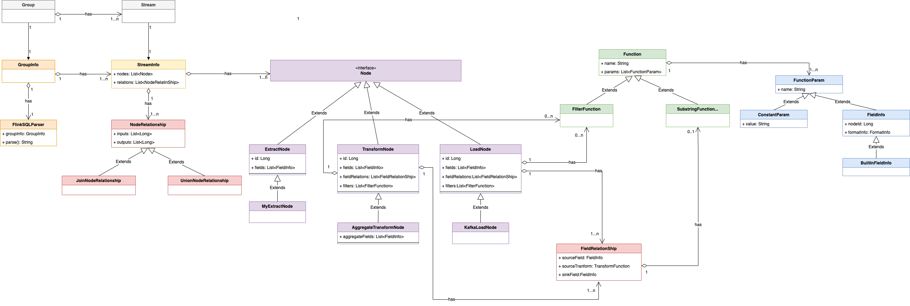
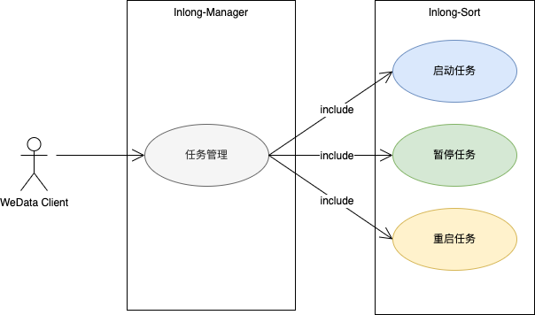
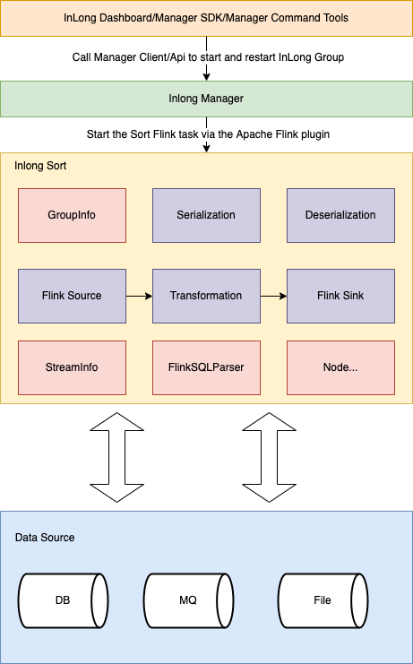

# Analysis of InLong Sort ETL Solution Based on Apache Flink SQL

## 1. Background

With the increasing number of users and developers of Apache InLong(incubating), the demand for richer usage scenarios and low-cost operation is getting stronger and stronger. Among them, the demand for adding Transform (T) to the whole link of InLong has received the most feedback. After the research and design of @yunqingmoswu, @EMsnap, @gong, @thexiay community developers, the InLong Sort ETL solution based on Flink SQL has been completed. This article will introduce the implementation details of the solution in detail.

<!--truncate-->

Firstly, based on Apache Flink SQL, there are mainly the following considerations：

-  Flink SQL has high scalability and flexibility brought about by its powerful expression ability. Basically, Flink SQL can support most demand scenarios in the community. When the built-in functions of Flink SQL do not meet the requirements, we can also extend them through various UDFs.
-  Compared with the implementation of the underlying API of Flink, the development cost of Flink SQL is lower. Only for the first time, the conversion logic of Flink SQL needs to be implemented. In the future, we can focus on the construction of the ability of Flink SQL, such as the extension connector and the UDF.
- In general, Flink SQL will be more robust and run more stable. The reason is that Flink SQL shields a lot of the underlying details of Flink, has strong community support, and has been practiced by a large number of users.
- For users, Flink SQL is also easier to understand, especially for users who have used SQL, the usage is simple and familiar, which helps users to land quickly.
- For the migration of existing real-time tasks, if they are originally SQL-type tasks, especially Flink SQL tasks, the migration cost is extremely low, and in some cases, no changes are even required.

**Note**: For all codes of this scheme, please refer to [Apache InLong Sort](https://github.com/apache/incubator-inlong/tree/master/inlong-sort), which can be downloaded and used in the upcoming version 1.2.0.

## 2. Introduction

### 2.1 Requirements

The main requirements of this solution are the completed inlong sort module transform (T) capability, including:

|          Transform          |                            Notes                             |
| :-------------------------: | :----------------------------------------------------------: |
| Deduplication in the window |            Deduplicate data within a time window             |
|   time window aggregation   |             Aggregate data within a time window              |
|   time format conversion    | Converts the value of a field to a string in the target time format |
|     field segmentation      |    Split a field into multiple new fields by a delimiter     |
|     string replacement      |    Replace some or all of the contents of a string field     |
|       Data filtering        |   Discard or retain data that meets the filter conditions    |
|     Content extraction      |        Extract part of a field to create a new field         |
|            Join             |                    Support two table join                    |
|     Value substitution      | Given a matching value, if the field's value is equal to that value, replace it with the target value |

### 2.2 Usage Scenarios

Users of big data integration have transform requirements such as data transformation, connection and filtering in many business scenarios.

### 2.3 Design Goal

This design needs to achieve the following goals:

- Functionality: Under InLong Sort's existing architecture and data flow model, it covers basic Transform capabilities and has the ability to expand rapidly.
- Compatibility: The new InLong Sort data model is forward compatible to ensure that historical tasks can be configured and run properly.
- Maintainability: The conversion of the InLong Sort data model to Flink SQL only needs to be implemented once. When there are new functional requirements later, this part does not need to be changed, even if there are changes, it can be supported with a small amount of changes.
- Extensibility: When the open source Flink Connector or the built-in Flink SQL function does not meet the requirements, you can customize the Flink Connector and UDF to achieve its function expansion.

### 2.4 Basic Concepts

The core concept refers to the explanation of terms in the outline design

|            Name             |                           Meaning                            |
| :-------------------------: | :----------------------------------------------------------: |
|      InLong Dashboard       |            Inlong front end management interface             |
|    InLong Manager Client    | Wrap the interface in the manager for external user programs to call without going through the front-end inlong dashboard |
|   InLong Manager Openapi    |      Inlong manager and external system call interface       |
|   InLong Manager metaData   | Inlong manager metadata management, including metadata information of group and stream dimensions |
| InLong Manager task manager | Inlong manager manages the data source collection task module, manages agent task distribution, instruction distribution, and heartbeat reporting |
|        InLong Group         | Data flow group, including multiple data flows, one group represents one data access |
|        InLong Stream        |     Data flow: a data flow has a specific flow direction     |
|        Stream Source        | There are corresponding acquisition end and sink end in the stream. This design only involves the stream source |
|         Stream Info         | Abstract of data flow in sort, including various sources, transformations, destinations, etc. of the data flow |
|         Group Info          | Encapsulation of data flow in sort. A group info can contain multiple stream infos |
|            Node             | Abstraction of data source, data transformation and data destination in data synchronization |
|        Extract Node         |       Source side abstraction of data synchronization        |
|          Load Node          |       Destination abstraction of data synchronization        |
|     MySQL Extract Node      |                MySQL data source abstraction                 |
|       Kafka Load Node       |              Kafka data destination abstraction              |
|       Transform Node        |  Transformation process abstraction of data synchronization  |
|  Aggregate Transform Node   | Data synchronization aggregation class transformation process abstraction |
|        Node Relation        |  Relationship abstraction of nodes in data synchronization   |
|       Field Relation        | Abstraction of the relationship between upstream and downstream node fields in data synchronization |
|          Function           | Abstraction of the relationship between upstream and downstream node fields in data synchronization |
|     Substring Function      |         Abstraction of string interception function          |
|       Filter Function       |             Abstraction of data filter function              |
|       Function Param        |           Input parameter abstraction of function            |
|       Constant Param        |                     Constant parameters                      |
|         Field Info          |                          Node field                          |
|       Meta FieldInfo        |                 Node meta information field                  |

### 2.5 Domain Model

This design mainly involves the following entities: 

Group, Stream, GroupInfo, StreamInfo, Node, NodeRelation, FieldRelation, Function, FilterFunction, SubstringFunction, FunctionParam, FieldInfo, MetaFieldInfo, MySQLExtractNode, KafkaLoadNode, etc.

For ease of understanding, this section will model and analyze the relationship between entities. Description of entity correspondence of domain model:

- One group corresponds to one group info
- A group contains one or more streams
- One stream corresponds to one StreamInfo
- A GroupInfo contains one or more StreamInfo
- A StreamInfo contains multiple nodes
- A StreamInfo contains one or more NodeRelations
- A NodeRelation contains one or more FieldRelations
- A NodeRelation contains 0 or more FilterFunctions
- A FieldRelation contains one function or one FieldInfo as the source field and one FieldInfo as the target field
- A function contains one or more FunctionParams

The above relationship can be represented by UML object relationship diagram as:



### 2.6 Function Use-case Diagram



## 3. System Outline Design

### 3.1 System Architecture Diagram



- Serialization: Serialization Implementation Module
- Deserialization: Deserialization Implementation Module
- Flink Source: Custom Flink source implementation module
- Flink Sink: Custom Flink sink implementation module
- Transformation: Custom Transform implementation module
- GroupInfo: Corresponding to Inlong group
- StreamInfo: Corresponding to inlong stream
- Node: Abstraction of data source, data conversion and data destination in data synchronization
- FlinkSQLParser: SQL parser

### 3.2 InLong Sort Internal Operation Flow Chart


### 3.3 Module Design

This design only adds Flink connector and Flink SQL generator to the original system, and modifies the data model module.

#### 3.3.1 Module Structure


#### 3.3.2 Module Division

Description of important module division:

|       Name        |                         Description                          |
| :---------------: | :----------------------------------------------------------: |
|  FlinkSQLParser   | Used to generate Flink SQL core classes, including references to GroupInfo |
|     GroupInfo     | The internal abstraction of sort for inlong group is used to encapsulate the synchronization related information of the entire inlong group, including the reference to list\<StreamInfo\> |
|    StreamInfo     | The internal abstraction of sort to inlong stream is used to encapsulate inlong stream synchronization related information, including references to list\<node\>, list\<NodeRelation\> |
|       Node        | The top-level interface of the synchronization node. Its subclass implementation is mainly used to encapsulate the data of the synchronization data source and the transformation node |
|    ExtractNode    |      Data extract node abstraction, inherited from node      |
|     LoadNode      |       Data load node abstraction, inherited from node        |
|   TransformNode   |  Data transformation node abstraction, inherited from node   |
|   NodeRelation    |              Define relationships between nodes              |
|   FieldRelation   |           Define field relationships between nodes           |
|     Function      |           Abstract of T-ability execution function           |
|  FilterFunction   | Function abstraction for data filtering, inherited from function |
| SubstringFunction | Used for string interception function abstraction, inherited from function |
|   FunctionParam   |             Abstraction for function parameters              |
|   ConstantParam   | Encapsulation of function constant parameters, inherited from FunctionParam |
|     FieldInfo     | The encapsulation of node fields can also be used as function input parameters, inherited from FunctionParam |
|   MetaFieldInfo   | The encapsulation of built-in fields is currently mainly used in the metadata field scenario of canal JSON, which is inherited from FieldInfo |

## 4. Detailed System Design

The following describes the principle of SQL generation by taking MySQL synchronizing data to Kafka as an example

### 4.1 Node Described in SQL

#### 4.1.1 ExtractNode Described in SQL

The node configuration is:

```java
 private Node buildMySQLExtractNode() {
        List<FieldInfo> fields = Arrays.asList(
                new FieldInfo("name", new StringFormatInfo()),
                new FieldInfo("age", new IntFormatInfo()));
        return new MySqlExtractNode("1", "mysql_input", fields,
                null, null, "id",
                Collections.singletonList("tableName"), "localhost", "root", "password",
                "inlong", null, null,
                null, null);
    }
```

The generated SQL is:

```sql
CREATE TABLE `mysql_1` (`name` string,`age` int) 
with 
('connector' = 'mysql-cdc-inlong',
'hostname' = 'localhost',
'username' = 'root',
'password' = 'password',
'database-name' = 'inlong',
'table-name' = 'tableName')
```

#### 4.1.2 TransformNode  Described in SQL

The node configuration is:

```java
 List<FilterFunction> filters = Arrays.asList(
                new SingleValueFilterFunction(EmptyOperator.getInstance(),
                        new FieldInfo("age", new IntFormatInfo()),
                        LessThanOperator.getInstance(), new ConstantParam(25)),
                new SingleValueFilterFunction(AndOperator.getInstance(),
                        new FieldInfo("age", new IntFormatInfo()),
                        MoreThanOrEqualOperator.getInstance(), new ConstantParam(18))
        );
```

The generated SQL is:

```sql
SELECT `name` AS `name`,`age` AS `age` FROM `mysql_1` WHERE `age` < 25 AND `age` >= 18
```

#### 4.1.3 LoadNode Described in SQL

The node configuration is:

```java
 private Node buildKafkaLoadNode(FilterStrategy filterStrategy) {
        List<FieldInfo> fields = Arrays.asList(
                new FieldInfo("name", new StringFormatInfo()),
                new FieldInfo("age", new IntFormatInfo())
        );
        List<FieldRelation> relations = Arrays
                .asList(
                        new FieldRelation(new FieldInfo("name", new StringFormatInfo()),
                                new FieldInfo("name", new StringFormatInfo())),
                        new FieldRelation(new FieldInfo("age", new IntFormatInfo()),
                                new FieldInfo("age", new IntFormatInfo()))
                );
        List<FilterFunction> filters = Arrays.asList(
                new SingleValueFilterFunction(EmptyOperator.getInstance(),
                        new FieldInfo("age", new IntFormatInfo()),
                        LessThanOperator.getInstance(), new ConstantParam(25)),
                new SingleValueFilterFunction(AndOperator.getInstance(),
                        new FieldInfo("age", new IntFormatInfo()),
                        MoreThanOrEqualOperator.getInstance(), new ConstantParam(18))
        );
        return new KafkaLoadNode("2", "kafka_output", fields, relations, filters,
                filterStrategy, "topic1", "localhost:9092",
                new CanalJsonFormat(), null,
                null, "id");
    }
```

The generated SQL is:

```sql
CREATE TABLE `kafka_3` (`name` string,`age` int) 
with (
'connector' = 'kafka-inlong',
'topic' = 'topic1',
'properties.bootstrap.servers' = 'localhost:9092',
'format' = 'canal-json-inlong',
'canal-json-inlong.ignore-parse-errors' = 'true',
'canal-json-inlong.map-null-key.mode' = 'DROP',
'canal-json-inlong.encode.decimal-as-plain-number' = 'true',
'canal-json-inlong.timestamp-format.standard' = 'SQL',
'canal-json-inlong.map-null-key.literal' = 'null'
)
```

### 4.2 Field T Described in SQL

#### 4.2.1 Filter operator

See 4.1 node configuration for relevant configurations

The generated SQL is:

```sql
INSERT INTO `kafka_3` SELECT `name` AS `name`,`age` AS `age` FROM `mysql_1` WHERE `age` < 25 AND `age` >= 18
```

#### 4.2.2 Watermark

The complete configuration of GroupInfo is as follows:

```java
private Node buildMySqlExtractNode() {
        List<FieldInfo> fields = Arrays.asList(
                new FieldInfo("name", new StringFormatInfo()),
                new FieldInfo("age", new IntFormatInfo()),
                new FieldInfo("ts", new TimestampFormatInfo()));
        WatermarkField wk = new WatermarkField(new FieldInfo("ts", new TimestampFormatInfo()),
                new StringConstantParam("1"),
                new TimeUnitConstantParam(TimeUnit.MINUTE));
        return new MySqlExtractNode("1", "mysql_input", fields,
                wk, null, "id",
                Collections.singletonList("tableName"), "localhost", "root", "password",
                "inlong", null, null,
                null, null);
    }

    private Node buildKafkaNode() {
        List<FieldInfo> fields = Arrays.asList(
                new FieldInfo("name", new StringFormatInfo()),
                new FieldInfo("age", new IntFormatInfo()),
                new FieldInfo("ts", new TimestampFormatInfo()));
        List<FieldRelation> relations = Arrays
                .asList(new FieldRelation(new FieldInfo("name", new StringFormatInfo()),
                                new FieldInfo("name", new StringFormatInfo())),
                        new FieldRelation(new FieldInfo("age", new IntFormatInfo()),
                                new FieldInfo("age", new IntFormatInfo()))
                );
        return new KafkaLoadNode("2", "kafka_output", fields, relations, null, null,
                "topic", "localhost:9092", new JsonFormat(),
                1, null, "id");
    }

    private NodeRelation buildNodeRelation(List<Node> inputs, List<Node> outputs) {
        List<String> inputIds = inputs.stream().map(Node::getId).collect(Collectors.toList());
        List<String> outputIds = outputs.stream().map(Node::getId).collect(Collectors.toList());
        return new NodeRelation(inputIds, outputIds);
    }

    @Override
    public GroupInfo getTestObject() {
        Node input = buildMySqlExtractNode();
        Node output = buildKafkaNode();
        StreamInfo streamInfo = new StreamInfo("1", Arrays.asList(input, output), Collections.singletonList(
                buildNodeRelation(Collections.singletonList(input), Collections.singletonList(output))));
        return new GroupInfo("1", Collections.singletonList(streamInfo));
    }
```
