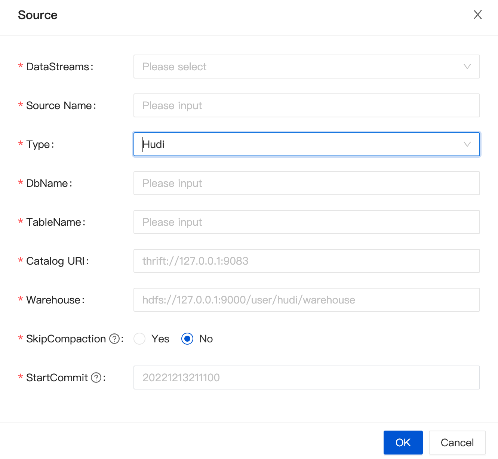
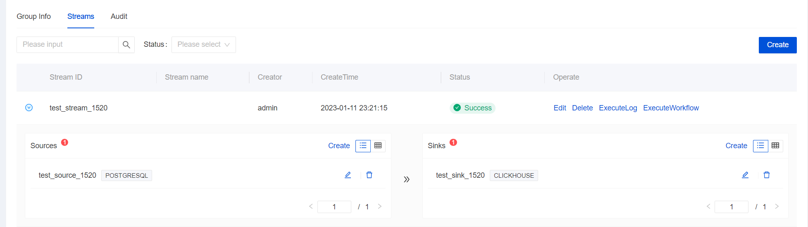

Apache InLong recently released version 1.5.0, which closed about 296+ issues, including 12+ major features and 110+ optimizations. Mainly completed the addition of StarRocks, Hudi, Doris, Elasticsearch, and other sinks, optimization of the Dashboard experience, refactor the MQ management model, support dirty data processing, full-link Apache Kafka support, and TubeMQ C++/Python SDK support for production, etc.
<!--truncate-->

## Abort Apache InLong
As the industry's first one-stop open-source massive data integration framework, Apache InLong provides automatic, safe, reliable, and high-performance data transmission capabilities to facilitate businesses to build stream-based data analysis, modeling, and applications quickly. At present, InLong is widely used in various industries such as advertising, payment, social networking, games, artificial intelligence, etc., serving thousands of businesses, among which the scale of high-performance scene data exceeds 1 trillion/day, and the scale of high-reliability scene data exceeds 10 trillion/day sky.

The core keywords of InLong project positioning are "one-stop" and actual "massive data". For "one-stop", we hope to shield technical details, provide complete data integration and support services, and realize out-of-the-box; With its advantages, such as multi-cluster management, it can stably support larger-scale data volumes on the basis of trillions/day.

## 1.5.0 Overview
Apache InLong recently released version 1.5.0, which closed about 296+ issues, including 12+ major features and 110+ optimizations. Mainly completed the addition of StarRocks, Hudi, Doris, Elasticsearch, and other data stream sinks, optimization of the Dashboard experience, reconstruction of the MQ management model, addition of dirty data processing, full-link Apache Kafka support, and TubeMQ C++/Python SDK support for production, etc. This version has also completed a large number of other features, mainly including the following:

### Agent Module
- Support log collection in CVM scenarios
- Added direct sending Pulsar, sending DataProxy synchronous and asynchronous strategies

### DataProxy Module
- Refactor the MQ management model to support the rapid expansion of new MQ types
- Optimized caching layer to support Apache Kafka message queue
- Added support for BufferQueueChannel

### TubeMQ Module
- Increase data sending and receiving delay statistics
- TubeMQ C++ SDK supports the produce
- TubeMQ Python SDK supports the produce

### Manager Module
- Added Hudi data node and data stream management
- Added StarRocks data node and data stream management
- Optimize Elasticsearch data node and data stream management
- Added data conversion management in Manager Client
- Optimize Apache Kafka message queue management

### Sort Module
- The MySQL Load node inventory phase supports concurrent reading of tables without primary keys
- Added StarRocks, Hudi, Doris, Elasticsearch 5.x data flow support
- Add dirty data processing for Doris, PostgreSQL, Hive, HBase, Elasticsearch, etc.
- Upgraded Iceberg to version 1.1.0
- StarRocks, PostgreSQL, Doris, Hudi and other flows support table-level indicators

### Dashboard Module
- Experience optimization with more than 50 optimization points
- Add JSON, Key-Value, and AVRO formats
- Support ClickHouse, Iceberg, Elasticsearch, MySQL, and other data node management pages
- Added SQLServer, Oracle, MongoDB, and MQTT data source pages

### Other
- Add Spotless code formatting plugin and response pipeline
- Docker-compose comes with Apache Flink environment
- Added Grafana indicator display templates for Agent and DataProxy

## 1.5.0 Feature Introduction
### Support StarRocks, Hudi, Doris, Elasticsearch Sinks
In version 1.5.0, InLong expanded the new data node Connector, supported StarRocks, Hudi, Doris, Elasticsearch, and other flow directions for community user scenarios, and expanded the data warehouse and lake scenarios. These new data nodes are mainly contributed by @liaorui, @featzhang, @kuansix, @LvJiancheng, and other developers.

### Optimization of the Dashboard Experience
Compared with traditional data integration projects, InLong has added concepts such as Group, Stream, and data nodes. Community users using Dashboard for the first time will be confused about the whole process. To reduce the cost of using Dashboard users, InLong has made a lot of optimizations for the Dashboard front-end page, with more than 50 optimization points, and adjusted the concept, process, and display. The figure below shows the process of creating a Stream in 1.5.0, which is more simplified than the previous version. Special thanks to @leezng, @bluewang, @kinfuy for optimizing the Dashboard and @Charles Zhang for the modification suggestions.

### Refactor the MQ Management Model
To quickly support new message queue services (such as RocketMQ) to implement plug-ins, and unify the existing support for Pulsar, Kafka, and TubeMQ, in version 1.5.0, InLong DataProxy refactored the MQ management model, and all MQ types are based on `MessageQueueHandler ` Implement the corresponding `Handler`. Thanks to @woofyzhao and @luchunliang for the implementation of this feature. If you need to develop a new MQ type, you can refer to the DataProxy plug-in guide.

### Support Dirty Data Processing
If there is dirty data that does not meet the data specifications (such as field range exceeding, missing data fields, etc.) when entering the lake into the warehouse, it may cause the user task to fail to write and restart continuously. In version 1.5.0, InLong supports storing unrecoverable dirty data in external storage, including S3 and local logs. At the same time, users can customize the output port of dirty data and can configure "whether to enable dirty data archiving" and "whether to ignore write entry error", as follows to design a UML diagram for dirty data archiving. The realization of this feature is thanks to the support of @yunqingmoswu and @Yizhou-Yang.

### Support Apache Kafka Full-link
In version 1.5.0, the DataProxy, Manager, Sort, and Dashboard modules have completed the full-link support for Apache Kafka. The support for Kafka has gone through two versions, and it is available for production in 1.5.0. When users create data streams Just choose Kafka. The implementation of this feature is thanks to @woofyzhao, @fuweng11, @haifxu for their support.

For more details on the 1.5.0 release, please refer to the release notes, which detail the features, enhancements, and bug fixes for this release.

### Follow-up planning
In the following versions, Apache InLong will add multi-tenant management, standardize data flow, resources, and permissions of projects, clusters, and users, and optimize the performance and stability of various data sources, Agent management, etc., expect more developers to participate and contribute.