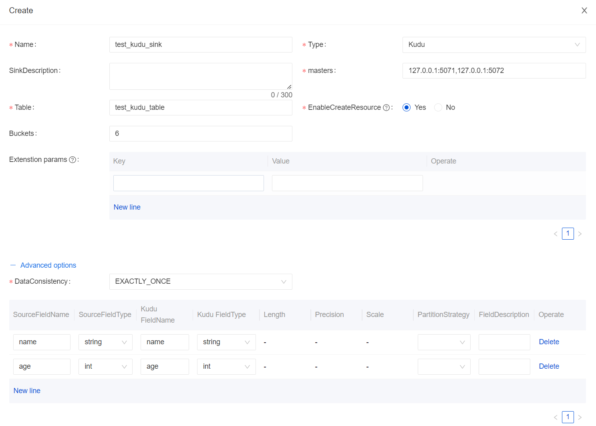
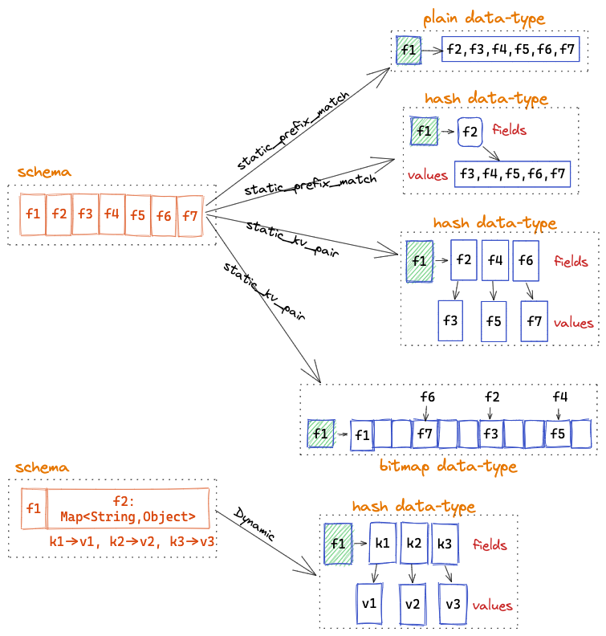
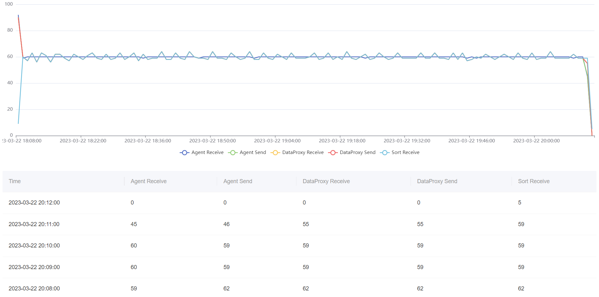

Apache InLong recently released version 1.6.0, which closed about 202+ issues, including 11+ major features and 80+ optimizations. Mainly completed the addition of Kudu data stream, improvement of Redis data stream, the addition of MQ cache cluster selector strategy, optimization of Audit ID allocation rules, the addition of data node connection testing, optimization of Sort Audit reconciliation benchmark time, and expansion of Audit support for using Kafka to cache audit data.
<!--truncate-->

## About Apache InLong
As the industry's first one-stop open-source massive data integration framework, Apache InLong provides automatic, safe, reliable, and high-performance data transmission capabilities to facilitate businesses to build stream-based data analysis, modeling, and applications quickly. At present, InLong is widely used in various industries such as advertising, payment, social networking, games, artificial intelligence, etc., serving thousands of businesses, among which the scale of high-performance scene data exceeds 1 trillion lines per day, and the scale of high-reliability scene data exceeds 10 trillion lines per day.

The core keywords of InLong project positioning are "one-stop" and  "massive data". For "one-stop", we hope to shield technical details, provide complete data integration and support services, and implement out-of-the-box; With its advantages, such as multi-cluster management, it can stably support larger-scale data volumes based on trillions lines per day.

## 1.6.0 Overview
Apache InLong recently released version 1.6.0, which closed about 202+ issues, including 11+ major features and 80+ optimizations. Mainly completed the addition of Kudu data stream, improvement of Redis data stream, the addition of MQ cache cluster selector strategy, optimization of Audit ID allocation rules, the addition of data node connection testing, optimization of Sort Audit reconciliation benchmark time, and expansion of Audit support for using Kafka to cache audit data, mainly including the following:

### Agent Module
- Improved the file collection stability and fixed multiple collection bugs
- Fixed multiple bugs such as MQTT, MongoDB

### DataProxy Module
- Added MQ cluster Selector strategy to reduce the number of producers
- Added Audit report for the new MQ Sink

### Manager Module
- Optimized the Audit ID distribution rules and supported multiple Load Data Node audit
- Optimized Clickhouse data node metadata configuration and management
- Added connection test for new Data Node, check the availability of nodes
- Added Pulsar Multi-Cluster Topic and Subscription Management
- Fixed multiple data stream management and status management bugs

### Sort Module
- Added data Audit for Kafka Source connector
- Added new CSV format and dirty data archive for Doris connector
- Supported Array, Map, Struct, and other complex types
- Optimized Pulsar Connector to solve the issue of data loss
- Fixed the writing in chaos for Canal-JSON metadata fields
- Optimized reconciliation benchmark time for Sort Audit

### Dashboard Module
- Continue to optimize the Dashboard experience and reduce the threshold for first users
- Added node management for Redis, Kudu, and other data nodes
- Optimized data node parameters such as PostgreSQL, Kafka, Redis, etc.
- Simplified the Agent node IP selection strategy
- Added connection test pages for data nodes

### Other
- Supported using Kafka as cache MQ for Audit
- Audit uniformly obtains the MQ cluster from Manager
- Optimized deployment steps such as Standalone, Docker-Compose, Kubernetes, and other deployment steps

## 1.6.0 Feature Introduction
### Supported Kudu data stream
Apache Kudu is an open-source storage engine by Cloudera, which can provide low-delayed random read and write and efficient data analysis capabilities simultaneously. In version 1.6.0, InLong supports the Kudu data stream, including adding Kudu Connector, metadata management, metrics, etc. Kudu data stream contributed by @featzhang independently. Interested users can make an installation and experience.


### Improved the of Redis data stream
Redis is a viral open-source memory database with high performance and rich data structure. In version 1.6.0, InLong perfects the Redis data stream, adding SinkFunction, metadata management, indicators, and Dashboard pages in Redis Connector. Supported data formats like Redis's PLAIN, Hash, and Bitmap and realized Redis Schema conversion through the SCHEMAMAPPING mechanism. Redis data streams through the SCHEMA mapping mode, and SCHEMA can be converted into different [Redis Data-Type] (https://redis.io/docs/data-types/tutorial/). Redis data stream is mainly contributed to and fulfilled by @featzhang independently. For details, please refer to [INLONG-7060] (https://github.com/apache/inlong/issues/7060).


### Added MQ cluster Selector strategy
In the multi-MQ cluster scene, if DataProxy is connected to all MQ clusters simultaneously, the number of producers in the MQ cluster will surge. At the same time, the amount of metadata of ZooKeeeper is excess, which will cause OutOfMemory. In version 1.6.0, InLong increased the selector strategy of the MQ cache cluster level (mainly for Apache Pulsar). As a result, the DataProxy node can only choose some MQ clusters under the same tag for production, thereby reducing the number of producer connections and Zookeeper metadata. @Luchunliang mainly develops this feature. For details, please refer to [INLONG-7231] (https://github.com/apache/inlong/pull/7236).


### Optimized the Audit ID distribution rules
In the original design of InLong Audit, the receiving and sending number of each module is an independent audit ID, which is used to record the receiving and sending number for each module. There is a defect in this scheme. If InLong Sort sorted data to multiple targets at the same time (such as writing Hive and Clickhouse), the audit ID cannot distinguish different data streams for the Sort. In version 1.6.0, the Audit ID distribution rules are optimized, the different data stream has a different audit ID, achieving data audit of multiple sorting targets for the same data stream. This feature also involves changes in Manager and Sort module. It is developed and implemented by @FuWeng11 and @EMSNAP. For details, please refer to [INLONG-7389] (https://github.com/apache/inlong/pull/7390), [INLONG-7232] (https://github.com/apache/inlong/pull/7233), and [INLONG-7503] (https://github.com/apache/inlong/pull/7552).
```sql
('audit_sort_hive_input', 'HIVE', 0, '7'),
('audit_sort_hive_output', 'HIVE', 1, '8'),
('audit_sort_clickhouse_input', 'CLICKHOUSE', 0, '9'),
('audit_sort_clickhouse_output', 'CLICKHOUSE', 1, '10'),
('audit_sort_es_input', 'ELASTICSEARCH', 0, '11'),
('audit_sort_es_output', 'ELASTICSEARCH', 1, '12'),
('audit_sort_starrocks_input', 'STARROCKS', 0, '13'),
('audit_sort_starrocks_output', 'STARROCKS', 1, '14'),
('audit_sort_hudi_input', 'HUDI', 0, '15'),
('audit_sort_hudi_output', 'HUDI', 1, '16'),
('audit_sort_iceberg_input', 'ICEBERG', 0, '17'),
('audit_sort_iceberg_output', 'ICEBERG', 1, '18'),
('audit_sort_hbase_input', 'HBASE', 0, '19'),
('audit_sort_hbase_output', 'HBASE', 1, '20'),
('audit_sort_doris_input', 'DORIS', 0, '21'),
('audit_sort_doris_output', 'DORIS', 1, '22')
```

### Added connection test for new Data Node
In the previous version, InLong added data nodes and registered MQ clusters, and did not judge the availability of the cluster. In the new version, InLong adds a connection test for the main data node and InLong system component registration, which enhances the data stream creation. This feature is mainly participated in development by @leosanqing, @Bluewang, and @Fuweng11.


### Optimized reconciliation benchmark time for Sort Audit
Before version 1.6.0, the Sort reconciliation benchmark time is the machine time for data processing. Using this time will cause the full-link reconciliation data to be inaccurate. In this version, the Sort audit reconciliation referred to the design of TimestampedCollector in Apache Flink, replaced the Simple Collector in the original Pulsar Connector, and aligned the audit index. The implementation principle is to set the Timestamp field at the Collector. When obtaining the InLongMsg data transmitted by DataProxy, the reset data time is used as the Audit time record metric when sending the message downstream. The optimized Sort audit index can be aligned with other modules, such as DataProxy, this feature was mainly developed by @Emsnap.


###  Supported using Kafka as cache MQ for Audit
InLong Audit is an independent subsystem that conducts real-time audit reconciliation of the InLong system's Agent, DataProxy, and Sort module's inflow, and outflow. The current amount of audits is minute, hour, and day. In the previous version, InLong Audit only supports the use of Pulsar to cache audit data, and this will increase the cost of user deployment when they chose Kafka. In the entire InLong Audit design, the choice of MQ type should be consistent with the data stream to avoid different use of different use MQ types. In version 1.6.0, in order to achieve the use of the same type of MQ service in Audit modules and data stream, Audit supports the use of Kafka cache audit data to achieve the unity of MQ service selection. This feature is mainly completed by @haifxu and @dockerzhang.


## Follow-up planning
In 1.6.0, the Sort module also fixes multiple bugs such as dirty data archives, metrics, and Connectors. The Dashboard continues to optimize display and approval processes and other experience problems. For more details, please refer to the Release [Changelog] (https: // github. com/Apache/InLong/Blob/Master/Changes.md). In the subsequent version, Apache InLong will add Schema dynamic change, Schema batch import, agent installation, adding more data nodes, looking forward to more developers participating in contributions.