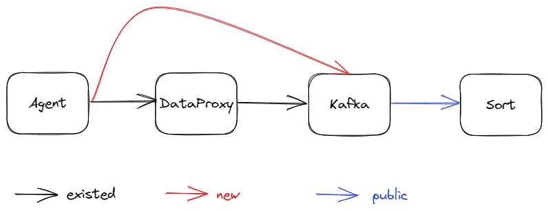
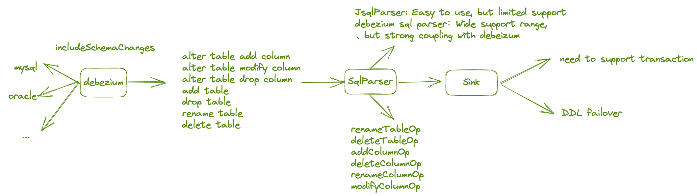
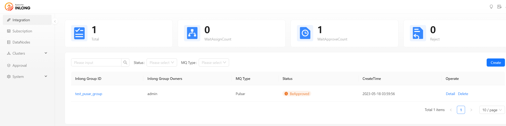

Apache InLong recently released version 1.7.0, which closed about 150+ issues, including 3+ major features and 40+ optimizations. The main features include support for sending data directly to Kafka, MySQL all-database migration with schema change support, GH-OST awareness for MySQL all-database migration, the addition of 4 batch import modes (CSV, SQL, JSON, and Excel), simplification of command line tool for creating data stream configurations, and refactoring of the Dashboard layout.
<!--truncate-->

## About Apache InLong
As the industry's first one-stop open-source massive data integration framework, Apache InLong provides automatic, safe, reliable, and high-performance data transmission capabilities to facilitate businesses to build stream-based data analysis, modeling, and applications quickly. At present, InLong is widely used in various industries such as advertising, payment, social networking, games, artificial intelligence, etc., serving thousands of businesses, among which the scale of high-performance scene data exceeds 1 trillion lines per day, and the scale of high-reliability scene data exceeds 10 trillion lines per day.

The core keywords of InLong project positioning are "one-stop" and "massive data". For "one-stop", we hope to shield technical details, provide complete data integration and support services, and implement out-of-the-box; With its advantages, such as multi-cluster management, it can stably support larger-scale data volumes based on trillions lines per day.

## 1.7.0 Overview
Apache InLong recently released version 1.7.0, which closed about 150+ issues, including 3+ major features and 40+ optimizations. The main features include support for sending data directly to Kafka, MySQL all-database migration with schema change support, GH-OST awareness for MySQL all-database migration, the addition of 4 batch import modes (CSV, SQL, JSON, and Excel), simplification of command line tool for creating data stream configurations, and refactoring of the Dashboard layout. This version also includes a large number of other features, mainly consisting of:

### Agent Module
- Support for sending data directly to Kafka, bypassing DataProxy
- Agent optimization, improving file collection and transmission performance
- Fixed the issue of Reader creation failure during MySQL data collection

### DataProxy Module
- Simplify common configuration and related control logic
- Code optimization, cleaning up invalid configurations in ConfigManager

### Manager Module
- Add PostgreSQL and Redis data node management
- Add heartbeat timeout status for data sources
- Add 4 batch import modes: CSV, SQL, JSON, and Excel
- Simplify command-line tools, including data stream creation logic
- Support restarting and stopping data source tasks in data streams
- Add connectivity tests for Redis and Kudu

### Sort Module
- Mask sensitive information of Flink SQL-related data sources/targets in logs
- Optimize the logic for calculating object byte size and related metrics
- Support extracting DDL and operations from raw data
- Add rate control when writing to Iceberg
- Support schema changes in MySQL full-database migration
- In full-database migration, MySQL Connector supports detecting GH-OST DDLs

### Dashboard Module
- Add CSV, SQL, JSON, and Excel batch import pages for 4 import modes
- Optimize Clickhouse flow configuration, supporting ttl/engine and other configurations
- Refactor Dashboard layout, improving display experience
- Optimize the creation process for data sources and data targets

### Other
- Fix multiple MySQL-related security vulnerabilities
- TubeMQ Golang SDK supports production, completing the first phase of development
- Optimize InLong development tool support for MacOS and Linux
- Optimize Pulsar Client dependency to reduce installation package size

## 1.7.0 Feature Introduction
### Support for sending data directly to Kafka
In previous versions, InLong supported sending data directly from Agent to Pulsar without going through DataProxy. With this design, users with simple data scenarios and who want to ensure data integrity as much as possible can reduce their dependency on DataProxy. For users accustomed to using Kafka, version 1.7.0 supports the feature of sending data directly from Agent to Kafka. Thanks to @wangpeix for the complete contribution, and details can be found in INLONG-7783. If you want to experience this feature, you can choose "Send to MQ, and respond after MQ receives" during the data stream approval process.



### MySQL all-database migration with schema change support
As community users delve deeper into using InLong, the drawbacks of not supporting schema changes become increasingly apparent. After the source end changes the DDL, the task needs to modify the configuration and restart, significantly increasing operational costs. In the current version, InLong supports automatic schema change capabilities. Upstream data sources can perceive Create, Alter, Drop, Truncate, and Rename DDL operations and synchronize these operations downstream. Meanwhile, downstream data sources can respond to upstream DDL changes and process them accordingly, supporting different processing strategies. For more details, refer to INLONG-7553. Thanks to @Emsnap, @yunqingmoswu, and @lordcheng10 for contributing to this feature. The following diagram illustrates the core process:



In the database, DDL messages are perceived by Debezium in the CDC. At this point, the data obtained is a single DDL statement, such as "DROP TABLE A". This statement is a field in the Debezium JSON. The DDL statement is then parsed into a DDL model by JSQLParser. This model parses common DDL messages and processes them into a JSON format that is easy for the program to handle. The DDL model will be sent to the Sink Operator in Flink as data, and the Operator will process the DDL model.

### GH-OST awareness for MySQL all-database migration
GH-OST (GitHub Online Schema Migration) is a trigger-free online schema migration solution for MySQL released by GitHub. It is testable and provides pause, dynamic control/reconfiguration, auditing, and many operational privileges. Throughout the migration process, it generates minimal workload on the primary server and is separated from the existing work on the migrated tables. By supporting GH-OST-aware DDL, the MySQL Connector can correctly handle table structure changes caused by GH-OST while capturing data changes. Thanks to @e-mhui for the complete contribution, and details of this feature can be found in INLONG-7554. The following diagram illustrates the core process:


First, after enabling the automatic DDL response for MySQL CDC, the ghc, gho, and del tables generated by GH-OST are also captured. Second, when perceiving the changes made by GH-OST to the gho table, the gho table in the DDL statement is replaced with the source table and stored in the state. Finally, after GH-OST completes the entire change process for the source table, the DDL statements previously stored in the state are sent downstream.

### Addition of 4 batch import modes (CSV, SQL, JSON, and Excel)
When creating data stream input metadata fields, we need to enter information such as name, type, and description in sequence. If we need to input hundreds or thousands of field information, this processing method is extremely inefficient. In version 1.7.0, InLong has added four batch import modes for CSV/SQL/JSON/Excel formats. Users only need to refer to the template for each format and fill in the selected information to achieve one-time import. Many thanks to @featzhang and @fuweng11 for their participation in the development of this feature. The four batch import modes are now supported by both front-end and back-end, and you can download the latest version for direct use.


### Simplification of command line tool for creating data stream configurations
In the before version, when creating a data stream using the command line, the JSON file content required was complex, and the file structure was not clear enough, making the threshold for users to create data streams through the command line very high. Additionally, when users wanted to reuse the file to create a new data stream, they had to modify many repetitive fields, such as inlongGroupID and inlongStreamID. In version 1.7.0, InLong has optimized the data stream configuration JSON structure and field configuration. Users can simply add Source/Sink content according to their data stream requirements, making creating a data stream much simpler than before. For more details, see INLONG-7778, and many thanks to @haifxu for the contribution. 
The following example is a template for creating a File -> Pulsar -> Clickhouse in the new version:

```json
{
    "groupInfo": {
        "inlongGroupId": "test_group_ctl",
        "inlongClusterTag": "default_cluster",
        "mqType": "PULSAR"
    },
    "streamInfo": {
        "inlongStreamId": "test_stream_ctl",
        "fieldList": [
            {
                "fieldName": "name",
                "fieldType": "string"
            }
        ],
        "sourceList": [
            {
                "sourceType": "FILE",
                "sourceName": "test_source_ctl",
                "agentIp": "127.0.0.1",
                "pattern": "/data/test.txt"
            }
        ],
        "sinkList": [
            {
                "sinkType": "CLICKHOUSE",
                "sinkName": "test_sink_ctl",
                "dataNodeName": "test_clickhouse",
                "dbName": "db_test",
                "tableName": "table_test",
                "flushInterval": 1,
                "flushRecord": 1000,
                "retryTimes": 3,
                "engine": "Log",
                "isDistributed": 1,
                "sinkFieldList": [
                    {
                        "sourceFieldName": "name",
                        "sourceFieldType": "string",
                        "fieldName": "name",
                        "fieldType": "string"
                    }
                ]
            }
        ]
    }
}
```

### Refactoring of the Dashboard layout
In version 1.7.0, the community has refactored the overall layout of the Dashboard, including adjusting the top-bottom layout to a left-right layout (moving the navigation bar to the left), adding a dark theme, adding icons to the main menu, adjusting the data source selection display and process, etc. This adjustment has improved the user experience of the Dashboard. Special thanks to @leezng and @bluewang for their contributions. For more details, see INLONG-7734.



## Follow-up planning
In version 1.7.0, the community has also improved the performance and stability of Agent file collection, while TubeMQ has completed the first phase of the Golang SDK production. Additionally, Sort can now consume using the subscription groups allocated by the Manager. In subsequent versions, InLong will support multiple Apache Flink versions, including not only the current Flink 1.13 but also Flink 1.15. Furthermore, tenant management will be added to unify the models of InLong projects, users, and resources. We look forward to more developers participating and contributing.