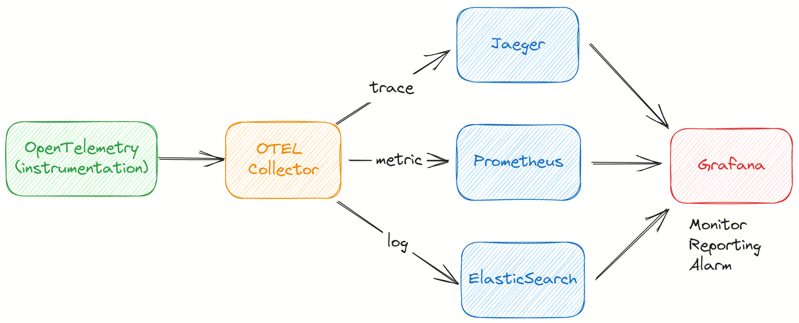

Apache InLong recently released version 1.9.0, which closed about 200+ issues, including 2+ major features and 30+ optimizations. The main improvements include building observability capabilities and optimizing DataProxySDK-CPP. After the release of version 1.9.0, Apache InLong has enhanced its observability capabilities in areas such as end-to-end tracing, metric collection, access and visualization, and alerting. This addresses the need for rapid problem diagnosis and performance optimization during development and operations, improving the user experience for Apache InLong's operation and maintenance.
<!--truncate-->

## About Apache InLong

As the industry's first one-stop, full-scenario, open-source massive data integration framework, Apache InLong provides automatic, safe, reliable, and high-performance data transmission capabilities to facilitate businesses to build stream-based data analysis, modeling, and applications quickly. At present, InLong is widely used in various industries such as advertising, payment, social networking, games, artificial intelligence, etc., serving thousands of businesses, among which the scale of high-performance scene data exceeds 1 trillion lines per day, and the scale of high-reliability scene data exceeds 10 trillion lines per day.

The core keywords of InLong project positioning are "one-stop" and "massive data". For "one-stop", we hope to shield technical details, provide complete data integration and support services, and implement out-of-the-box; With its advantages, such as multi-cluster management, it can stably support larger-scale data volumes based on trillions of lines per day.

## Overview of version 1.8.0

Apache InLong recently released version 1.9.0, which closed about 200+ issues, including 2+ major features and 30+ optimizations. The main improvements include building observability capabilities and optimizing DataProxySDK-CPP. After the release of version 1.9.0, Apache InLong has enhanced its observability capabilities in areas such as end-to-end tracing, metric collection, access and visualization, and alerting. This addresses the need for rapid problem diagnosis and performance optimization during development and operations, improving the user experience for Apache InLong's operation and maintenance.

In addition, Apache InLong 1.9.0 includes a large number of other features, mainly including:

### Agent module

- Support end-to-end log tracking and reporting, enhancing observability capabilities
- Remove metric reporting deregistration logic during TaskManager initialization
- Remove capacity limit for setting blacklist
- Stop sending task snapshots to Manager
- Optimize Agent's JVM parameters

### DataProxy module

- Optimize metadata update logic
- Optimize file metric output format
- Optimize DataProxy metric statistics
- Support configurable logic for configuration loading
- HTTP interface supports callback parameter
- Optimize retry logic after failed sending
- Adjust the IP of messages entering the MQ, from DataProxy node IP to client IP

### Sort module

- Iceberg data source supports Flink 1.15
- Add audit metric reporting for StarRocks connector
- Iceberg supports dynamic metadata updates
- Support for Iceberg data source
- Support dynamic changes in field types for data sources and data targets
- Resolve version compatibility issues between Mysql connector JDBC and Mysql CDC
- Support more DDL types
- Optimize Pulsar output logic for SortStandalone
- Iceberg supports dynamic switching between append and upsert modes
- PostgreSQL connector supports parallel data reading
- Update Kafka single table support for partition addressing based on custom fields
- Doris supports DDL changes
- Data synchronization supports audit metric reporting

### Manager module

- Support Tencent CLS data stream
- Support configurable use of ZooKeeper
- Support end-to-end log tracking and reporting, enhancing observability capabilities
- Support subscription to Pulsar cluster
- Support Iceberg data source configuration
- Support tenant status validation before deleting a tenant
- Optimize Agent heartbeat handling logic
- Openapi supports tenant parameters
- Support parameter validation before testing connection
- Optimize configuration interface for SortSDK
- Add new role INLONG_SERVICE, supporting internal service queries
- Optimize tenant-related permission validation
- Support automatic approval for creating a new tenant
- ManagerClient supports paginated queries for InLong data stream sources and sinks
- ManagerClient tool supports multi-tenant logic
- Remove tenant permission validation from Service layer and DAO layer
- Data sources support multi-tenant configuration

### Dashboard module

- Support management of Pulsar data clusters
- Support output to Pulsar data clusters
- Optimize StarRocks output field configuration
- Support management of Iceberg data sources
- Optimize data synchronization interface
- Optimize password change interface logic
- Optimize field mapping interaction for data synchronization
- Data synchronization supports audit metric display
- Approval management supports data synchronization business
- Optimize tenant management queries
- Data access supports display of processing progress

### Audit module

- Add audit_tag information to distinguish between data sources and data targets
- Optimize audit Proxy log output

### SDK module
- Optimize DataProxySDK-CPP, improving performance and reliability during network instability
- SortSDK supports parallel creation of cache layer consumption
- Optimize failure retry strategy for DataProxySDK-Java
- DataProxySDK-Java adds cache pool and asynchronous sending logic

### TubeMQ module
- Add TubeMQ command-line tool
- TubeMQ Manager adds restart script

### Others

- Add ASF DOAP file
- Add Mysql connector management image
- Optimize third-party dependencies to address security risks

## 1.9.0 Feature Introduction

### Observability Capability Building:

In the application process of Apache InLong, we often encounter the following scenarios:

- Locate the problematic code through detailed link call data (Tracing).
- Query and analyze the abnormal module and associated logs to find the core error information (Logs).
- Open the monitoring dashboard to find abnormal phenomena and locate the abnormal module through queries (Metrics).
- Discover anomalies through various preset alarms (Metrics/Logs).
For this purpose, we investigated the mainstream observability building solutions in the industry, and ultimately, skywalking and opentelemetry entered the selection process. After comparison, we chose opentelemetry, mainly due to the Trace (link tracking) aspect: opentelemetry provides more flexible, convenient, and rich Span customization capabilities, such as adding custom attributes and events. It can be displayed in the backend UI with just development in the code.

#### Implementation Plan

- The application will push the trace, log, and metric data collected through instrumentation to the otel collector using the otlp-exporter.
- The otel collector collects and converts the data, then exports it to Jaeger, Prometheus, and Elasticsearch.
- Grafana configures the three data sources for unified display, query, monitoring, and alerting.

## Follow-up planning

In the 1.9.0 version, the community has also refactored the DataProxy C++ SDK, enriched the Flink 1.15 Connector, and improved data synchronization features. In subsequent versions, InLong will continue to enrich the Flink 1.15 Connector and enhance the scheduling capabilities of data synchronization, and we look forward to more developers participating and contributing.