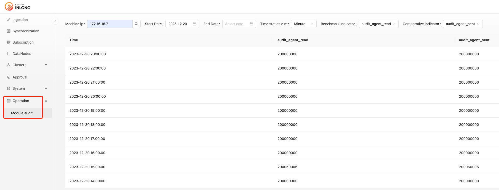
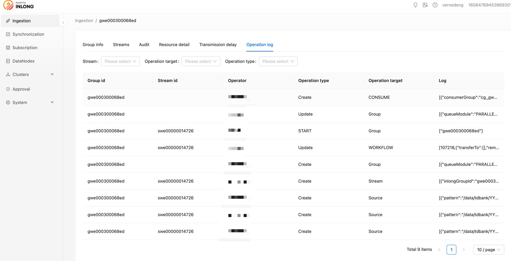

Apache InLong recently released version 1.10.0, which closed about 200+ issues, including 6+ major features and 30+ optimizations. The main features include Manager supporting viewing operation logs, supporting Group migration between clusters, Agent supporting periodic collection and task supplementation, Sort real-time synchronization supporting Transform, supporting MySQL to Iceberg whole database synchronization, and supporting automatic table creation. After the release of 1.10.0, Apache InLong has enriched and optimized Agent function scenarios, added the ability of whole database synchronization and automatic table creation, supported viewing operation logs, solved the demand for quick troubleshooting in development and operation, and optimized the user experience of Apache InLong operation and maintenance.
<!--truncate-->

## About Apache InLong

As the industry's first one-stop, full-scenario, open-source massive data integration framework, Apache InLong provides automatic, safe, reliable, and high-performance data transmission capabilities to facilitate businesses to build stream-based data analysis, modeling, and applications quickly. At present, InLong is widely used in various industries such as advertising, payment, social networking, games, artificial intelligence, etc., serving thousands of businesses, among which the scale of high-performance scene data exceeds 1 trillion lines per day, and the scale of high-reliability scene data exceeds 10 trillion lines per day.

The core keywords of InLong project positioning are "one-stop" and "massive data". For "one-stop", we hope to shield technical details, provide complete data integration and support services, and implement out-of-the-box; With its advantages, such as multi-cluster management, it can stably support larger-scale data volumes based on trillions of lines per day.

## 1.10.0 Version Overview
Apache InLong recently released version 1.10.0, which closed about 200+ issues, including 6+ major features and 30+ optimizations. The main features include Manager supporting viewing operation logs, supporting Group migration between clusters, Agent supporting periodic collection and task supplementation, Sort real-time synchronization supporting Transform, supporting MySQL to Iceberg whole database synchronization, and supporting automatic table creation. After the release of 1.10.0, Apache InLong has enriched and optimized Agent function scenarios, added the ability of whole database synchronization and automatic table creation, supported viewing operation logs, solved the demand for quick troubleshooting in development and operation, and optimized the user experience of Apache InLong operation and maintenance. In Apache InLong 1.10.0 version, a large number of other features have also been completed, mainly including:

### Agent Module
- Support periodic collection and task supplementation
- Global memory control to avoid OOM caused by large business data
- Achieve final consistency between Agent and Manager tasks
- Enrich Agent audit dimensions

### Sort Module
- Support MySQL to Iceberg whole database synchronization
- Support richer Flink 1.15 Connectors: MongoDB, Iceberg, SQLServer, HBase
- Support task status management, able to view real-time synchronization task status
- Real-time tasks support automatic table creation
- Support configuration of Transform

### Manager Module
- Support Sort Standalone management
- Separate transmission protocol and data protocol types
- Support Group cluster switching
- Support query audit data size
- Support viewing operation logs
- Apache Iceberg supports automatic Schema information fetching

### Dashboard Module
- Support displaying resource creators and recent modifiers simultaneously
- Support viewing operation logs
- Approval directory displays Group corresponding to consumer groups
- Support batch parsing of source fields

### Audit Module
- Support automatic creation of required Kafka Topics when the service starts

### SDK Module
- Resolve dependency version conflicts in DataProxy Java SDK
- Update dependency version in DataProxy Go SDK
- Use UUID instead of snowflake algorithm to generate data ID in DataProxy Go SDK
- DataProxy C++ SDK supports dynamic load balancing
- DataProxy C++ SDK supports multi-dimensional resource isolation
- Optimize the ability of DataProxy C++ SDK to access nearby resources in multi-location deployment
- DataProxy C++ SDK supports local disaster recovery
- DataProxy C++ SDK supports dynamic update of DataProxy node information

### Others
- Strengthen protection against request forgery attacks
- Update Snappy version
- Add Master branch protection strategy

## 1.10.0 Version Feature Introduction

### Agent Supports Periodic Collection
In version 1.10.0, InLong adds the ability to perform periodic file collection tasks. The periodic strategy includes daily, hourly, and real-time, and users can specify this strategy when creating a new file data source. At the same time, users can also configure time offsets to delay or advance collection. Thanks to @Justinhuang, @Blue

### Support for viewing Agent audit by IP dimension
In order to better monitor the status of InLong Agent and quickly discover problems in live network operation, in version 1.10.0, users can view different Agent audit indicators based on the IP dimension in the system operation and maintenance -> audit module. Thanks to @fuwen11, @Bluewang, and @Justinhuang for their contributions, for more details, please see INLONG-9443, INLONG-9446, and INLONG-9458.

### Manager adds Group operation logs
In version 1.10.0, InLong supports viewing operation logs, including the creation and modification of Group/Stream, and the addition and removal of Sink/Source operations. Operation logs can quickly help users track historical behavior, allowing users to quickly view key data stream operations for easier live network maintenance. Users can view all operation logs under a Group in the Data Access -> Group Details -> Operation Logs section.

### New ability to switch Group clusters
In order to support resource integration and cost allocation capabilities, InLong introduced the Group cluster switching feature in version 1.10.0. Direct switching will inevitably lead to problems such as unsynchronized metadata between modules and data loss. To achieve seamless cluster switching for businesses, Group cluster switching is divided into three states and two steps. Thanks to @Vernedeng for the contribution, for more details, please see INLONG-9314.

Before switching clusters, the data is on Cluster 1.

After starting the cluster switch, the original routing configuration is copied, new data is written to Cluster 2, and the unsent data on Cluster 1 continues to be sent.

### C++ SDK supports multi-dimensional isolation
In the old version of the C++ SDK, all Groups competed for the internal resources of the SDK. If a particular Group has a particularly large flow, it will inevitably squeeze other Groups, causing small flow Groups to be unable to obtain resources. In version 1.10.0, DataProxy C++ SDK supports resource isolation at the Cluster and Group levels, and users can enable or disable it by configuring enable_isolation. Thanks to @doleyzi for the contribution, for more details, please see INLONG-9213.

## Future plans
In version 1.10.0, the community refactored InLong Agent, enriched Flink 1.15 Connector, and completed support for viewing operation logs and other functions. In subsequent versions, InLong will continue to enrich Flink 1.15 Connector, enhance Transform capabilities, unify DataProxy data protocols, support integration with Apache Paimon, optimize Dashboard experience, etc. We look forward to more developers participating and contributing.

