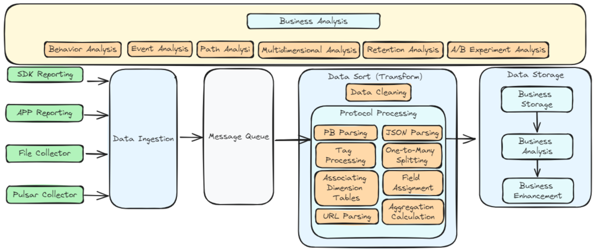
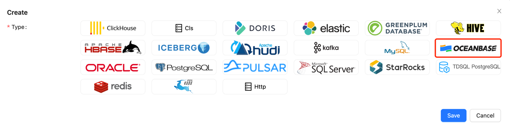
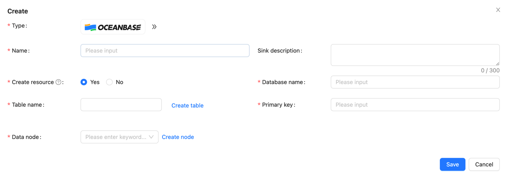
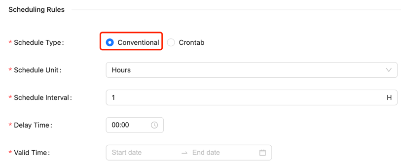
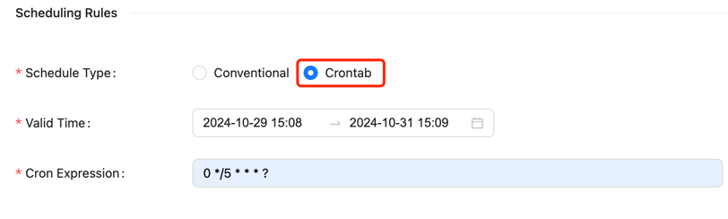

Apache InLong（应龙）has recently released version 2.0.0, which has closed over 315 issues, including more than 6 major features and over 96 optimizations. 
The main accomplishments include support for the Transform SDK and integrated into the ES Sink of Sort Standalone, OceanBase data source management,
adaptive resource configuration for Sort tasks, HTTP output for SortStandalone, community documentation restructuring, and full-link support for offline synchronization.

After the 2.0.0 release, Apache InLong has added transform capabilities, improved support for the Agent Pulsar Source, enriched the capabilities and applicable scenarios of Sort, 
and optimized the display of the InLong Dashboard, addressing various issues encountered during the operation and maintenance of InLong.

<!--truncate-->

## About Apache InLong
As the industry's first one-stop, all-scenario massive data integration framework, Apache InLong provides automated, secure, reliable,
and high-performance data transmission capabilities, enabling businesses to quickly build stream-based data analysis, modeling, and applications. 
Currently, InLong is widely used in various industries including advertising, payment, social networking, gaming, and artificial intelligence,
serving thousands of businesses, with high-performance scenarios processing over hundreds of billions of records per day and highly reliable scenarios
handling over tens of trillions of records per day.

The core keywords for InLong's project positioning are "one-stop," "all-scenario," and "massive data." For "one-stop," 
we aim to shield technical details, provide complete data integration and supporting services, and achieve out-of-the-box usability; 
for "all-scenario," we aim to offer comprehensive solutions covering common data integration scenarios in the big data field;
for "massive data," we hope to leverage architectural advantages such as layered data links, fully extensible components, 
and built-in multi-cluster management to stably support even larger data volumes based on hundreds of billions of records per day.

## From 1.0 to 2.0
In version 1.13.0, InLong added the underlying framework for offline synchronization tasks and supported Flink's stream-batch integration capability.
Version 2.0.0 fixed several issues with the built-in scheduler, connected the front and back ends, and enabled the configuration of offline 
synchronization tasks on the Dashboard page, providing full process support for the configuration and management of offline synchronization tasks.
Based on this capability, users can manage both real-time and offline synchronization tasks uniformly.

In historical versions, InLong's standard and lightweight architecture focused on data collection, reporting, and data storage in lakes,
with relatively weak support for fine-grained operations on data. Therefore, after version 1.13.0, a very important task for the InLong community
was to enhance support for Transform capabilities, allowing users to perform more flexible processing of data at any stage of data integration.

Transform is based on general SQL semantics and has now completed the framework for Transform capabilities, supporting over 180 custom Transform functions 
while ensuring the extensibility of Transform from a design perspective, allowing users to flexibly define new Transform capabilities.

In addition to the Transform feature, another focus of the InLong community has been the restructuring of community documentation. 
On one hand, we have filled in missing documentation and updated outdated content; 
on the other hand, we have reorganized the documentation according to user guidance, core system introduction, development guidance, and system management,
providing better explanations from user, developer, and operational perspectives. With the restructured documentation,
users can more easily utilize InLong and better understand its operational and management mechanisms, 
as well as quickly develop custom plugins to meet specific needs.

Overall, by the time version 2.0.0 was released:
- InLong has achieved full-link support for offline synchronization tasks, possessing stream-batch integrated data processing capabilities.
- InLong has greatly enriched the capabilities of T, laying the foundation for future support of ELT/EtLT Pipelines.
- The optimization of documentation has made InLong more user-friendly, better attracting users to understand, use, and co-build InLong.

InLong now supports both standard and lightweight architectures, stream-batch integrated data synchronization capabilities, and flexible data Transform capabilities. Therefore, the community has decided to upgrade InLong to version 2.0.0, marking the official entry of Apache InLong into the 2.0 era.

## 2.0.0 Overview
Apache InLong has recently released version 2.0.0, which has closed over 315 issues, including more than 6 major features and over 96 optimizations, achieving the following:
- Support for Transform SDK and integrated into the ES Sink of Sort Standalone
- New capabilities for OceanBase data source management
- Adaptive resource configuration for Sort tasks
- HTTP output for Sort Standalone
- Restructured and optimized community documentation
- Stream-batch integration, support for offline synchronization capabilities

In addition to the above features, version 2.0.0 also:
- Improved support for the Agent Pulsar Source
- Enriched the capabilities and usage scenarios of Sort
- Fixed some issues encountered during InLong operation and maintenance
- Optimized the display and user experience of the Dashboard

### Agent Module
- Optimized the Pulsar Source implementation to fix issues with inaccurate consumption offsets.
- Added support for data re-insertion filtering capabilities.
- Introduced the ability to report Agent status.
- Updated the implementations for Redis, Oracle, SQLServer, and MQTT data sources.

### Dashboard Module
- Added an offline synchronization configuration page for data synchronization.
- Optimized the style and structure of data preview.
- Introduced a heartbeat display page for cluster node management.
- Added cluster name display to data source information.
- Supported custom ASCII code options for source data field delimiters.
- Merged metric items with other items on the module review page.
- Enabled delete operations for cluster management and template management.
- Fixed errors in data preview.
- Added support for OceanBase data sources.

### Manager Module
- Added support for OceanBase data source management.
- Introduced TubeMQ configuration capabilities for Sort Standalone.
- Supported asynchronous installation of Agent and the display of Agent installation logs.
- Enabled configuration for HTTP type Sink.
- Supported paginated queries for detailed information on sorting tasks.
- Data preview now supports KV data types, escape characters, and filtering Tube data by StreamId.
- Added data filtering functionality.
- Permission optimization: Regular users are not allowed to modify Group information if they are not the Owner.
- Fixed issues with offline synchronization updates.
- Resolved alignment issues in data preview fields.

### SDK Module
- Transform supports data partitioning using GroupBy semantics.
- Transform can parse Map nodes in JSON or PB data.
- Transform JSON data source supports multidimensional arrays.
- Transform supports ELT functionality.
- Transform supports configuration and parsing of Transform annotations.
- Transform supports various data source types: JSON, PB, XML, YAML, BSON, AVRO, ORC, PARQUET, etc.
- Transform supports arithmetic functions: ceil, floor, sin, cos, cot, tanh, cosh, asin, atan, mod, etc.
- Transform supports date and time functions: year, quarter, month, week, from_unixtime, unix_timestamp, to_timestamp, etc.
- Transform supports string functions: substring, replace, reverse, etc.
- Transform supports common encoding and encryption functions: MD5, ASCII, SHA.
- Transform supports numeral and bitwise operation functions: HEX, Bitwise.
- Transform supports compression and decompression functions: GZIP, ZIP, etc.
- Transform includes other common functions: case conversion, IN, NOT IN, EXISTS, etc.
- DataProxy Java SDK: Shaded Native Library to reduce conflicts with other SDKs.
- DataProxy Java SDK: Optimized sending jitter issue during metadata changes.
- DataProxy CPP SDK: Improved memory management and optimized build scripts.
- DataProxy CPP SDK: Supports multiple protocols.
- DataProxy CPP SDK: Added message manager and optimized data reception capabilities.
- DataProxy CPP SDK: Supports forking subprocesses in DataProxy CPP SDK.
- DataProxy Python SDK: Updated build scripts and supports skipping the CPP SDK build step.

### Sort Module
- Adjust resources required for Sort tasks based on data scale.
- Added support for OceanBase data source.
- Flink 1.18 now supports Elasticsearch 6 and Elasticsearch 7 connectors.
- SortStandalone Elasticsearch Sink supports Transform.
- SortStandalone supports HTTP Sink and batch sorting.
- Connector supports OpenTelemetry log reporting.
- Optimized producer parameters for Kafka connector.
- Added end-to-end test cases for Flink 1.15.

### Audit Module
- Supports global memory control for the audit SDK.
- Optimized daily dimension audit data statistics.
- Audit SDK allows custom local IP settings.
- Unified audit aggregation interval range.
- Resolved Protobuf version conflicts between Audit SDK and other components.

## 2.0.0 Feature Introduction

### New Transform Capabilities
InLong Transform enhances InLong's ability to expand access and distribution capabilities by adapting to a wider range of data protocols and reporting scenarios on the input side,
while accommodating complex and diverse data analysis scenarios on the output side. This improves data quality and collaboration, providing computing capabilities such as connection, 
aggregation, filtering, grouping, value extraction, and sampling, all decoupled from the computation engine.

It simplifies the pre-processing operations for users reporting data, lowers the barriers to data usage, and streamlines the pre-operations required before users can start analyzing data. 
The focus is on the business value of data, achieving the goal of making data "visible and usable."

Transform has a wide range of application scenarios. Here are some typical examples:
- Data Cleaning: During the data integration process, Transform capabilities can effectively eliminate errors, duplicates, and inconsistencies in data from different sources, improving data quality.
- Data Fusion: Combining data from different sources for unified analysis and reporting. Transform capabilities can handle various formats and structures of data, achieving data fusion and integration.
- Data Standardization: Converting data into a unified standard format for cross-system and cross-platform data analysis. Transform capabilities help enterprises achieve data standardization and normalization.
- Data Partitioning and Indexing: To enhance the performance of data queries and analysis, Transform capabilities can dynamically adjust field values for data partitioning and indexing, thereby improving data warehouse performance.
- Data Aggregation and Calculation: In the data analysis process, Transform capabilities can perform complex data aggregation and calculations to extract valuable business information, covering multidimensional data analysis.

Main Features of Transform：
- Support for Rich Data Protocols: Enables integration with a variety of data protocols.
- Decoupled from Computing Engine: Allows flexibility in processing without being tied to a specific computing engine.
- Support for Rich Transformation Functions: Provides a wide range of functions for data transformation.
- Lossless and Transparent Changes: Ensures that changes can be made without data loss or noticeable impact.
- Automatic Scaling: Supports dynamic scaling up and down based on workload.

Currently, Transform supports a variety of data formats and custom functions, allowing users to flexibly process data using SQL. 
Special thanks to contributors such as @luchunliang, @vernedeng, @emptyOVO, @ying-hua, @Zkplo, @MOONSakura0614, and @Ybszzzziz for their efforts. 
For more details, please refer to [Transform SDK Issues](https://github.com/aloyszhang/inlong/blob/master/CHANGES.md#sdk).

### Community Documentation Restructuring
With the continuous development of the InLong community, the capabilities of InLong are also constantly enhancing. However, there have been issues with missing or outdated community documentation. 
To address this, the InLong community has initiated a restructuring of the community documentation to better assist users in understanding and utilizing InLong.

Main Content Includes:
  - Optimized Document Structure: Better organization of document content. 
  - Enhanced Quick Start Examples:
    - Offline synchronization usage examples
    - Transform SDK usage examples
    - Data subscription usage examples
    - HTTP message reporting usage examples
  - Improved SDK Documentation:
    - DataProxy: C++, Java, Golang, Python SDKs, and HTTP data reporting manuals
    - TubeMQ SDK: C++, Java, Golang SDK usage manuals
  - Enhanced Development Guidelines:
    - Code compilation guidelines
    - Documentation for data protocols of each component
    - Documentation for extension development of each component
    - REST API documentation
  - Improved Management Articles: Documentation on user management, approval management, tenant management, node management, cluster management, tag management, template management, and agent management.

Currently, the community documentation has seen significant improvements in usage guidelines, development guidelines, and management guidelines. 
Special thanks to contributors such as @aloyszhang, @fuweng11, @vernedeng, @luchunliang, @gosonzhang, @doleyzi, @baomingyu, @justinwwhuang, and @wohainilaodou for their contributions to the documentation improvement.
For more details, please refer to the [official website](https://inlong.apache.org/docs/next/introduction).

### Support for OceanBase Data Source
OceanBase Database is a distributed relational database characterized by high availability and scalability, suitable for large-scale data storage and processing scenarios. InLong version 2.0.0 adds support for OceanBase data sources, allowing data to be imported from data sources into OceanBase.

Managing OceanBase data nodes is similar to MySQL. To create a new OceanBase node, you need to fill in the node name, type (OceanBase), username, password, address, and other key information.

To write data into OceanBase, you first need to create a data target of type `OceanBase`.

Then fill in the relevant information, including the name, data node information, database and table names of the data target, and the primary key information of the target table.

Thanks to @xxsc0529 for their contributions to this feature. For more details, please refer to [INLONG-10700](https://github.com/apache/inlong/pull/10700), [INLONG-10701](https://github.com/apache/inlong/pull/10701), [INLONG-10704](https://github.com/apache/inlong/pull/10704).

### Dynamic Resource Calculation for Sort Tasks
The total resources (task parallelism) for Flink Sort Jobs come from the configuration file `flink-sort-plugin.properties`, meaning that all submitted sorting jobs will use the same amount of resources. When the data scale is large, resources may be insufficient, and when the data scale is small, resources may be wasted.

Therefore, dynamically calculating the required resource quantity based on data volume is a much-needed feature. InLong now supports dynamically calculating the total resource requirements for tasks based on data volume, involving two core pieces of data:

- The data volume of the task: This relies on the audit system and is derived from the average data volume recorded by `DataProxy` over the past hour.
- The processing capacity per core: This depends on the maximum number of messages per core configured in the `flink-sort-plugin.properties` file.

With these two pieces of data, the total resource requirements for a task can be calculated. This feature supports a switch to enable or disable it as needed.

Thanks to @PeterZh6 for their contributions to this feature. For more details, please refer to [INLONG-10916](https://github.com/apache/inlong/pull/10916).

### SortStandalone Supports HTTP Sink
Inlong SortStandalone is responsible for consuming data from MQ and distributing it to various data storage modules, supporting multiple data stores such as ElasticSearch and CLS.

Compared to SortFlink, SortStandalone offers higher performance and lower latency, making it suitable for scenarios with high performance requirements.

HTTP is a widely used communication protocol, and SortStandalone supports HTTP output, allowing data to be sent to HTTP interfaces without worrying about specific storage implementations, thus adapting more flexibly to different business scenarios.

The processing flow for HTTP output is as follows:

HTTP output has the following features:

- SortSDK is responsible for consuming data from MQ
- Supports semaphore-based traffic control capabilities
- Metadata management relies on Manager, supporting dynamic updates
- The output protocol is HTTP, decoupling specific storage implementations
- Supports retry strategies

Thanks to @yfsn666 and @fuweng11 for their contributions to this feature. For more details, please refer to [INLONG-10831](https://github.com/apache/inlong/pull/10831) and [INLONG-10884](https://github.com/apache/inlong/pull/10884).

### Full-Link Management of Offline Synchronization

Version 2.0.0 adds full-link management capabilities for offline data synchronization tasks, with configuration methods for offline synchronization tasks similar to real-time synchronization. The specific process is as follows:

First, create the Group information for the synchronization task.

Note that the "Sync Type" should be selected as "Offline."

The second step is to configure the scheduling information for the offline task.

The conventional scheduling configuration requires setting the following parameters:
- Scheduling unit: Supports minute, hour, day, month, year, and single execution (single execution means it will only run once)
- Scheduling cycle: Represents the time interval between two task schedules
- Delay time: Represents the delay time for task startup
- Valid time: Includes start and end times; scheduled tasks will only run within this time range

In addition to conventional scheduling methods, Crontab configuration is also supported.

Crontab scheduling requires setting the following parameters:
- Valid time: Includes start and end times; scheduled tasks will only run within this time range
- Crontab expression: Represents the task cycle, for example, `0 */5 * * * ?`

The third step is to create a Stream and configure data source and target information, which is consistent with real-time synchronization and will not be repeated here. 
For more details, please refer to [Offline Synchronization Pulsar->MySQL](https://inlong.apache.org/docs/next/quick_start/offline_data_sync/pulsar_mysql_example).

## Summary and Future Plans
Version 2.0.0 is the first version of the 2.x series, and the technical capability framework has been basically established. We welcome everyone to use it.
If you have more scenarios and requirements, or encounter issues during use, please feel free to raise issues and PRs.
In future versions, the InLong community will continue to:
- Support more data source collection capabilities.
- Enrich Flink 1.15 and 1.18 connectors.
- Continuously enhance Transform capabilities.
- Provide real-time synchronization support for more data sources and targets.
- Advance offline integration, supporting third-party scheduling engines.
- Optimize SDK capabilities and user experience.
- Improve Dashboard experience.

We also look forward to more developers interested in InLong to contribute and help drive the project's development!