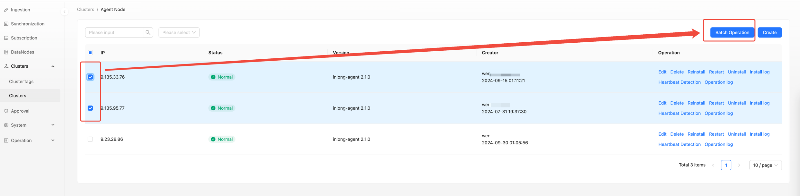
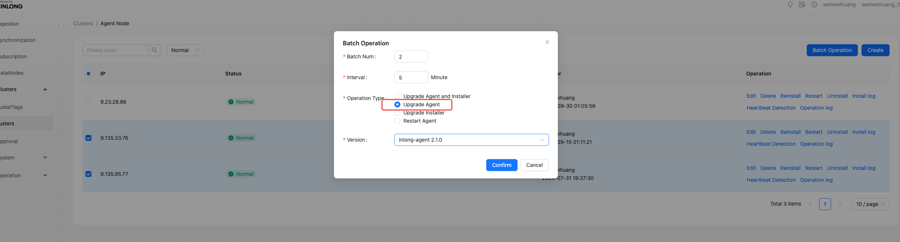
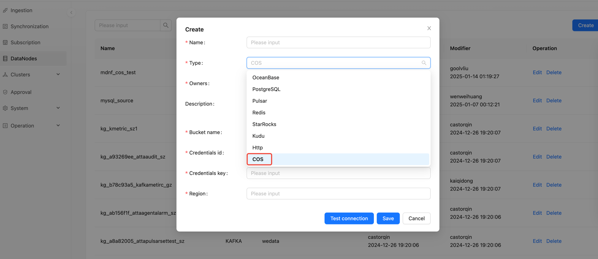
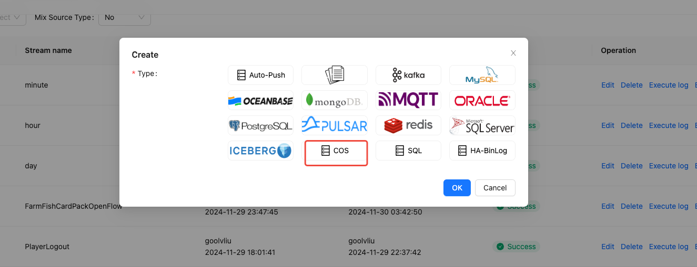
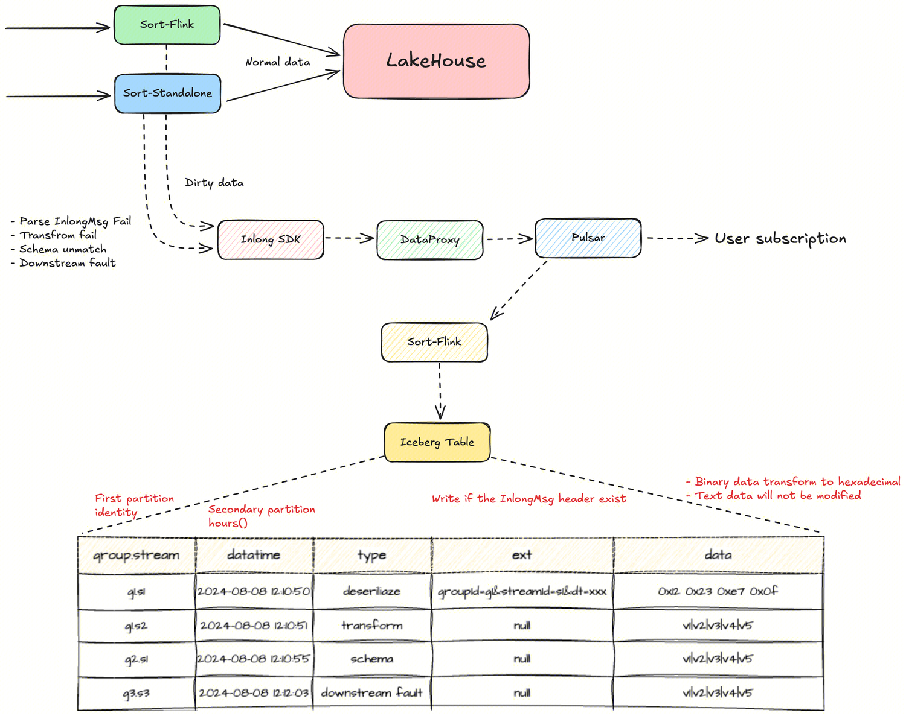

Apache InLong（应龙）has recently released version 2.1.0, which has closed over 120 issue, including more than 4 major features and over 110 optimizations.
The main accomplishments include Dashboard supports batch operation of nodes, Manager supports multiple scheduling engines, Agent supports COS data sources,
Sort supports archiving dirty data through the InLong SDK. Simultaneously optimize the user experience of Apache InLong operations and maintenance. In Apache InLong 2.1.0 version, a large number of other features have also been completed.
<!--truncate-->

## About Apache InLong
As the industry's first one-stop, all-scenario massive data integration framework, Apache InLong provides automated, secure, reliable,
and high-performance data transmission capabilities, enabling businesses to quickly build stream-based data analysis, modeling, and applications.
Currently, InLong is widely used in various industries including advertising, payment, social networking, gaming, and artificial intelligence,
serving thousands of businesses, with high-performance scenarios processing over hundreds of billions of records per day and highly reliable scenarios
handling over tens of trillions of records per day.

The core keywords for InLong's project positioning are "one-stop," "all-scenario," and "massive data." For "one-stop,"
we aim to shield technical details, provide complete data integration and supporting services, and achieve out-of-the-box usability;
for "all-scenario," we aim to offer comprehensive solutions covering common data integration scenarios in the big data field;
for "massive data," we hope to leverage architectural advantages such as layered data links, fully extensible components,
and built-in multi-cluster management to stably support even larger data volumes based on hundreds of billions of records per day.

## 2.1.0 Overview

Apache InLong（应龙）has recently released version 2.1.0, which has closed over 120 issue, including more than 4 major features and over 110 optimizations.
The main accomplishments include 
- Dashboard supports batch operation of nodes
- Manager supports multiple scheduling engines
- Agent supports COS data sources
- Sort supports archiving dirty data through the InLong SDK. 

Simultaneously optimize the user experience of Apache InLong operations and maintenance. In Apache InLong 2.1.0 version, a large number of other features have also been completed.

### Dashboard Module
- Support COS data source
- Support batch operation of agents: restart, upgrade
- Support exporting audit data as CSV files
- Support sorting of audit data and comparison of differences
- Support queries for all types of indicators
- Support data preview field segmentation
### Manager Module
- Support COS data source
- Support managing multiple scheduling engines: AirFlow、DolphinScheduler
- Support dirty data management and querying
- Support querying heartbeat information based on IP
- Limit one IP to only belong to one cluster
- Provide an API for querying of dirty data archiving
### Agent Module
- Support COS data source
- Support quick startup and shutdown
- Support starting multiple instances
- Support data supplementation in chronological order
- Optimize the logic of the Installer process guardian for Agent
- Support supplementary recording based on local data time
### Sort Module
- Added Elasticsearch connector based on Flink 1.18
- Support KV separation on Kafka Sink
- Support audit data reporting
- Tube Connector source supports dirty data archiving
### SDK Module
- Transform SDK adds 7 new functions
- Add Dirty Data Archiving SDK
### Audit Module
- Audit Proxy increases metric reporting
- Audit Store adds metric reporting
- Audit Service increases metric reporting
- Add asynchronous flush audit data interface
### TubeMQ Module
- Write the consumption offset information to a local file
- Optimize the load balancing logic of the Go version SDK
### Others
- Pipeline supports parallel build
- Support Manager to configure volumes
## 2.1.0 Feature Introduction
### Dashboard supports batch operation of agents
This feature is mainly used for the operation of Inlong Agent: mainly for upgrading and restarting:
- After finding the cluster in cluster management, select multiple nodes to operate on and click on batch operation.

  

- Select the operation type and fill in the required parameters for the corresponding operation, then click OK.

  

This feature optimizes the operation and maintenance experience of Inlong: interface based operation eliminates the need to operate DB and increases the cohesion of Inlong:
- Visual Agent version upgrade, which can be upgraded in batches and at regular intervals to control upgrade risks.
- During agent fault recovery, this function can be used to quickly restart.

Thanks to @[wohainilaodou](https://github.com/wohainilaodou) for their contributions to this feature. For more details, please refer to [INLONG-11187](https://github.com/apache/inlong/issues/11187)
### Manager supports multiple scheduling engines
Previously, for offline data synchronization, Inlong only supported Quartz scheduling engine. This version has added two third-party engines: DolphinScheduler and AirFlow.
#### AirFlow engine
- In order to facilitate the maintenance and expansion of AirFlow interface support in the future, AirflowApi interface and BaseAirflowApi abstract class have been designed, and subsequent extensions only need to be based on this foundation.
- Implement a unified request class AirflowServerClient for the interface.
- Add two interceptors in OkHttpClient: AirflowAuthInterceptor for unified authorization of interfaces; LoggingInterceptor is used for logging.

Thanks to @[Zkplo](https://github.com/Zkplo) for their contributions to this feature. For more details, please refer to [INLONG-11400](https://github.com/apache/inlong/issues/11400)
#### DolphinScheduler engine
-Add the DolphinScheduler package to org.apache.inlong.manager.schedule
-Add client and engine for DS, as well as util for operating open APIs for DS
-Add pojo class for DS interaction

Thanks to @[emptyOVO](https://github.com/emptyOVO) for their contributions to this feature. For more details, please refer to [INLONG-11401](https://github.com/apache/inlong/issues/11401)
### Agent supports COS data source
- Create a new COS type node and fill in the corresponding bucket name, credential ID, credential key, and region.

  

- Create a new COS type data source, select the corresponding node, IP, and file path.

  
  

This feature supports direct data collection from COS storage, and businesses do not need to download COS files locally for data collection.
Thanks to @[justinwwhuang](https://github.com/justinwwhuang) for their contributions to this feature. For more details, please refer to [INLONG-11187](https://github.com/apache/inlong/issues/11187)

### Sort supports archiving dirty data through the InLong SDK.
Added the ability to report dirty data to specified InLong Group and Stream ID through the InLong SDK. Users can choose to export dirty data or consume it independently from Pulsar.


The following configuration needs to be added to the Connector:
``` 
'dirty.side-output.inlong-sdk.inlong-auth-key' = 'your auth key',

'dirty.side-output.inlong-sdk.inlong-auth-id' = 'your auth id',

'dirty.side-output.enable' = 'true',

'dirty.side-output.inlong-sdk.inlong-group-id' = 'target_inlong_group_id',
'dirty.side-output.inlong-sdk.inlong-stream-id' = 'target_inlong_stream_id',

'dirty.side-output.labels' = 'groupId=xx&streamId=xx&serverType=tube&dataflowId=xx',

'dirty.side-output.inlong-sdk.inlong-manager-addr' = 'xxx',

'dirty.side-output.connector' = 'inlong-sdk',

'dirty.ignore' = 'true',`
```
Thanks to @[vernedeng](https://github.com/vernedeng) and @[fuweng11](https://github.com/fuweng11) for their contributions to this feature. For more details, 
please refer to [INLONG-11481](https://github.com/apache/inlong/issues/11481) and [INLONG-11508](https://github.com/apache/inlong/issues/11508)


## Future Plans
In version 2.1.0, we have enriched and improved our operational capabilities. Welcome everyone to use it. If you have more scenarios and requirements, 
or encounter any problems during use, please feel free to raise issues and PR. In future versions, the InLong community will continue to:

- Support more data source collection capabilities

- Enrich Flink 1.15, 1.18 Connector

- Continuously enhance Transform capabilities.

- Provide real-time synchronization support for more data sources and targets.

- Optimize SDK capabilities and user experience

- Optimize Dashboard experience


We also look forward to more developers interested in InLong to contribute and help drive the project's development!