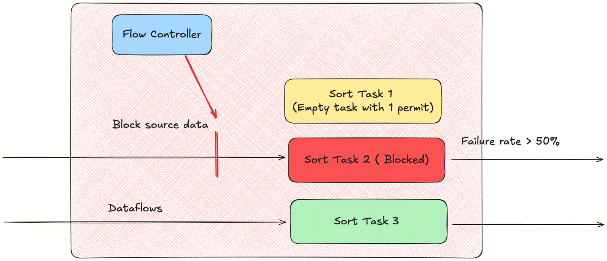

Apache InLong (应龙) recently released version 2.2.0, which resolved 87 issues, including 3 major features and 80+ optimizations. Key enhancements focus on improving Agent stability and resource management in data collection, multi-language SDK support with performance optimizations, and enhanced traffic control capabilities for Sort. This version also optimizes the operational and maintenance experience for Apache InLong. Additionally, numerous other features were implemented in Apache InLong 2.2.0.
<!--truncate-->

## About Apache InLong

As the industry's first one-stop, all-scenario massive data integration framework, Apache InLong (Yinglong) delivers automated, secure, reliable, and high-performance data transmission capabilities. It enables businesses to rapidly build stream-based data analysis, modeling, and applications. Currently, InLong is widely used across industries such as advertising, payment, social media, gaming, and artificial intelligence, serving thousands of business use cases. It handles over a million billion records/day in high-performance scenarios and over a hundred billion records/day in high-reliability scenarios.

The core positioning of InLong revolves around three keywords: "one-stop," "all-scenario," and "massive data." For "one-stop," InLong aims to shield technical complexities by providing complete data integration and supporting services for out-of-the-box usability. For "all-scenario," it offers comprehensive solutions covering common data integration scenarios in big data ecosystems. For "massive data," its architecture leverages data pipeline layering, fully extensible components, and built-in multi-cluster management to stably support data scales beyond millions of billions of records/day.

## Overview of Version 2.2.0

Apache InLong (应龙) recently released version 2.2.0, which resolved 87 issues, including 3 major features and 80+ optimizations. Key enhancements include:

- **Agent**: Improved stability in data collection and resource management capabilities
- **SDK**: Multi-language support and performance optimizations
- **Sort**: Enhanced traffic control capabilities

This version also optimizes the operational and maintenance experience for Apache InLong. Other significant features are detailed below.

### Dashboard Module
- Fixed page refresh issues after switching
- Optimized user login verification logic

### Manager Module
- Added support for SQL data sources
- Enhanced JDBC validation
- Enabled configuration of Inlong Properties metadata for Pulsar data sources

### Agent Module
- Optimized instance lifecycle control mechanism
- Introduced global instance count limits
- Fixed duplicate file collection issues
- Enhanced recovery capabilities in exceptional scenarios
- Improved accuracy in log collection

### Sort Module
- Introduced traffic control for SortStandalone
- Optimized escaping processing for KV/CSV formats
- Added Exactly Once audit reporting for MySQL CDC

### SDK Module
- Go SDK: Added connection pool lifetime limits to improve stability in high-concurrency scenarios
- Optimized JAVA SDK implementations
- SortSDK: Shared a single PulsarClient across SortTasks to avoid performance bottlenecks from excessive clients

### Audit Module
- Supported CDC auditing for MySQL Binlog

### TubeMQ Module
- Fixed intermittent consumption interruption issues
- Saved consumption offsets to local files

## Key Features of Version 2.2.0

### DataProxy SDK Refactoring
The original SDK provided two separate Sender objects for TCP and HTTP reporting protocols, with independent logic and high maintenance costs. Error returns were coarse-grained without detailed error categorization.

This version reconstructs the DataProxy Java SDK to reduce user complexity:
- **Decoupled Sender construction and initialization**: Heavy operations (e.g., thread pool initialization, metadata fetching) are moved from the constructor to a new `start()` method, allowing faster object creation and explicit startup control.
- **TCP reporting with QoS**: Three modes are introduced:
    - *QoS 0*: SDK sends continuously without awaiting responses; DataProxy forwards requests silently.
    - *QoS 1*: SDK awaits DataProxy acknowledgment before DataProxy forwards to MQ. 
    - *QoS 2*: SDK awaits MQ-level confirmation from DataProxy 

  *Contributed by [@gosonzhang](https://github.com/gosonzhang) via [INLONG-11729](https://github.com/apache/inlong/pull/11730) and [INLONG-11720](https://github.com/apache/inlong/pull/11721)*.

### Enhanced Agent Stability and Resource Management
Agent now enforces a global instance limit (default: 100, configurable via `agent.instance.limit`). Requests to add tasks are rejected if they exceed this limit, preventing resource exhaustion.

*Contributed by [@justinwwhuang](https://github.com/justinwwhuang) via [INLONG-11760](https://github.com/apache/inlong/issues/11760) and [INLONG-11776](https://github.com/apache/inlong/issues/11776)*.

### Sort Traffic Control Enhancements
Previously, SortStandalone allocated up to 1/3 of resources to new tasks, leading to idle resource waste. Version 2.2.0 introduces:
- **Lazy-loaded Flow Controller**: Physical resources are allocated only when a task's data stream is consumed. 
- **Dynamic resource allocation**: Resources scale based on actual traffic demand. 
- **Failure handling**: Blocks data flow for high-failure-rate tasks to prevent systemic degradation. 

*Contributed by [@luchunliang](https://github.com/luchunliang) via [INLONG-11836](https://github.com/apache/inlong/issues/11836) and [INLONG-11841](https://github.com/apache/inlong/issues/11841)*.

## Future Plans
In version 2.1.0, we have enriched and improved our operational capabilities. Welcome everyone to use it. If you have more scenarios and requirements, or encounter any problems during use, please feel free to raise issues and PR. In future versions, the InLong community will continue to:
- Supporting more data source connectors
- Expanding real-time synchronization sources and targets
- Optimizing SDK capabilities and usability
- Improving Dashboard experience

We welcome contributions from developers interested in InLong!  