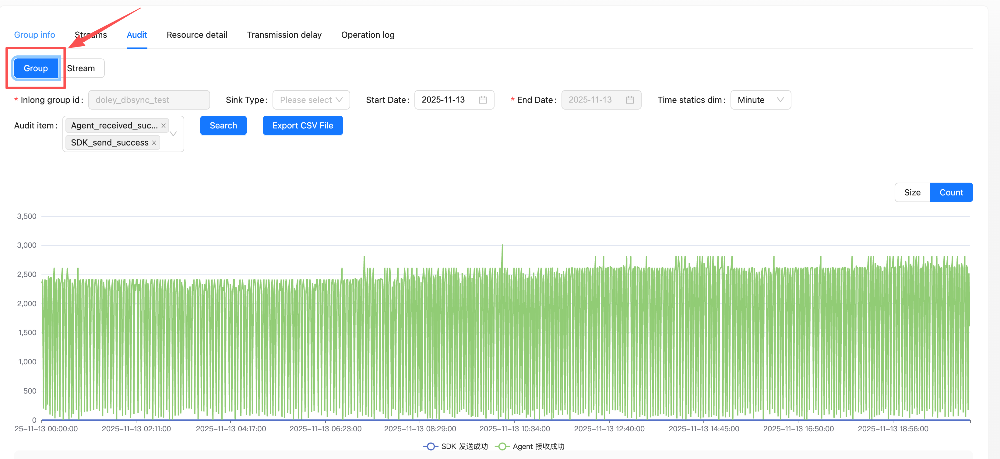
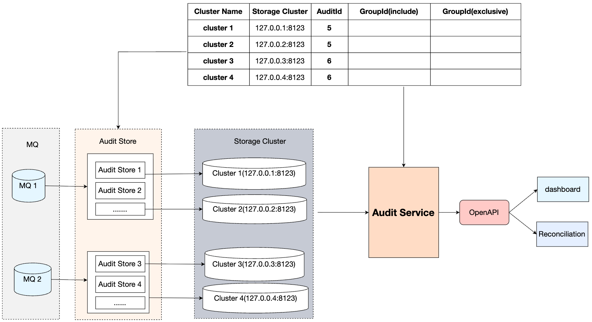

Apache InLong (应龙) recently released version 2.3.0, which resolved 59 issues, including 3 major features and 50+ optimizations. Mainly completed the support for Transform capabilities in SortCkafka and others, enabled horizontal scaling for Audit Store, and optimized the SDK. This version also optimizes the operational and maintenance experience for Apache InLong. Additionally, numerous other features were implemented in Apache InLong 2.3.0.
<!--truncate-->

## About Apache InLong

As the industry's first one-stop, all-scenario massive data integration framework, Apache InLong (Yinglong) delivers automated, secure, reliable, and high-performance data transmission capabilities. It enables businesses to rapidly build stream-based data analysis, modeling, and applications. Currently, InLong is widely used across industries such as advertising, payment, social media, gaming, and artificial intelligence, serving thousands of business use cases. It handles over a million billion records/day in high-performance scenarios and over a hundred billion records/day in high-reliability scenarios.

The core positioning of InLong revolves around three keywords: "one-stop," "all-scenario," and "massive data." For "one-stop," InLong aims to shield technical complexities by providing complete data integration and supporting services for out-of-the-box usability. For "all-scenario," it offers comprehensive solutions covering common data integration scenarios in big data ecosystems. For "massive data," its architecture leverages data pipeline layering, fully extensible components, and built-in multi-cluster management to stably support data scales beyond millions of billions of records/day.

## Overview of Version 2.3.0

Apache InLong (应龙) recently released version 2.3.0, which resolved 59 issues, including 3 major features and 50+ optimizations. Key enhancements include:

- **Sort**: SortCkafka, SortHttp, SortStandalone, SortCls, and SortEs now support Transform functionality
- **Audit**: Audit Store supports horizontal scaling
- **SDK**: Optimizations of Transform SDK and DataProxy SDK

This version also optimizes the operational and maintenance experience for Apache InLong. Other significant features are detailed below.

### Dashboard Module
- Added grouping and stream switching features to the audit page
- Fixed the issue of multiple API calls triggered by queries on the audit page

### Manager Module
- Added comprehensive audit alarm rule management API
- Supported parsing transformation configurations into transformation SQL
- Enabled configuration support for source fields in receivers

### Agent Module
- The agent now supports parallel creation of sender connections to the DataProxy, improving connection creation efficiency
- Added loading functionality for the agent_ext.properties configuration file to prevent personalized configurations from being lost when agent.properties is overwritten during upgrades

### Sort Module
- SortCkafka, SortHttp, SortStandalone, SortCls, and SortEs now support transformation functionality
- Deserialization process now supports returning the byte size of data in a single row
- Upgraded the Pulsar SDK to version 4.0.3

### SDK Module
- TransformSDK now supports array index access; the WHERE clause supports the LIKE operator; the str_to_json function can convert KV format data to JSON format
- SortSDK defaults to retrieving GroupId and StreamId from unified metadata if these cannot be obtained from the InLongMsgV0 protocol
- Optimized Golang SDK to fix potential data race issues

### Audit Module
- Audit service now supports enabling and disabling custom caching
- Supports audit reconciliation by data stream group dimension
- Added end-to-end reconciliation alarm capabilities
- Added horizontal scaling for Audit Store

### TubeMQ Module
- Fixed TubeMQ image build failure

## Key Features of Version 2.3.0

### Dashboard supports audit data reconciliation based on data stream groups
This feature enables querying audit data based on data stream groups to achieve reconciliation functionality

*Contributed by [@wohainilaodou](https://github.com/wohainilaodou) via [INLONG-11894](https://github.com/apache/inlong/pull/11895)*.

### Audit Store supports horizontal scaling
When the scale of audit data reaches hundreds of billions, a single Audit Store may face performance pressure. This version introduces horizontal scaling capabilities to effectively enhance the system's capacity

- Build a routing topology between Audit Store clusters and AuditId, GroupId, StreamId.
- Audit Store writes audit data to the corresponding storage clusters (ClickHouse/StarRocks/MySQL) based on the routing topology.
- Audit Service queries the corresponding audit data based on the routing topology.

*Contributed by [@doleyzi](https://github.com/doleyzi) via [INLONG-11894](https://github.com/apache/inlong/pull/11895)*.

## Future Plans
In version 2.3.0, we have enriched and improved our operational capabilities. Welcome everyone to use it. If you have more scenarios and requirements, or encounter any problems during use, please feel free to raise issues and PR. In future versions, the InLong community will continue to:
- Support for collecting from more data sources
- Real-time synchronization supports more data sources and data targets
- Optimized issue of data duplication in weak network environments

We welcome contributions from developers interested in InLong!  