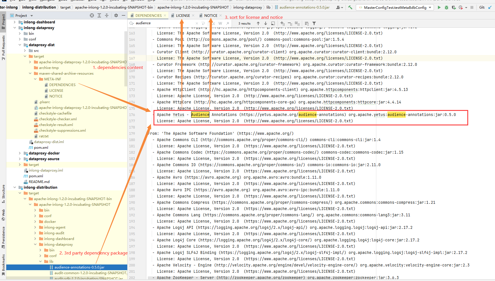
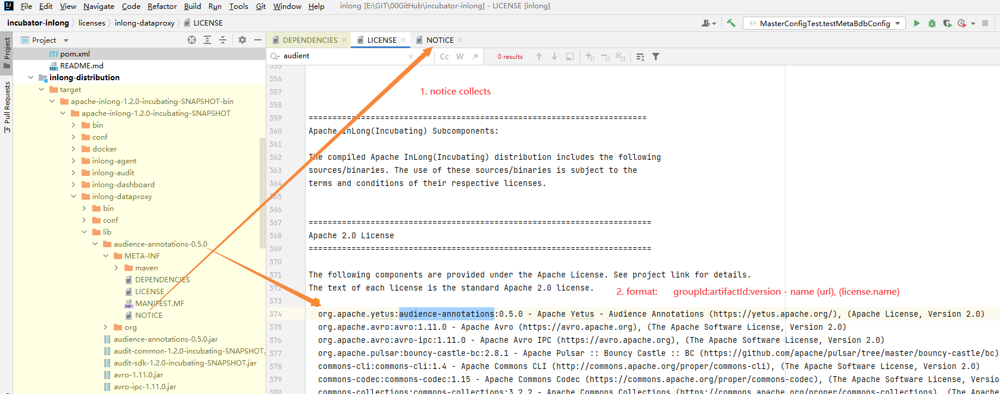
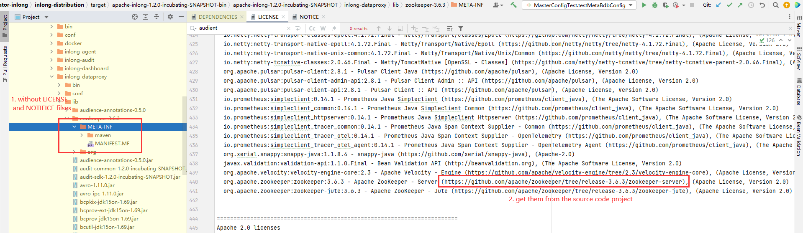

## Why maintain third-party dependencies
Different dependencies contain different LICENSEs. The third-party dependencies used by the Apache project must strictly comply with the [ASF 3rd Party License Policy](https://www.apache.org/legal/resolved.html) , which The various licenses that depend on are divided into three categories: A, B, and X, and a detailed and clear enumeration definition of which authorization protocol belongs to which category; Apache project deliverables must not contain X The authorization protocol of the class depends on the package, either directly or indirectly, is not allowed.

## Operations involved
Based on [ASF 3rd Party License Policy](https://www.apache.org/legal/resolved.html), we have done a complete sorting and inspection of all dependencies of the InLong project to ensure that all third-party versions of Dependencies are already in a state that meets the requirements of the Apache specification; since the project is developing iteratively, you need to check and maintain third-party dependency packages in accordance with unified standards, including:
1. Add new modules to the project;
2. Perform the following operations on the existing modules of the project:
    1. Add new third-party dependencies;
    2. Delete existing third-party dependencies;
    3. Modify the version number that has been relied on by a third party;
3. Release check on deliverables before release

The core of the above operation is to add or modify each pom.xml operation, we need to check the third-party dependencies of the project and make changes to the third-party dependencies licenses of existing projects.

## Third-party dependency combing method
1. Aggregate location of LICENSE and NOTICE relied on by third parties:
   We currently summarize the licenses and NOTICEs of third-party dependencies of each module into the [third-party license directory](https://github.com/apache/inlong/tree/master/licenses)  according to the module name of the project, and you can import After the project, you can see the following content: 

2. How third-party dependencies of deliverables are mapped:
   - Let's take the inlong-dataproxy module as an example. We first package it locally through the `mvn clean package install` command to get the details of each dependent package: ;

   
   - As we can see from the figure, we have obtained the DEPENDENCIES file of the module. We search for the corresponding entry of the DEPENDENCIES file according to the artifactId of the dependency package in the delivery example, and archive the dependency according to the type of LICENSE: 
     Attention: the entry format here is "groupId:artifactId:version - name (url), (license.name)", and each unit is sorted by the alphabet of artifactId;

   
   - There is NOTICE in this project, we need to copy the original text of NOTICE to the NOTICE file of the inlong-dataproxy module: , if the original text of NOTICE exceeds 10 lines, the original text Put it in the notices subdirectory;

3. Special case: If the dependency package does not carry LICENSE and (or, there may be LICENSE but no NOTICE) NOTICE files, we need to find the project source code corresponding to the dependency package, find the LICENSE and NOTICE in the corresponding source code, and Add to the above directory, you can refer to the combing method of ZooKeeper components: .

4. Goals: Apache project deliverables must not contain authorization protocol dependency packages with class X, whether direct or indirect dependencies, are not allowed to exist.

    

