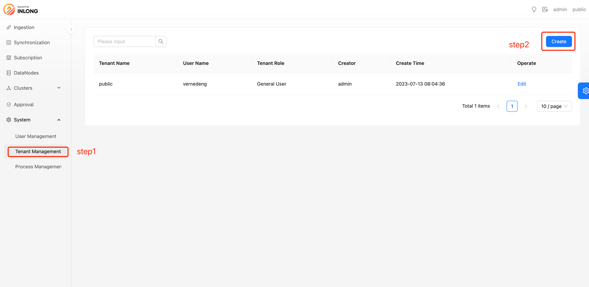
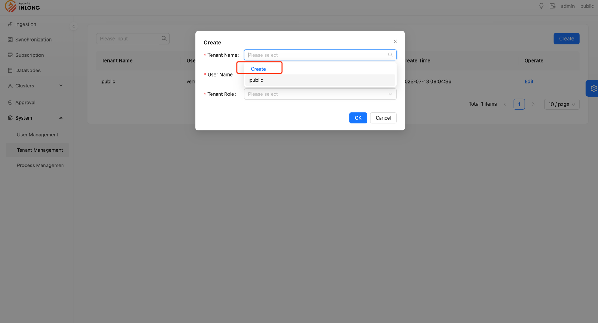
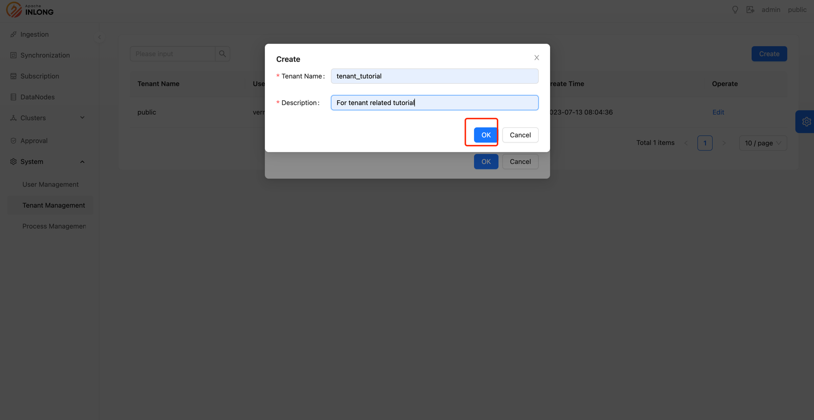

## Overview

Multi-tenancy is a software architecture pattern that allows a single application to serve multiple independent users or organizations (called "tenants") simultaneously. 
In this model, each tenant is logically isolated from one another but shares the same underlying software infrastructure and resources.
This means that a single application instance can serve multiple tenants without the need to deploy and maintain the application separately for each tenant.

For the implementation of InLong multi-tenancy, please refer to:
https://github.com/apache/inlong/issues/7914

:::caution
- Resources and permissions are isolated between different tenants, and users can only see resources under their tenant.
- After upgrading from a lower version to version 1.8.0, all resources will be migrated to the `public` tenant.
:::

## Create a tenant

Currently, only **InLong Admins** are allowed to create and modify tenants.
- Select `Tenant Management`, and click `Create`.
  
- Choose to `Create` a new tenant.
  
- Complete the `Tenant Name` and description, click `OK` to finish creating the tenant.
  
  The tenant has been created at this point.

## Create tenant role

- Select `Tenant Management`, and click `Create`.
  
- Choose the target `Tenant Name`, `User Name`, and the `Tenant Role` you want to grant (if the tenant does not exist, please refer to [Create a tenant](#create-a-tenant)).
  
- After successful creation, you can see the tenants and their corresponding user roles in the `Tenant Management`.
  

## Tenant switching

- Click the `Tenant` field in the upper right corner and choose the tenant you switch to.
  