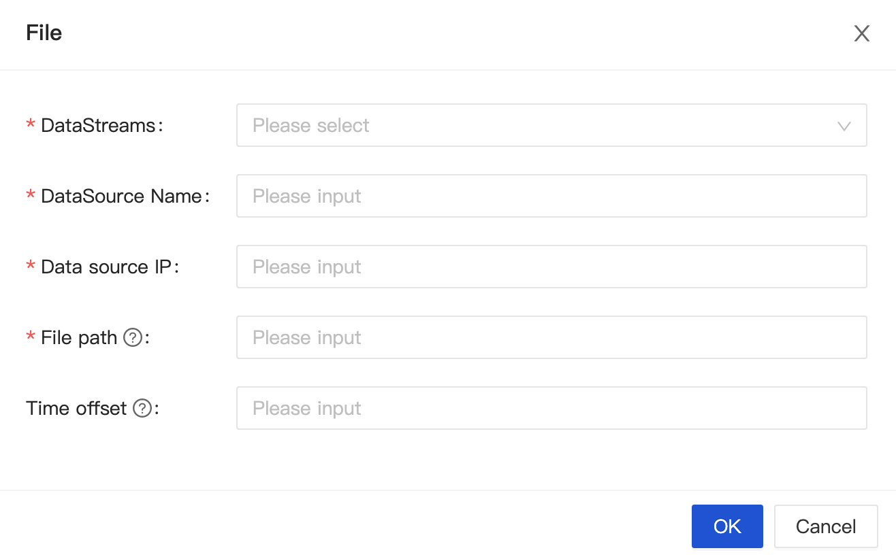

## Parameters

- DataSource Name
- Data source IP: Collect Node Agent IP.
- File path: Must be an absolute path and support regular expressions.
- Time offset: The file will be collected from a certain time,' 1m' means 1 minute later,' -1m' means 1 minute before, and m(minute), h(hour), d(day) are supported. If it is empty, the file will be collected from the current time.
- Source data fileDelimiter: Vertical line(|), Comma(,), Semicolon(;)...
- Source data field: Delimited fields

## Path Configuration
```
/data/inlong-agent/test.log //Represents reading the new file test.log in the inlong-agent folder
/data/inlong-agent/test[0-9]{1} // means to read the new file test in the inlong-agent folder followed by a number at the end
/data/inlong-agent/test //If test is a directory, it means to read all new files under test
/data/inlong-agent/^\\d+(\\.\\d+)? // Start with one or more digits, followed by. or end with one. or more digits (? stands for optional, can match Examples: "5", "1.5" and "2.21"
```

## Data Time
Agent supports obtaining the time from the file name as the production time of the data. The configuration instructions are as follows:
```
/data/inlong-agent/***YYYYMMDDHH***
```

Where YYYYDDMMHH represents the data time, YYYY represents the year, MM represents the month, DD represents the day, and HH represents the hour
Where *** is any character

At the same time, you need to add the current data cycle to the job conf, the current support day cycle and hour cycle,
When adding a task, add the property job.cycleUnit. job.cycleUnit contains the following two types:
- D: Represents the data time and day dimension
- H: Represents the data time and hour dimension

E.g:
The configuration data source is
```
/data/inlong-agent/2021020211.log
```
Write data to 2021020211.log
Configure job.cycleUnit as D
Then the agent will try the 202020211.log file at the time of 202020211. When reading the data in the file, it will write all the data to the backend proxy at the time of 20210202.
If job.cycleUnit is configured as H
When collecting data in the 2021020211.log file, all data will be written to the backend proxy at the time of 2021020211。