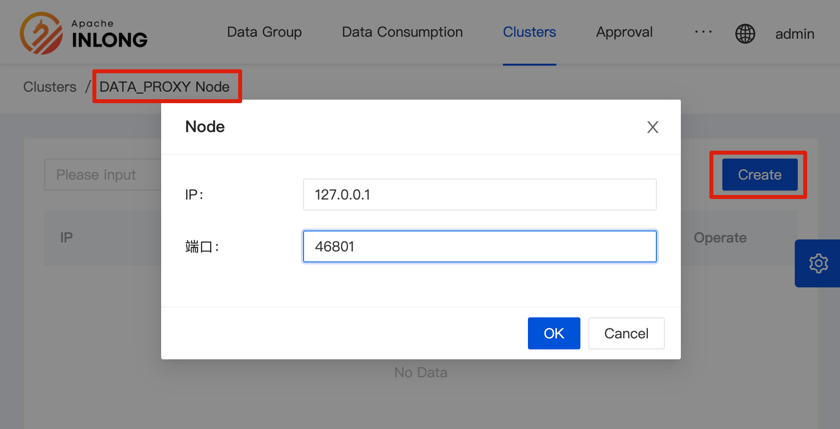
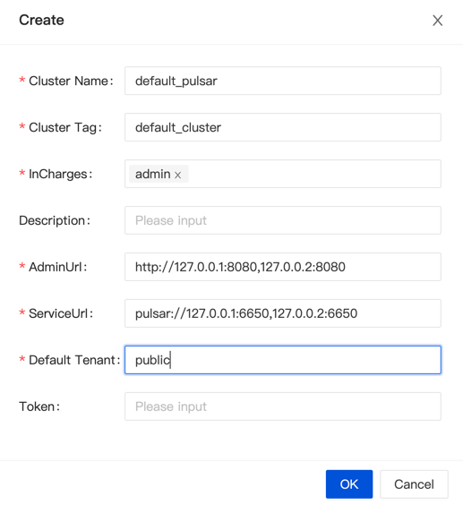

Deploy all InLong module by Docker Compose, it's only available for development. 

*Notice: The default message queue is Apache Pulsar for Docker.*

## Environment Requirements
- [Docker](https://docs.docker.com/engine/install/) 19.03.1+
- Docker Compose 1.29.2+
- Flink 1.13.5

## Download
You can get `apache-inlong-[version]-bin.tar.gz` from [Download Page](https://inlong.apache.org/download) ,or you can build the InLong refer to [How to Build](quick_start/how_to_build.md).

## Configure
Replace the `FLINK_HOST` and `FLINK_PORT` environment variables in `docker/docker-compose/docker-compose.yml` refer to the Flink cluster address.

## Deploy

Start all components.

```shell
cd docker/docker-compose
docker-compose up -d
```

## Register Cluster

### DataProxy Cluster

Open the Inlong-Dashboard page (the default is <http://127.0.0.1>), and select to add a DataProxy cluster on the [Clusters] tab:


Click the [Create] button, and fill in the cluster name, cluster label, and responsible person in the pop-up box to save.

> Note: [Cluster Tag] is a logical concept. Tags with the same name will be regarded as the same cluster.
>
> For example, the DataProxy cluster and the Pulsar cluster with the same cluster tag belong to the same cluster.

Then add nodes to this DataProxy cluster - a DataProxy cluster can support adding multiple nodes:


Just fill in the IP and port of the DataProxy node.



### Pulsar Cluster

Similar to the above entry for adding a DataProxy cluster, the filling example is as follows:



## Usage

After all containers run successfully, you can access `http://localhost` with default account:

```shell
User: admin
Password: inlong
```

## Destroy

```shell
docker-compose down
```
