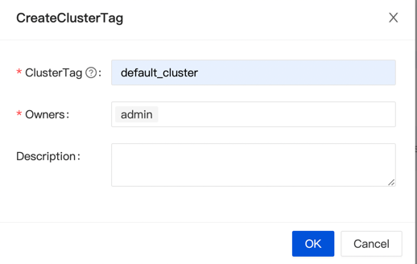
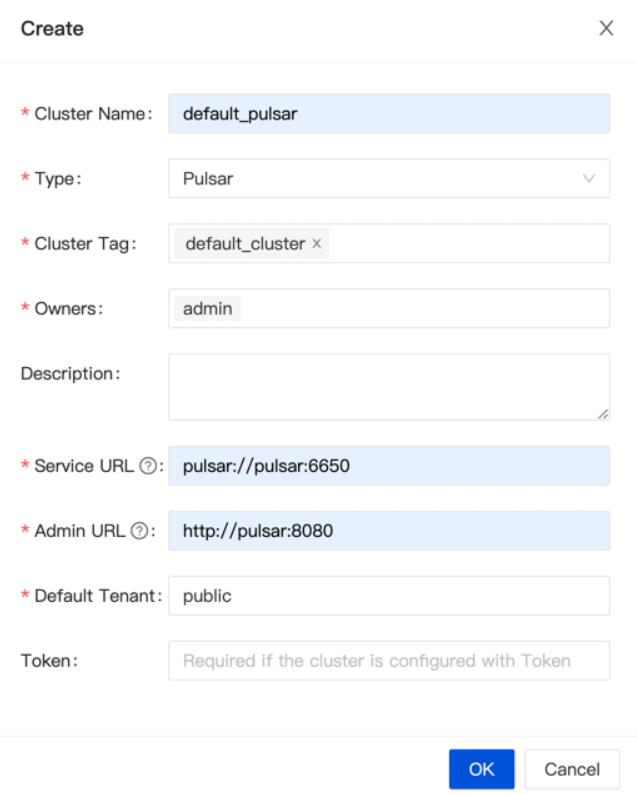

## Environment Requirements
- MySQL 5.7+
- [Flink 1.13.5](https://nightlies.apache.org/flink/flink-docs-release-1.13/docs/try-flink/local_installation/)
- [Docker](https://docs.docker.com/engine/install/) 19.03.1+

## Prepare Message Queue
InLong Support the following Message Queue services now, you can choose one of them.
- [InLong TubeMQ](modules/tubemq/quick_start.md)
- [Apache Pulsar 2.8.x](https://pulsar.apache.org/docs/en/2.8.1/standalone/)

## Download the Binary Package
You can get binary package from [Download Page](https://inlong.apache.org/download) ,or you can build the InLong refer to [How to Build](quick_start/how_to_build.md).

:::note
Extract `apache-inlong-[version]-bin.tar.gz` and `apache-inlong-[version]-sort-connectors.tar.gz`, and make sure the `inlong-sort/connectors/` directory contains `sort-connector-[type]-[version].jar`.
:::

## DB Dependencies
- If the backend database is MySQL, please download [mysql-connector-java-8.0.27.jar](https://repo1.maven.org/maven2/mysql/mysql-connector-java/8.0.27/mysql-connector-java-8.0.27.jar) and put it into the following directories:
```bash
inlong-agent/lib/
inlong-audit/lib/
inlong-manager/lib/
inlong-tubemq-manager/lib/
```
- If the backend database is PostgreSQL, there's no need for additional dependencies.

## Configure 
In `conf/inlong.conf`, configure the parameters according to the actual situation, mainly include:
```shell
# local IP
local_ip=
# Configure Database, MySQL or PostgreSQL
spring_datasource_hostname=
spring_datasource_port=3306
spring_datasource_username=root
spring_datasource_password=inlong
# Configure Pulsar Address if use Pulsar for Audit
pulsar_service_url=
pulsar_admin_url=
# the REST server address for Flink
flink_rest_address=
# the REST server Port for Flink
flink_rest_port=8081
```

## Start
```shell
bin/inlong-daemon start standalone
```

## Cluster Initialize
When all containers are successfully started, you can access the Inlong dashboard address `http: // localhost`, and use the following default account to log in:
```
User: admin
Password: inlong
```

### Create Cluster Tag
Click [Clusters]->[ClusterTags]->[Create] on the page to specify the cluster label name and person in charge:


:::caution
Since each component reports the ClusterTags as `default_cluster` by default, do not use other names.
:::

### Register Pulsar Cluster
Click [Clusters]->[ClusterTags]->[Create] on the page to register Pulsar Cluster:


:::note
The ClusterTags selects the newly created `default_cluster`, and then configuring the Pulsar cluster info.
:::

## Use
You can refer [Pulsar Example](quick_start/pulsar_example.md) to create Data Stream.