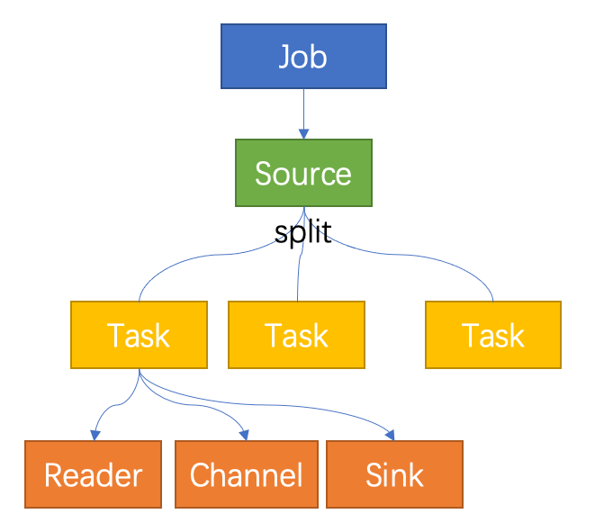

## Overview

In Standard Architecture, we can collect various types of data through InLong Agent. InLong Agent supports extending new collection types in the form of plug-ins. This article will guide developers on customizing the new Agent collection plug-ins.

## Concepts and Models

InLong Agent is a data collection framework, adopted `Job` + `Task` architectural model. And abstract data source reading and writing into Reader/Sink plugins.

Developers need to be clear about the concepts of Job and Task:

- `Job`: `Job` is used by Agent to describe the synchronization job from a source to a destination, and is the smallest business unit of Agent data synchronization. For example: read all files in a file directory
- `Task`: `Task` is the smallest execution unit obtained by splitting `Job`. For example, if there are multiple files in the folder that need to be read, then a job will be split into multiple tasks, and each task will read the corresponding file

A Task contains the following components:

- Reader: a data collection module, which is responsible for collecting data from the data source and sending the data to the Channel.
- Sink: a data writing module, responsible for continuously fetching data from the Channel and writing the data to the destination.
- Channel: connect Reader and Sink, as a data transmission channel for both, and plays a role in monitoring data writing and reading.

When extending an Agent plugin, you need to develop specific Source, Reader and Sink. If the data needs to be persisted to the local disk, use the persistent Channel, otherwise use the memory Channel

## Demonstration

The Job/Task/Reader/Sink/Channel concept introduced above can be represented by the following figure:


- The user submits a Job (via the manager), and the Job defines the Source, Channel, and Sink that need to be used (defined by the fully qualified name of the class)
- The framework starts the Job and creates the Source through the reflection mechanism
- The framework starts the Source and calls the Split interface of the Source to generate one or more Tasks
- When a Task is generated, a Reader (a type of Source will generate a corresponding reader), a User-configured Channel and a User-configured Sink are generated at the same time
- Task starts to execute, Reader starts to read data to Channel, Sink fetches data from Channel and sends it
- All the information needed for Job and Task execution is encapsulated in the JobProfile

## Development Process

- First develop Source, implement split logic, and return ReaderList
- The developed Reader implements the logic of reading data and writing to Channel
- The sink under development implements the logic of fetching data from the channel and writing it to the specified sink

## Interface

The following will introduce the classes and interfaces you need to know to develop an Agent plug-in.

### Reader
```java
private class ReaderImpl implements Reader {

    private int count = 0;

    @Override
    public Message read() {
        count += 1;
        return new DefaultMessage("".getBytes(StandardCharsets.UTF_8));
    }

    @Override
    public boolean isFinished() {
        return count > 99999;
    }

    @Override
    public String getReadSource() {
        return null;
    }

    @Override
    public void setReadTimeout(long mill) {

    }
}
```

The `Reader` interface functions as follows:
- `read`: Called by a single Task, and returns a read message after the call, and the message inside the Agent is encapsulated by Message
- `isFinished`: judge whether the reading is completed, for example: if it is an SQL task, judge whether all the contents in the ResultSet have been read; if it is a file task, judge whether there is still data written after the waiting time set by the user
- `getReadSource`: Get the acquisition source, for example: if it is a file task, it will return the file name currently read
- `setReadTimeout`: set read timeout

### Sink

```java
public interface Sink extends Stage {

    /**
     * Write data into data center
     *
     * @param message - message
     */
    void write(Message message);

    /**
     * set source file name where the message is generated
     * @param sourceName
     */
    void setSourceName(String sourceName);

    /**
     * every sink should include a message filter to filter out stream id
     */
    MessageFilter initMessageFilter(JobProfile jobConf);
}

```

The `Sink` interface functions as follows:
- `write`: called by a single Task, reads a message from the Channel in the Task and writes it to a specific storage medium. Taking PulsarSink as an example, it needs to be sent to Pulsar through PulsarSender
- `setSourceName`: set the data source name, if it is a file, the file name
- `initMessageFilter`: Initialize MessageFilter , the user can create a message filter to filter each message by setting agent.message.filter.classname in the Job configuration file. For details, please refer to the MessageFilter interface

### Source

```java
/**
 * Source can be split into multiple reader.
 */
public interface Source {

    /**
     * Split source into a list of readers.
     *
     * @param conf job conf
     * @return - list of reader
     */
    List<Reader> split(JobProfile conf);
}

```

The `Source` interface functions as follows:
- `split`: Called by a single job to generate multiple Readers, for example: a read file task, matching multiple files in a folder, when the job starts, it will specify TextFileSource as the Source entry,
  After calling the split function, TextFileSource will detect how many paths match the path matching expression in the folder set by the user, and generate TextFileReader to read


## Job Definition

The code is written, have you ever wondered how the framework finds the entry class of the plugin? How does the framework load plugins?

When submitting a task, you will find information about the plugin defined in the task, including the entry class. For example:

```json
{
"job": {
"name": "fileAgentTest",
"source": "org.apache.inlong.agent.plugin.sources.TextFileSource",
"sink": "org.apache.inlong.agent.plugin.sinks.ProxySink",
"channel": "org.apache.inlong.agent.plugin.channel.MemoryChannel"
}
}
```

- `source`: The fully qualified name of the Source class, the instance of which the framework imports the plugin through reflection.
- `sink`: The fully qualified name of the Sink class, the instance of which the framework imports through the reflection plugin.
- `channel`: The name of the Channel class used by the framework, the instance of the entry class of the plugin through reflection.

## Message

Like the general `producer-consumer` model, the `Reader` plugin and the `Sink` plugin also use `channel` to achieve data transmission.
`channel` can be in-memory or persistent, plugins don't have to care. Plugins write data to `channel` through `RecordSender` and read data from `channel` through `RecordReceiver`.

A piece of data in `channel` is a `Message` object, `Message` contains a byte array and attribute data represented by a Map

`Message` has the following methods:

```java
public interface Message {

    /**
     * Data content of message.
     *
     * @return bytes body
     */
    byte[] getBody();

    /**
     * Data attribute of message
     *
     * @return map header
     */
    Map<String, String> getHeader();
}
```

Developers can expand customized Message according to this interface. For example, ProxyMessage contains InLongGroupId, InLongStreamId and other attributes