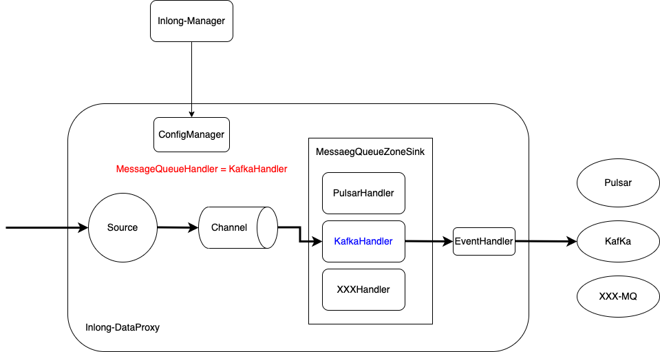

## Overview

DataProxy implements an abstract unified MQ (Message Queue) sink model, so that developers and easily extend mq sink types under standard MessageQueueZoneSink. By default, Pulsar Kafka and TubeMQ are already integrated. This article guides developers to extend new mq types accordingly。

## Concepts and Models

DataProxy is a message flow architecture based on Apache Flume with its `Source` + `Channel` + `Sink` components. Here we focus on the sink layer alone.

- `MessageQueueZoneSink`: The standard MQ sink provided by DataProxy, supposedly to support all kinds of MQ types.
- `MessageQueueHandler`: The abstract MQ handler interface that deals with connecting, sending data to, and disconnecting the MQ cluster.
- `EventHandler`: The interface to convert MQ message header and body when required. For example to convert the data protocol. 

When a new MQ cluster type needs to be integrated, developers should at least implement the MessageQueueHandler interface as plugin. Optionally they can also implement the EventHandler interface to transform data as required. The plugin classes can be specified and pulled from manager as configuration information so that new MQ type can be easily extended on the fly.

## Demonstration

The concepts introduced above can be represented by the following figure:


## Development Process

In the rest of the article we use the Kafka MQ with ProtoBuffer message format as an example. Here's what to do:
- Implement the subclass plugin of MessageQueueHandler, namely KafKaHandler and its init / start /stop / send methods.
- Implenent the EventHandler interface as ProtoBufferEventHandler and its parseHeader / parseBody method 

## Plugin Implementation

### MessageQueueHandler
```java
private class KafkaHandler implements MessageQueueHandler {

    private EventHandler handler;
    
    @Override
    public void init(CacheClusterConfig config, MessageQueueZoneSinkContext sinkContext) {
        // initialize configuration and event handler
    }
    
    @Override
    public void start() {
        // create Kafka Producer
    }

    @Override
    public void stop() {
       // close Kafka Producer
    }

  @Override
    public boolean send(BatchPackProfile event) {
        // process and send data
    }
}
```

### EventHandler
```java
public class ProtoBufferEventHandler implements EventHandler {

    @Override
    public Map<String, String> parseHeader(IdTopicConfig idConfig, BatchPackProfile profile, String nodeId,
            INLONG_COMPRESSED_TYPE compressType) {
        // retrieve, process and convert event header
    }

    @Override
    public byte[] parseBody(IdTopicConfig idConfig, BatchPackProfile profile, INLONG_COMPRESSED_TYPE compressType)
            throws IOException {
        // retrieve and repack event to ProtoBuffer message
    }
}
```
(See the full implementation org.apache.inlong.dataproxy.sink.mq.kafka.KafkaHandler from inlong-dataproxy module)

## Plugin Configuration

### dataproxy.conf

The sink configuration please refer to [Sink Configuration Exampnle](modules/dataproxy/configuration.md)

### inlong manager configuration registry

Specify the plugin class when registering cache cluster to inlong manager, such as：
```shell
{
  "clusterTags": "default_cluster",
  "name": "kafka-1",
  "type": "KAFKA",
  "inCharges": "admin",
  "url": "127.0.0.1:9092",
  "extParams": "{\"messageQueueHandler\":\"org.apache.inlong.dataproxy.sink.mq.kafka.KafkaHandler\",\"bootstrap.servers\":\"127.0.0.1:9092\"}
}
```

