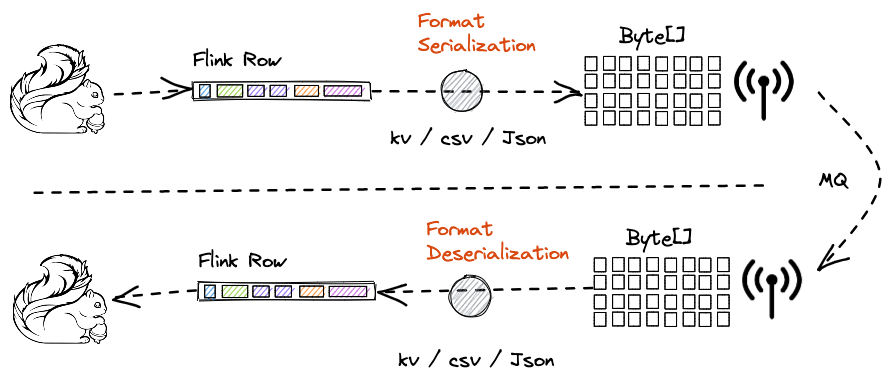

## What is format?



As shown in FIG:

When Flink SQL reads and writes data, it adopts the form of Row, and its interior is an Object
array `Object[]`, and each element in the number represents a field of a Flink table.
The type, name, precision and other information of the field are marked by `Schema`.

Format provides two interfaces: SerializationSchema and DeserializationSchema:

- When Flink writes data to MQ, it needs to serialize `Flink Row` into formats such
  as `key-value`/`csv`/`Json`, and call the `SerializationSchema#serialize` method.
  The data will be serialized into `Byte[]` and written to `MQ`
- When Flink reads MQ data, the process is reversed. Read data from MQ, the data format is `byte[]`.
  Deserialize to `Format`, and then convert to `Flink row`

> See
> details: [`inlong-sort/sort-formats`](https://github.com/apache/inlong/tree/release-1.5.0/inlong-sort/sort-formats)

## The format in InLong


InLong is a one-stop data integration platform, and MQ (the Cache part in the figure) is used as a
transmission channel. At the same time, it realizes the decoupling of DataProxy and Sort, and has
stronger scalability.

1. When DataProxy reports data, it needs to serialize the data into the corresponding
   format (`SerializationSchema#serialize`).
2. Sort receives the data, deserializes the MQ data (`DeserializationSchema#deserialize`)
   into `Flink Row`, and writes it to the corresponding storage through Flink SQL.

## What are the formats?

Currently, InLong-sort provides CSV/KeyValue/JSON, and the corresponding InLongMsg packaging format.

### CSV

```xml
<dependency>
<groupId>org.apache.inlong</groupId>
<artifactId>sort-format-csv</artifactId>
<version>${inlong.version}</version>
</dependency>
```

`org.apache.inlong.sort.formats.kv.KvFormatFactory`

| Option                    | Type    | Required | Default value                            | Advanced | Remark                                                                                                                                                                                                                                                                                                                                             |
|---------------------------|---------|----------|------------------------------------------|----------|----------------------------------------------------------------------------------------------------------------------------------------------------------------------------------------------------------------------------------------------------------------------------------------------------------------------------------------------------|
| `format.delimiter`        | char    | Y        | `,`                                      | N        |                                                                                                                                                                                                                                                                                                                                                    |
| `format.escape-character` | char    | N        | disabled                                 | Y        |                                                                                                                                                                                                                                                                                                                                                    |
| `format.quote-character`  | char    | N        | disabled                                 | Y        |                                                                                                                                                                                                                                                                                                                                                    |
| `format.null-literal`     | String  | N        | disabled                                 | Y        |                                                                                                                                                                                                                                                                                                                                                    |
| `format.charset`          | String  | Y        | "UTF-8"                                  | N        |                                                                                                                                                                                                                                                                                                                                                    |
| `format.ignore-errors`    | Boolean | Y        | true                                     | N        |                                                                                                                                                                                                                                                                                                                                                    |
| `format.derive_schema`    | Boolean | N        | Required if no format schema is defined. | Y        | Derives the format schema from the table's schema. This allows for defining schema information only once. <br/>The names, types, and fields' order of the format are determined by the table's schema. <br/>Time attributes are ignored if their origin is not a field. <br/>A "from" definition is interpreted as a field renaming in the format. |

### Key-Value

```xml
<dependency>
<groupId>org.apache.inlong</groupId>
<artifactId>sort-format-kv</artifactId>
<version>${inlong.version}</version>
</dependency>
```

`org.apache.inlong.sort.formats.csv.CsvFormatFactory`

| Option                    | Type    | Required | Default value                            | Advanced | Remark                                                                                                                                                                                                                                                                                                                                             |
|---------------------------|---------|----------|------------------------------------------|----------|----------------------------------------------------------------------------------------------------------------------------------------------------------------------------------------------------------------------------------------------------------------------------------------------------------------------------------------------------|
| `format.entry-delimiter`  | char    | N        | '&'                                      | N        |                                                                                                                                                                                                                                                                                                                                                    |
| `format.kv-delimiter`     | char    | N        | '='                                      | N        |                                                                                                                                                                                                                                                                                                                                                    |
| `format.escape-character` | char    | N        | disabled                                 | Y        |                                                                                                                                                                                                                                                                                                                                                    |
| `format.quote-character`  | char    | N        | disabled                                 | Y        |                                                                                                                                                                                                                                                                                                                                                    |
| `format.null-literal`     | char    | N        | disabled                                 | Y        |                                                                                                                                                                                                                                                                                                                                                    |
| `format.charset`          | String  | Y        | "UTF-8"                                  | N        |                                                                                                                                                                                                                                                                                                                                                    |
| `format.ignore-errors`    | Boolean | Y        | true                                     | N        |                                                                                                                                                                                                                                                                                                                                                    |
| `format.derive_schema`    | Boolean | N        | Required if no format schema is defined. | Y        | Derives the format schema from the table's schema. This allows for defining schema information only once. <br/>The names, types, and fields' order of the format are determined by the table's schema. <br/>Time attributes are ignored if their origin is not a field. <br/>A "from" definition is interpreted as a field renaming in the format. |

### JSON

```xml
<dependency>
<groupId>org.apache.flink</groupId>
<artifactId>flink-json</artifactId>
<version>${flink.version}</version>
</dependency>
```

`org.apache.flink.formats.json.JsonFormatFactory`

`org.apache.flink.formats.json.JsonOptions`

| Option                           | Type    | Required | Default value | Advanced | Remark                                                                                                                                                                                                                                                                                                                            |
|----------------------------------|---------|----------|---------------|----------|-----------------------------------------------------------------------------------------------------------------------------------------------------------------------------------------------------------------------------------------------------------------------------------------------------------------------------------|
| `ignore-parse-errors`            | Boolean | N        | false         | N        | Optional flag to skip fields and rows with parse errors instead of failing; <br/>fields are set to null in case of errors, false by default.                                                                                                                                                                                      |
| `map-null-key.mode`              | String  | N        | "FAIL"        | Y        | Optional flag to control the handling mode when serializing null key for map data."<br/>Option DROP will drop null key entries for map data."<br/>Option LITERAL will use 'map-null-key.literal' as key literal.                                                                                                                  |
| `map-null-key.literal`           | String  | N        | "null"        | Y        | Optional flag to specify string literal for null keys when 'map-null-key.mode' is LITERAL.                                                                                                                                                                                                                                        |
| `encode.decimal-as-plain-number` | Boolean | N        | false         | Y        | Optional flag to specify whether to encode all decimals as plain numbers instead of possible scientific notations, false by default.                                                                                                                                                                                              |
| `timestamp-format.standard`      | String  | N        | "SQL"         | Y        | Optional flag to specify timestamp format, SQL by default."<br/>Option ISO-8601 will parse input timestamp in "yyyy-MM-ddTHH:mm:ss.s{precision}" format and output timestamp in the same format."<br/>Option SQL will parse input timestamp in "yyyy-MM-dd HH:mm:ss.s{precision}" format and output timestamp in the same format. |
| `encode.decimal-as-plain-number` | Boolean | N        | false         | Y        | Optional flag to specify whether to encode all decimals as plain numbers instead of possible scientific notations, false by default.                                                                                                                                                                                              |
