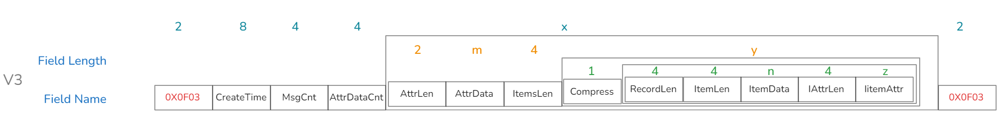

import {siteVariables} from '../../version';

## Overview

Users report data to the InLong system through SDK, HTTP, Agent and other data reporting methods. InLong's DataProxy component packages the received data into the `InLongMsg` format and stores it in the message body of the MQ message. After consuming data from MQ, users need to decode it according to the `InLongMsg` format to obtain the original reported data. This article mainly introduces the data structure of the `InLongMsg` format and how users parse this type of data after receiving it.

## InLongMsg data format

### Format framework

InLongMsg is a binary data packet in a custom format, which consists of a formatted payload information encapsulated by the same magic number (Magic) of 2 bytes at the front and back, as shown in the following figure:


The Magic field has 4 valid values in the current implementation of InLongMsg, which respectively identify 4 different data versions that can be carried in the Payload part (MAGIC0 is an invalid value):

```java
private static final byte[] MAGIC0 = {(byte) 0xf, (byte) 0x0};
private static final byte[] MAGIC1 = {(byte) 0xf, (byte) 0x1};
private static final byte[] MAGIC2 = {(byte) 0xf, (byte) 0x2};
private static final byte[] MAGIC3 = {(byte) 0xf, (byte) 0x3};
private static final byte[] MAGIC4 = {(byte) 0xf, (byte) 0x4};
```
The Payload part carries data content in the corresponding format according to the definition of the above Magic field. Regardless of the format used, these contents are ultimately mapped to the original data information reported by the user according to {attribute set, single data} or {attribute set, multiple data}.
Next, we begin to introduce the corresponding Payload definitions according to different Magic version values.

### InLongMsg V1

For the InLongMsg V1 format, the Magic field value is 0x0f01. In this value, the Payload format is as shown below:


Among them:
 
- CreatTime: field identifies the construction time of the InLogMsg message;

- AttrDataCnt: field identifies how many {attribute, data} pairs are carried in the message;

AttrDataCnt The following information is stored in pairs of {attribute, data}

- AttrLen, AttrData: The fields define the length and value of the attribute information;
 
- ItemsLen: The field identifies the entire data length information contained in the attribute, and this field contains the length information of the following Compress field;

- Compress: The field identifies whether the following data part is compressed. If it is compressed, it is organized in the following format after decompression. InLongMsg currently only supports Snappy data compression;

Since the attribute may carry multiple data, the data part needs to support multiple data:

- ItemLen: field identifies the length of the data item;

- ItemData: field identifies the data value.

### InLongMsg V2

For the InLongMsg V2 format, the Magic field value is 0x0f02. When this value is used, the Payload format is as shown in the following figure:


Compared with the InLongMsg V1 format, the meanings of the other fields of the InLongMsg V2 format are the same as those of the V1 format except for the newly added MsgCnt and ItemCnt fields:

- MsgCnt: used to identify the total number of data items carried by the message;

- ItemCnt: used to identify the total number of data items in the {attribute, data} pair information.

### InLongMsg V3

For the InLongMsg V3 format, the Magic field value is 0x0f03. When this value is used, the Payload format is as shown in the following figure:



Compared with InLongMsg V1 and V2 formats, InLongMsg V3 format mainly solves the data reporting situation of {attribute set, multiple data} in the information, and each data carries private attributes. In the V3 format definition, it is completed by adding data private attribute fields to each data part, as follows:

- RecordLen: used to identify the total length of a single data record;

- IAttrLen: used to identify the length of the private attribute carried by a single data;

- IitemAttr: used to identify the private attribute data value carried by a single data.

### InLongMsg V4

For the InLongMsg V4 format, the Magic field value is 0x0f04. When this value is used, the Payload format is as shown in the following figure:


Compared with the previous InLongMsg V1, V2, and V3 format definitions, InLongMsg V4 has two improvements:

1. The fixed fields in the common attributes are extracted from the attribute key-value pairs and saved as fixed fields, thereby reducing the total message length;

2. Different bits of some fixed fields carry different values to indicate different function activations or type definitions.

The relevant fields are defined as follows:

- TotalLen: identifies the total length of the entire message;

- MsgType: This field is a composite field that indicates the type and compression type of the message. The lower 5 bits indicate the message type, and the upper 3 bits indicate the compression method. Different bits indicate different meanings;

- GroupId: identifies the ID value corresponding to the group, used when transmitting digital group information;

- StreamId: identifies the ID value corresponding to the stream, used when transmitting digital stream information;

- ExtField: identifies the extended function enabling field, used to transmit the extended function enabled by the message, and different bits indicate different meanings. For details, see the ExtField bit definition table;

- DataTime: identifies the data time, with precision in seconds;

- MsgCnt: identifies the total number of messages carried;

- UniqueId: identifies the unique tag of the 8-byte long type of the message;

- BodyLen: identifies the total length of the message body, and identifies the length of the following binary message body data;

- BodyData: identifies the binary message content carried by the message;

- AttrLen: identifies the attribute length;

- AttrData: identifies the attribute value content.

For ExtField field, each bit is defined as follows:

| Bit | Meaning                                                   | Remark                                       |
|-----|-----------------------------------------------------------|----------------------------------------------|
| 0   | reserved                                                  |                                              |
| 1   | Whether each data contains private attributes             | 1 indicates inclusion, 0 indicates exclusion |
| 2   | Whether to enable digital group, stream                   | 0 indicates enabled, 1 indicates not enabled |
| 3   | reserved                                                  |                                              |
| 4   | reserved                                                  |                                              |
| 5   | Whether multiple data are separated by newline characters | 1 indicates enabled, 0 indicates not enabled |
| 6   | reserved                                                  |                                              |
| 7   | reserved                                                  |                                              |

For BodyData field value, the format is as follows:


- ItemLen: identifies the data length;

- ItemData: identifies the data value;

- IAttrLen: identifies the private attribute length;

- IitemAttr: identifies the private attribute value.

## Parsing messages of type InLongMsg

The data consumed directly from InLong's message queue (InLong TubeMQ or Pulsar), you need to parse InLongMsg first. You can parse the source data in the following ways.

### Add Maven dependency

```xml
<dependency>
    <groupId>org.apache.inlong</groupId>
    <artifactId>inlong-common</artifactId>
    <version>${siteVariables.inLongVersion}</version>
</dependency>
```

### Add Parse Method

```java
public static List<byte[]> parserInLongMsg(byte[] bytes) {
    List<byte[]> originalContentByteList = new ArrayList<>();
    InLongMsg inLongMsg = InLongMsg.parseFrom(bytes);
    Set<String> attrs = inLongMsg.getAttrs();
    if (CollectionUtils.isEmpty(attrs)) {
        return originalContentByteList;
    }
    for (String attr : attrs) {
        if (attr == null) {
            continue;
        }
        Iterator<byte[]> iterator = inLongMsg.getIterator(attr);
        if (iterator == null) {
            continue;
        }
        while (iterator.hasNext()) {
            byte[] bodyBytes = iterator.next();
            if (bodyBytes == null || bodyBytes.length == 0) {
                continue;
            }
            // Origin data sent by InLong reporter
            originalContentByteList.add(bodyBytes);
        }
    }
    return originalContentByteList;
}
```