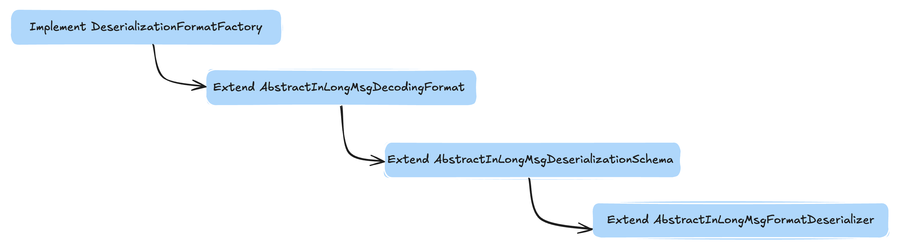

## Overview

This article is aimed at InLong-Sort-Formats data format parsing developers and aims to comprehensively explain the process of developing data parsing for a data format.

The InLong-Sort-Formats module supports two major types of data format parsing, implemented based on the Flink Row and Flink RowData types. These two implementations differ only in the Flink API used. This article will describe the implementation based on the Flink RowData.

Currently, InLong-Sort supports the following formats, including 6 formats encapsulated in the InLongMsg format and 3 original data formats:
- InLongMsg binlog
- InLongMSg CSV
- InLongMsg KV
- InLongMsg Tlog-CSV
- InLongMsg Tlog-KV
- InLongMsg PB
- CSV
- KV
- JSON
By implementing the data parsing process for these formats, developers can effectively handle and process data in the InLong-Sort module.

## Before Development

- InLongMsg refer to [InLongMsg](../binary_protocol/inlong_msg.md);
- When selecting a specific parsing method, it is important to note that the original data, after passing through the DataProxy module, is encapsulated using the InLongMsg format;
- InLongMsg encapsulates at least one data record, so the parsing logic should handle scenarios with multiple records.
- Each InLongMsg consists of two parts: the message header and the message body:
  + The message header is composed of key-value pairs in the format of k1=v1&k2=v2. It should contain essential information such as the streamId (stream ID) and dt (data timestamp).
  + The message body is represented by a binary array of the specific data format to be parsed, such as key-value (kv), comma-separated values (csv), and so on.
  
When implementing the parsing process, you need to extract the message header and body separately. The header can be parsed to retrieve the necessary information, while the body should be processed based on the specific data format such as CSV, kv and so on.

By understanding the structure and components of the InLongMsg format, you can develop the appropriate parsing logic to handle multiple records and extract the necessary information from the message header and body.

## Processing
- Raw Format Data
  + Parse processing 
    * Step 1: Build a DeserializationFormatFactory object for the specific format, for example, CsvFormatFactory.
    * Step 2: Use the DeserializationFormatFactory object to obtain the corresponding DecodingFormat object.
    * Step 3: Use the DecodingFormat object to obtain the DeserializationSchema object for the specific format.
    * Step 4: Use the DeserializationSchema object to call the deserialize(byte[] message) or deserialize(byte[] message, Collector<T> out) method, passing the data to be parsed and retrieving the parsed result.
  + Extend processing  
    To extend the parsing of raw data formats that are not encapsulated in the InLongMsg format, you would need to implement the three interfaces shown in Figure 1. The arrows in the diagram represent the calling relationships between the implementations.

    
     
    
 Figure 1 The extension of parsing raw data formats not encapsulated in the InLongMsg 

- Data formatted using InLongMsg
  + Parse processing  
    * Step 1: Build a specific format DeserializationFormatFactory, such as InLongMsgCsvFormatFactory. This factory class is responsible for creating parsers for the desired format.
    * Step 2: Using the DeserializationFormatFactory object, obtain the corresponding DecodingFormat object, which is a subclass of AbstractInLongMsgDecodingFormat. This object is used to decode the InLongMsg formatted data.
    * Step 3: Using the DecodingFormat object, obtain the DeserializationSchema object corresponding to the specific format. This object is a subclass of AbstractInLongMsgDeserializationSchema. It defines the parsing rules and how the parsed results are returned.
    * Step 4: Using the DeserializationSchema object, call the deserialize(byte[] message) or deserialize(byte[] message, Collector<T> out) methods. Pass the data to be parsed as input and retrieve the parsed results. These methods will parse the data according to the defined rules and return the parsed results.
    By following these steps, you can parse data in the specific format of InLongMsg and obtain the parsed results. The actual implementation may involve specific classes and methods based on your requirements and the specific parsing format.
  + Extend processing  
    To extend the parsing of data formats encapsulated in the InLongMsg format, you need to implement one interface and inherit three base classes as shown in Figure 2. The arrows in the diagram represent the calling relationships between the implementations. 
    
     
Figure 2 To extend the parsing of data formats encapsulated in the InLongMsg format

     
    Compareing with the parsing process shown in Figure 1, the main difference is that the DecodingFormat and DeserializationSchema obtained in the Figure 2 are subclasses of AbstractInLongMsgDecodingFormat and AbstractInLongMsgDeserializationSchema.
    For the implementation of the subclass of AbstractInLongMsgDeserializationSchema, it is recommended to implement a subclass of AbstractInLongMsgFormatDeserializer and invoke it.

## Demo

- For Raw Format Data
  refer to：[format-rowdata-kv](https://github.com/apache/inlong/tree/master/inlong-sort/sort-formats/format-rowdata/format-rowdata-kv)
- For InLongMsg Format Data
  refer to：[format-inlongmsg-rowdata-kv](https://github.com/apache/inlong/tree/master/inlong-sort/sort-formats/format-rowdata/format-inlongmsg-rowdata-kv)

## Last but not Least

In Inlong-Sort-formats, we provide implementations for common data formats to achieve out-of-the-box usability. We have also designed a unified data parsing and processing framework that allows developers to customize their own data parsing and transformation based on the characteristics of the data format they are working with.

However, it's important to note that our current implementation and architectural design are primarily focused on meeting the current parsing and processing requirements, and we currently only support a few common data formats. We are committed to continuously expanding the range of supported data formats, improving parsing efficiency, and making overall enhancements. We also welcome your contributions and involvement in this endeavor.

Thank you for your feedback and support! If you have any questions or suggestions, please feel free to reach out to us.