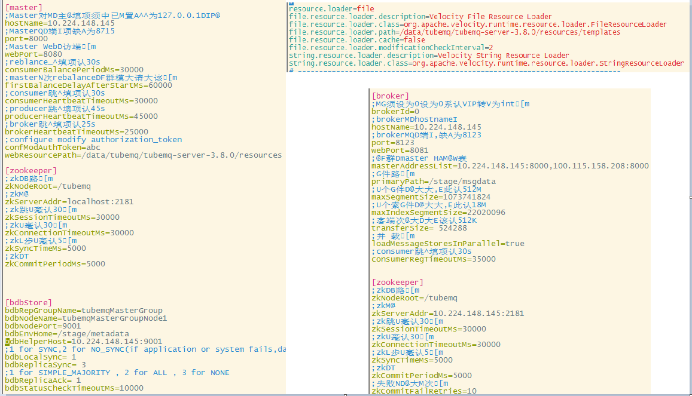
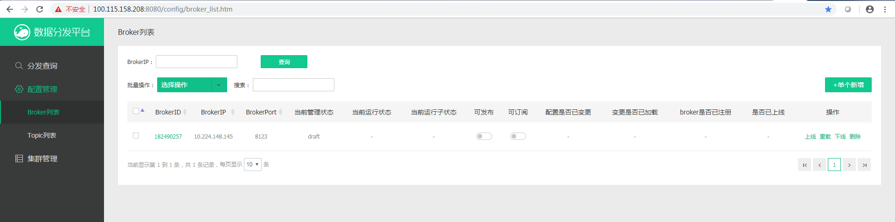
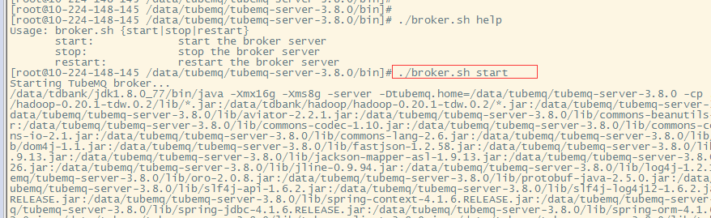
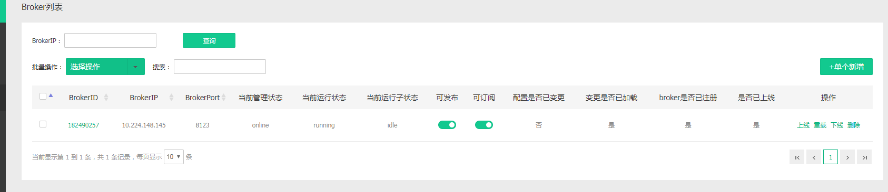
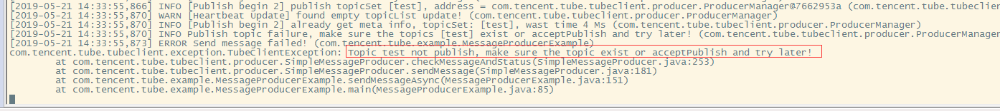

# Compile, Deploy and Examples of TubeMQ ：

## Compile and Package Project：

Enter the root directory of project and run:

```
mvn clean package -Dmaven.test.skip
```

e.g. We put the TubeMQ project package at `E:/`, then run the above command. Compilation is complete when all subdirectories are compiled successfully.


We can also run individual compilation in each subdirectory. Steps are the same as the whole project's compilation.

**Server Deployment**

As example above, entry directory `E:\GIT\TubeMQ\tubemq-server\target`, we can see several JARs. `tubemq-server-3.8.0-bin.tar.gz` is the complete server-side installation package， including execution scripts, configuration files, dependencies, and frontend source code. `tubemq-server-3.8.0.jar` is a server-side processing package included in `lib` of the complete project installer. Consider to daily changes and upgrades are most made to server side, we place this jar separately so that we just need to replace this jar during upgrade.


Here we have a complete package deployed onto server and we place it in `/data/tubemq`


**Configuration System**

There are 3 roles in server package: Master, Broker and Tools. Master and Broker can be deployed on the same or different machine. It depends on the bussiness layouts. As example below, we have 3 machine to startup a complete production and consumption cluster with 2 Masters.

| Machine | Role | TCP Port | TLS Port | WEB Port | Note |
| --- | --- | --- | --- | --- | --- |
| 10.224.148.145 | **Master** | 8099 | 8199 | 8080 | Metadata stored at `/stage/metadata` |
| | Broker | 8123 | 8124 | 8081 | Message stored at`/stage/msgdata` |
| | ZK | 2181 | | | Offset stored at root directory`/tubemq` |
| 100.115.158.208 | **Master** | 8099 | 8199 | 8080 | Metadata stored at `/stage/metadata` |
| | Broker | 8123 | 8124 | 8081 | Message stored at`/stage/msgdata` |
| 10.224.155.80 | Producer ||||
| | Consumer ||||
|

Something should be noticed during deploying Master:

1. Master cluster can be deployed in 1, 2 or 3 machines. 3 machines is suggested if HA is necessary so that reading/writing configuration and access to new production/consumption is still available when one of them is shutdown. In common situation, 2 machines provide readable configuration and proper state of production/consumption already registered when one is shutdown. The minimum is 1 and it provides proper state of production/consumption already registered when is shutdown.
2. For machines with Master Role, we should promise clock synchronization. At the same time, IP address of each Master machine should be set in `/etc/hosts` on each Master machine.


Take `10.224.148.145` and `100.115.158.208` as examples, if we want to deploy both Master and Broker role on them, we need to configure in `/conf/master.ini`, `/resources/velocity.properties` and `/conf/broker.ini`. First set up the configuration of `10.224.148.145`,



then it is `100.115.158.208`.


Note that the upper right corner is configured with Master's web frontend configuration and configuration `file.resource.loader.path` in `/resources/velocity.properties` need to be modified according to the Master's installation path.

**Start up Master**：

After configuration, entry directory `bin` of Master environment and start up master.


We First start up `10.224.148.145`, and then start up Master on `100.115.158.208`. The following messages indicate that the master and backup master have been successfully started up and the external service ports are reachable.


Visiting Master's Administrator panel([http://100.115.158.208:8080/config/topic\_list.htm](http://100.115.158.208:8080/config/topic_list.htm)), search operation working well indicates that master has been successfully started up.


**Start up Broker**：

Starting up Broker is a little bit different to starting Master: Master is responsible for managing the entire TubeMQ cluster, including Broker node with Topic configuration on them, production and consumption managament. So we need to add metadata on Master before starting up Broker.


Confirm and create a draft record of Broker.



We try to start up the Broker.



But we got an error message.


Because the broker record is currently in draft status and it is not available now. Let's go back to Master Administrator panel and publish.


Every changing operation need to text in an Authorization Code when submited to Master. Authorization Code is defined by `confModAuthToken` in `master.ini`. If you have the Code of this cluster, we consider you as administrator and you have permission to operate the modification.


Then we restart the Broker.


Check the Master Control Panel, broker has successfully registered.




**Topic Configuration and Activation**：

Configuration of Topic is similar with Broker's, we should add metadata on Master before using them, otherwise it will report an Not Found Error during production/consumption. For example, if we try to consum a non-existent topic `test`,
```
/usr/local/java/default/bin/java -Xmx512m -Dlog4j.configuration=file:/data/tubemq/tubemq-server-3.8.0/conf/tools.log4j.properties -Djava.net.preferIPv4Stack=true -cp /data/tubemq/tubemq-server-3.8.0/lib/\*:/data/tubemq/tubemq-server-3.8.0/conf/\*: com.tencent.tubemq.example.MessageProducerExample 100.115.158.208 10.224.148.145:8000,100.115.158.208:8000 test 10000000 
```

Demo returns error message.



First we add a topic in topic list page in Master Control Panel.


Choose publish scope and confirm after submit topic detail. After adding a new topic, we need to overload the topic.


Topic is available after overload. We can see some status of topic has changed after overload.


**Note** When we are executing overload opertaion, we should make it in batches. Overload operations are controlled by state machines. It would become unwritable and un readale, read-only, readable and writable in order before published. Waiting for overloads on all brokers make topic temporary unreadable and unwritable, which result in production and consumption failure, especially production failure.

**Message Production and Consumption**：

We pack Demo for test in package or `tubemq-client-3.8.0.jar` can be used for implementing your own production and consumption.
We run Producer Demo in below script and we can see data accepted on Broker.
```
/usr/local/java/default/bin/java -Xmx512m -Dlog4j.configuration=file:/data/tubemq/tubemq-server-3.8.0/conf/tools.log4j.properties -Djava.net.preferIPv4Stack=true -cp /data/tubemq/tubemq-server-3.8.0/lib/\*:/data/tubemq/tubemq-server-3.8.0/conf/\*: com.tencent.tubemq.example.MessageProducerExample 100.115.158.208 10.224.148.145:8000,100.115.158.208:8000 test 10000000 
```


Then we run the Consumption Demo and we can see that consumption is also working properly.
```
 /usr/local/java/default/bin/java -Xmx512m -Dlog4j.configuration=file:/data/tubemq/tubemq-server-3.8.0/conf/tools.log4j.properties -Djava.net.preferIPv4Stack=true -cp /data/tubemq/tubemq-server-3.8.0/lib/\*:/data/tubemq/tubemq-server-3.8.0/conf/\*: com.tencent.tubemq.example.MessageConsumerExample 10.224.148.145 10.224.148.145:8000,100.115.158.208:8000 test testGroup 3 1 1 

```


As we can see, files relative to broker's production and consumption already exist.


Here, the compilation, deployment, system configuration, startup, production and consumption of TubeMQ has been completed!
If you need to get further, please refer to "TubeMQ HTTP API" and make your appropriate configuration settings.