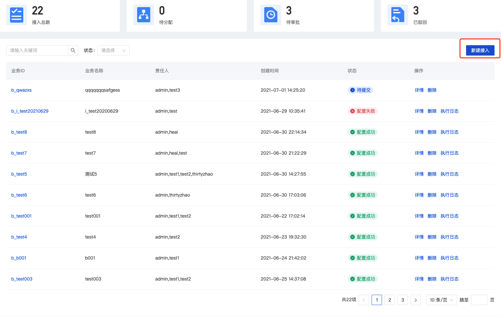
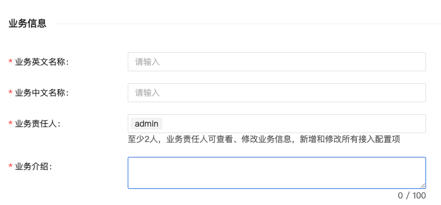
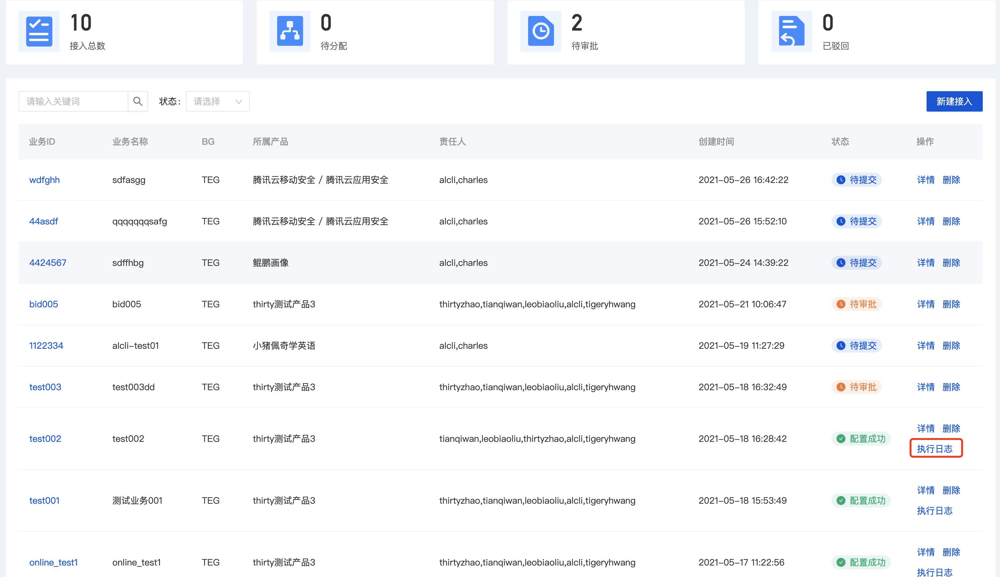
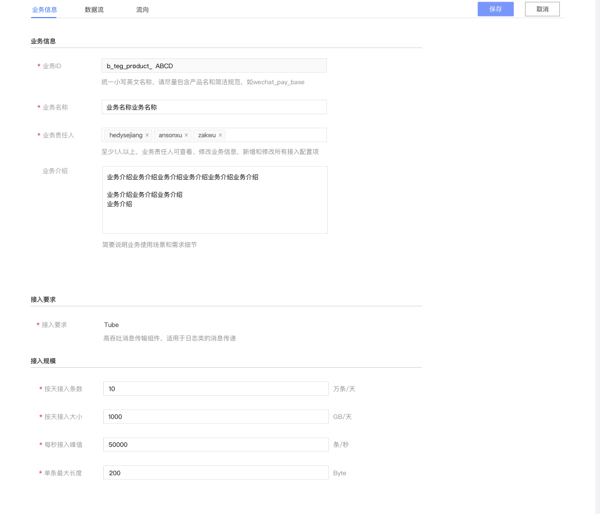
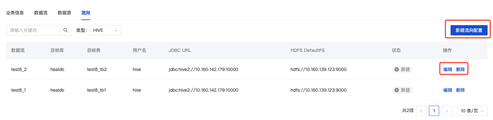
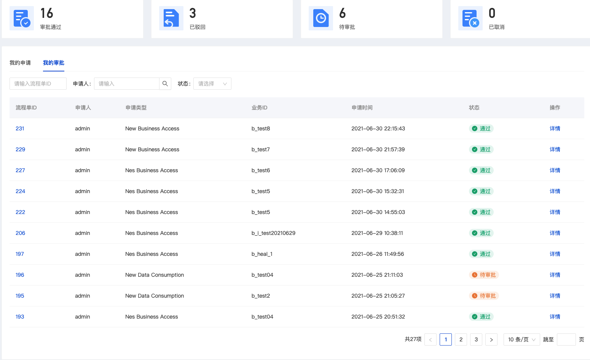
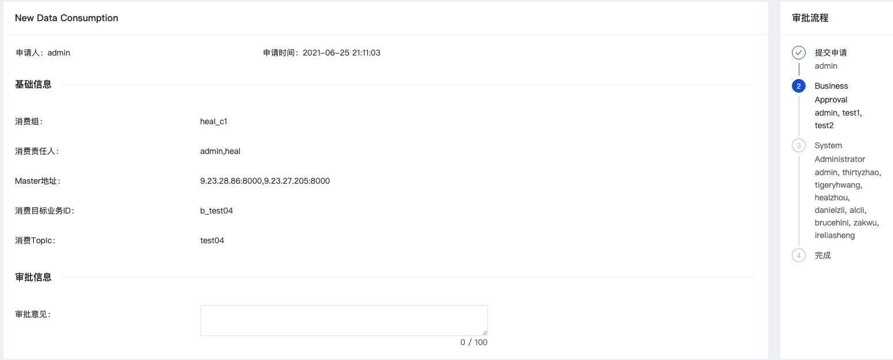
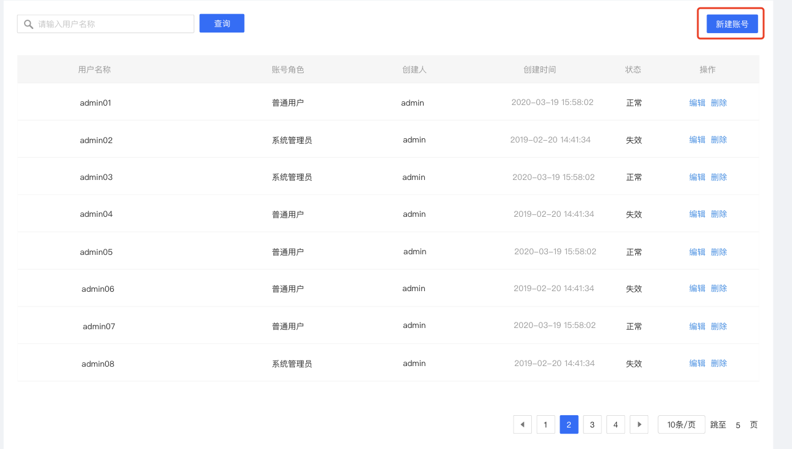

# 1. User login

Requires the user to enter the account name and password of the system

# 2. Data access

The data access module displays a list of all tasks connected to the system within the current user authority, and can
view, edit, update and delete the details of these tasks Click [Data Access] access process, there are two steps to fill
in data access information: business information, data stream.

## 2.1 Business Information

### 2.1.1 Business Information

You are required to fill in basic business information for access tasks.

- Business English ID: Unified lowercase English name, please try to include the product name and concise
  specifications, such as wechat_pay_base
- Business Chinese name: Chinese description of the business, easy to use and retrieve, up to 128 characters
- Business responsible person: at least 2 people, the business responsible person can view and modify business
  information, add and modify all access configuration items
- Business introduction: Cut SMS to introduce the business background and application of this access task:

### 2.1.2 Access requirements

Access requirements require users to choose message middleware: high throughput (TUBE)

High-throughput-Tube: high-throughput message transmission component, suitable for log message transmission

### 2.1.3 Access scale

The scale of access requires users to judge the scale of access data in advance, to allocate computing and storage
resources later

## 2.2 Data stream

Click [Next] to enter the data flow information filling step. There are four modules for data flow information filling:
basic information, data source, data information, and data flow direction In the data flow process, you can
click [New Data Stream] to create a new data stream page

### 2.2.1 Basic information

You are required to fill in the basic information of the data stream in the access task

- Data stream ID: The prefix is automatically generated according to the product/project, the unique identifier of
  the data in the business, the unique identifier defined by a certain business data in InLong, the data stream ID in
  the data source, and the entry in the TDW library information table The data stream ID is the same
- Data stream name: interface information description, the length is limited to varchar (64), 32 Chinese
- Data stream owner: The data stream owner can view and modify data stream information, add and modify all access
  configuration items
- Introduction to data flow: simple text introduction to data flow

### 2.2.2 Data source

You are required to select the source of the data stream. Currently, three methods of file and independent push are
supported, and the detailed information of the data source can be supplemented in the advanced options;

- File: The business data is stored in the form of a file, and the business machine deploys TDBank Agent, which is read
  according to the customized policy rules, and the detailed description link
- Autonomous push: The copy is to be determined, and the technical implementation is related to the 109 message
  middleware type
  
  

### 2.2.3 Data Information

You are required to fill in the data-related information in the data stream

- Data Format
- Data encoding: If the data source contains Chinese, you need to choose UTF-8 or GBK, otherwise the encoding format is
  incorrect and the storage is garbled
- Source field separator: the format of data sent to mq
- Source data field: attributes with different meanings divided by a certain format in mq

### 2.2.4 Data storage

You are required to select the final flow direction of this task, this part is not Currently supports both
hive flow direction and autonomous push

Add HIVE storage

- Target database: hive database name (prepared to create in advance)
- Target table: hive table name
- First-level partition: the field name of the first-level subdirectory of hdfs data divided by hive data
- Secondary partition: the field name of the first-level subdirectory of hdfs data divided by hive data
- Username: hive server connection account name
- User password: hive server connection account password
- HDFS url: Hive bottom HDFS connection
- JDBC url: jdbc url of hive server
- Field related information: source field name, source field type, HIVE field name, HIVE field type, field description,
  and support deletion and addition-

# 3. Access details

## 3.1 Execution log

When the status of the data access task is "approved successfully" and "configuration failed", the "execution log"
function can be used to allow users to view the progress and details of the task execution process

Click [Execution Log] to display the details of the task execution log in a pop-up window

The execution log will display the task type, execution result, execution log content, end time, and the end time of the
execution of the access process. If the execution fails, you can "restart" the task and execute it again.

## 3.2 Task details

The business person in charge/following person can view the access details of the task, and can modify and update part
of the information under the status of [Pending Submit], [Configuration Successful], and [Configuration Failed]
There are three modules in the access task details: business information, data flow, flow direction, and

### 3.2.1 Business Information

Display the basic business information in the access task, click [Edit] to modify part of the content

### 3.2.2 Data stream

Display the basic information of the data flow under the access task, click [New Data Flow] to create a new data flow
information

### 3.2.3 Data Storage

Display the basic information of the data flow in the access task, select different flow types through the drop-down
box, and click [New Flow Configuration] to create a new data flow information

# 4 Data consumption

Data consumption currently does not support direct consumption access to data, and data can be consumed normally after
the data approval process; Click [New Consumption] to enter the data consumption process, and you need to fill in
information related to consumption information.

## 4.1 Consumer Information

Applicants need to gradually fill in the basic consumer business information related to data consumption applications in
the information filling module

- Consumer group name: The prefix is automatically generated according to the product/project. The brief name of
  the consumer must be composed of lowercase letters, numbers, and underscores. The final approval will assign the
  consumer name based on the abbreviation splicing
- Consumer Responsible Person: At least 2 persons are required to choose the responsible person; the responsible person
  can view and modify the consumption information
- Consumer target business ID: you need to select the business ID of the consumer data, you can click [Query] and select
  the appropriate business ID in the pop-up window
  
- Data usage: select data usage usage
- Data usage description: The applicant needs to briefly explain the items used and the purpose of the data according to
  their own consumption scenarios After completing the information, click [Submit], and the data consumption process
  will be formally submitted to the approver before it will take effect.

# 5. Approval management

The approval management function module currently includes my application and my approval, and all tasks of data access
and data consumption application approval in the management system

## 5.1 My application

Display the current task list submitted by the applicant for data access and consumption in the system, click [Details]
to view the current basic information and approval process of the task

### 5.1.1 Data access details

Data access task detailed display The current basic information of the application task includes: applicant-related
information, basic information about application access, resource estimation information, and current approval process
nodes

### 5.1.2 Data consumption details

Data consumption task details display basic information of current application tasks including: applicant information,
basic consumption information, resource estimation, and current approval process nodes

## 5.2 My approval

As a data access officer and system member with approval authority, have the responsibility for data access or
consumption approval

### 5.2.1 Data Access Approval

New data access approval: Currently it is a first-level approval, which is approved by the system administrator The
system administrator will review whether the access process meets the access requirements based on the data access
business information

### 5.2.2 New data consumption approval

New data consumption approval: Currently it is a first-level approval, which is approved by the person in charge of the
business Business approval: The person in charge of the data access business judges whether the access requirements are
met according to the access parameter information, and then approves the application for consumption tasks based on this

# 6 System Management

System management is currently aimed at users with system administrator status, which can create, modify, and delete
accounts

## 6.1 New user

Users with system administrator rights can create new user accounts

- Account type: Ordinary user (has data access and data consumption permissions, but does not have data access approval
  and account management permissions); system administrators (have data access and data consumption permissions, but
  also require data access approval and Account management permissions)
- username: username for login
- user password:
  -Effective duration: the account can be used in the system
  

## 6.2 Delete user

The system administrator can delete the account of the created user, and the secondary account will stop using after
deletion

## 6.3 User Edit

The system administrator can edit the created account for the second time

Currently, system administrators support modification of existing accounts: account type and effective duration

## 6.4 Change password

Users can change the account password by themselves, click [Change Password]

The user needs to enter the old password and the new password, the new password of the second account will take effect
after confirmation