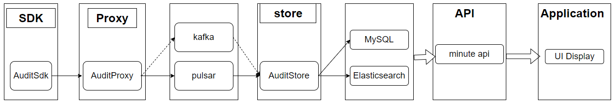

InLong audit is a subsystem independent of InLong, which performs real-time audit and reconciliation on the incoming and
outgoing traffic of the Agent, DataProxy, and Sort modules of the InLong system.
There are three granularities for reconciliation: minutes, hours, and days.

The audit reconciliation is based on the log reporting time, and each service participating in the audit will conduct
real-time reconciliation according to the same log time. Through audit reconciliation, we can clearly understand InLong
The transmission status of each module, and whether the data stream is lost or repeated

## Architecture



- The audit SDK is nested in the service that needs to be audited, audits the service, and sends the audit result to
  the audit access layer
- The audit proxy writes audit data to MQ (Pulsar, Kafka or TubeMQ)
- The distribution service consumes the audit data of MQ, and writes the audit data to MySQL or StarRocks.
- The interface layer encapsulates the data of MySQL or StarRocks.
- Application scenarios mainly include report display, audit reconciliation, etc.
- Support audit and reconciliation of data supplementary recording scenarios.
- Support audit reconciliation in Flink checkpoint scenarios.

## Module

| Modules       | Description                                                                                  |
|:--------------|:---------------------------------------------------------------------------------------------|
| audit-sdk     | Audit hidden points are reported. Each module uses the SDK to report audit data              |
| audit-proxy   | Audit proxy layer, receives data reported by SDK and forwards it to MQ (pulsar/kafka/tubeMQ) |
| audit-store   | Audit storage layer, supporting common JDBC protocol                                         |
| audit-service | Audit service layer, providing aggregation, cache, OpenAPI and other capabilities            |

## Audit Dimension

|            |              |           ||                    |          |                 |                  |                   |      |
|------------|--------------|-----------|--------------------|----------|-----------------|------------------|-------------------|------| ---- |
| Machine ip | Container ID | Thread ID | Log time (minutes) | Audit ID | inlong_group_id | inlong_stream_id | Number of records | Size | Transmission delay (ms) |

## Audit ID

The receiving and sending of each module are respectively an independent audit item ID

| Inlong Service Module                   | Audit ID |
|-----------------------------------------|----------|
| Inlong API Received Successfully	       | 1        |
| Inlong API Send Successfully	           | 2        |
| Inlong Agent Received Successfully	     | 3        |
| Inlong Agent Send Successfully	         | 4        |
| Inlong DataProxy Received Successfully	 | 5        |
| Inlong DataProxy Send Successfully	     | 6        |

## Audit data storage

Audit Store supports writing operations to all storage components compatible with the JDBC protocol. Therefore, when
selecting a storage component compatible with the JDBC protocol, it is only necessary to ensure that it meets the
following schema:

```sql
CREATE TABLE IF NOT EXISTS `audit_data`
(
    `id`               int(32)      NOT NULL PRIMARY KEY AUTO_INCREMENT COMMENT 'Incremental primary key',
    `ip`               varchar(32)  NOT NULL DEFAULT '' COMMENT 'Client IP',
    `docker_id`        varchar(100) NOT NULL DEFAULT '' COMMENT 'Client docker id',
    `thread_id`        varchar(50)  NOT NULL DEFAULT '' COMMENT 'Client thread id',
    `sdk_ts`           TIMESTAMP    NOT NULL DEFAULT CURRENT_TIMESTAMP COMMENT 'SDK timestamp',
    `packet_id`        BIGINT       NOT NULL DEFAULT '0' COMMENT 'Packet id',
    `log_ts`           TIMESTAMP    NOT NULL DEFAULT CURRENT_TIMESTAMP COMMENT 'Log timestamp',
    `inlong_group_id`  varchar(100) NOT NULL DEFAULT '' COMMENT 'The target inlong group id',
    `inlong_stream_id` varchar(100) NOT NULL DEFAULT '' COMMENT 'The target inlong stream id',
    `audit_id`         varchar(100) NOT NULL DEFAULT '' COMMENT 'Audit id',
    `audit_tag`        varchar(100)          DEFAULT '' COMMENT 'Audit tag',
    `audit_version`    BIGINT                DEFAULT -1 COMMENT 'Audit version',
    `count`            BIGINT       NOT NULL DEFAULT '0' COMMENT 'Message count',
    `size`             BIGINT       NOT NULL DEFAULT '0' COMMENT 'Message size',
    `delay`            BIGINT       NOT NULL DEFAULT '0' COMMENT 'Message delay count',
    `update_time`      timestamp    NOT NULL DEFAULT CURRENT_TIMESTAMP ON UPDATE CURRENT_TIMESTAMP COMMENT 'Update time',
    INDEX group_stream_audit_id (`inlong_group_id`, `inlong_stream_id`, `audit_id`, `log_ts`)
) ENGINE = InnoDB
  DEFAULT CHARSET = UTF8 COMMENT ='InLong audit data table';
```

- ip: Represents the client's IP address;
- docker_id: String of length 100 that represents the client's Docker ID;
- thread_id: String of length 50 that represents the client's thread ID;
- sdk_ts: TIMESTAMP type that represents the SDK timestamp, with a default value of the current timestamp;
- packet_id: 64-bit integer that represents the ID of the data packet;
- log_ts: TIMESTAMP type that represents the timestamp of the log, with a default value of the current timestamp;
- inlong_group_id: String of length 100 that represents the ID of the target Inlong group;
- inlong_stream_id: String of length 100 that represents the ID of the target Inlong stream;
- audit_id: String of length 100 that represents the audit ID;
- audit_tag: String of length 100 that represents the audit tag, with a default value of an empty string;
- audit_version: 64-bit integer that represents the audit version, with a default value of -1;
- count: 64-bit integer that represents the message count, with a default value of 0;
- size: 64-bit integer that represents the message size, with a default value of 0;
- delay: 64-bit integer that represents the message delay count, with a default value of 0;
- update_time: TIMESTAMP type that represents the update time, with a default value of the current timestamp.