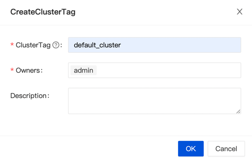
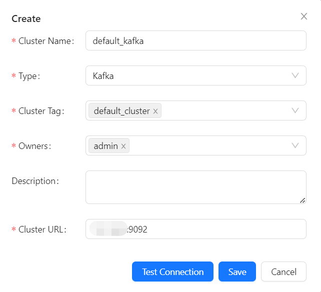
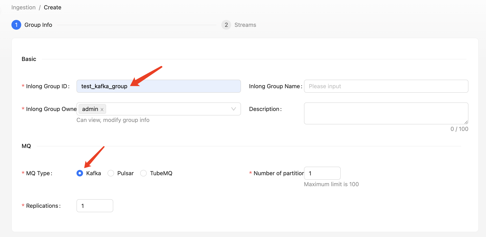
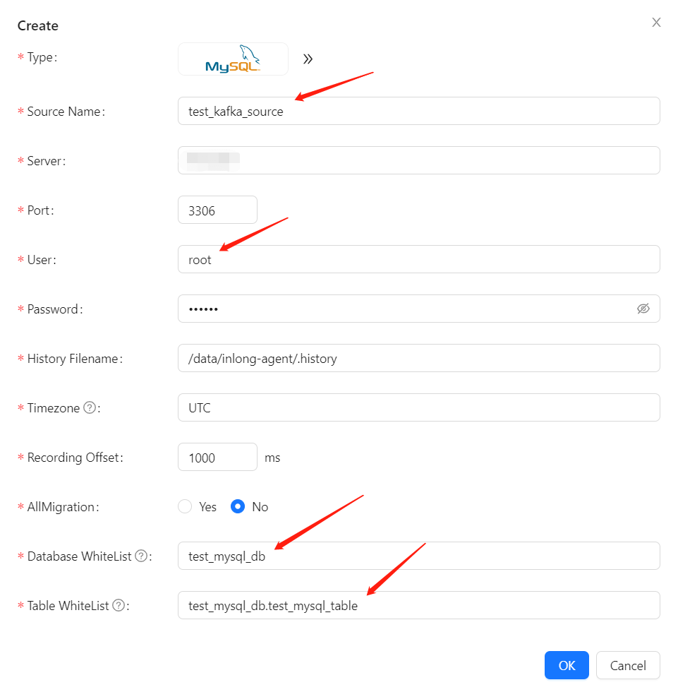
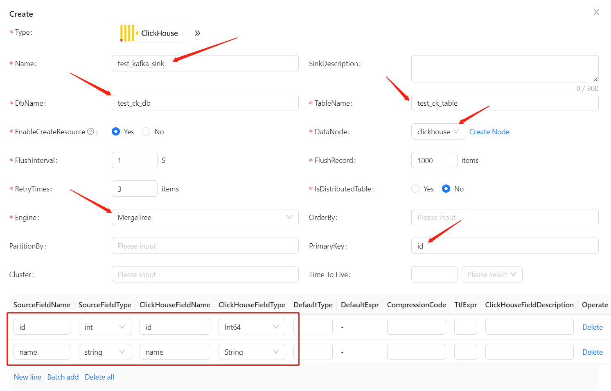
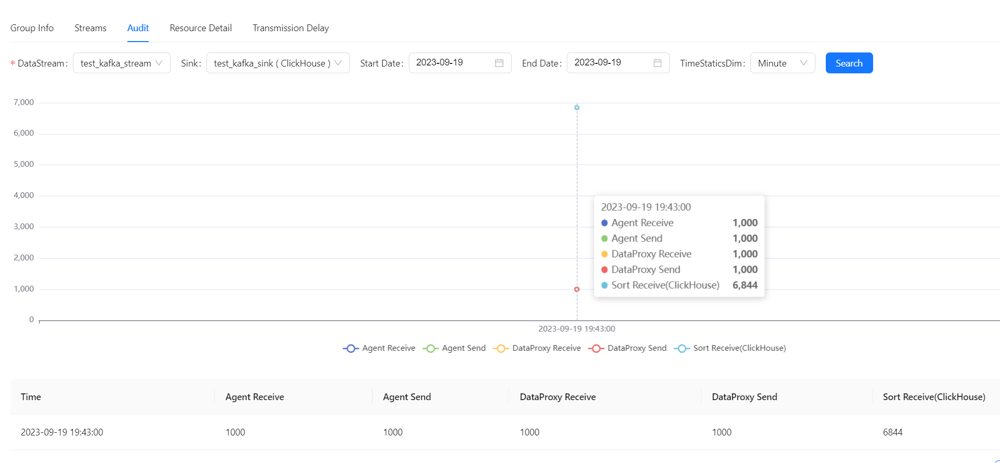

Here we use an example to introduce how to use Apache InLong creating `MySQL -> Kafka -> ClickHouse` data ingestion.

## Deployment
### Install InLong

Before we begin, we need to install InLong. Here we provide two ways:
- [Docker Deployment](deployment/docker.md) (Recommended)
- [Bare Metal Deployment](deployment/bare_metal.md)

### Install ClickHouse
```shell
docker run -d --rm --net=host --name clickhouse -e CLICKHOUSE_USER=admin -e CLICKHOUSE_PASSWORD=inlong -e CLICKHOUSE_DEFAULT_ACCESS_MANAGEMENT=1 clickhouse/clickhouse-server:22.8
```

### Install Kafka
```shell
# Prepare zookeeper for Kafka
docker run -d --name zookeeper -p 2181:2181 -t wurstmeister/zookeeper
# Install Kafka 
docker run -d --name kafka -p 9092:9092 -e KAFKA_BROKER_ID=0 -e KAFKA_ZOOKEEPER_CONNECT=zookeeper:2181 --link zookeeper -e KAFKA_ADVERTISED_LISTENERS=PLAINTEXT://kafka:9092 -e KAFKA_LISTENERS=PLAINTEXT://0.0.0.0:9092 -t wurstmeister/kafka
```

## Cluster Initialize
When all containers are successfully started, you can access the InLong dashboard address http://localhost, and use the following default account to log in.
```properties
User: admin
Password: inlong
```

### Create Cluster Tag
Click [Clusters] -> [ClusterTags] -> [Create] on the page to specify the cluster label name and person in charge.


:::caution
Since each component reports the ClusterTags as `default_cluster` by default, do not use other names.
:::

### Register Kafka Cluster
Click [Clusters] -> [Create] on the page to register Kafka Cluster.


### Register Clickhouse DataNodes
Click [DataNodes] -> [Create] on the page to register ClickHouse DataNodes.


## Create Task
### Create Data Streams Group
Click [Ingestion] -> [Create], input ID and select Kafka MQ Type.


### Create Data Stream
Click [Next] -> [Create], config data stream.


### Create Data Source
Click [Sources create] -> [MySQL], config data source information.


:::note
Please create `test_mysql_db.test_mysql_table` database and table, it's schema is:
CREATE TABLE test_mysql_db.test_mysql_table (
id INT PRIMARY KEY,
name VARCHAR(50)
);
:::

### Create Data Sink
Click [Sinks create] -> [ClickHouse], input Name, DbName, TableName and select created ck DataNode and so on, then click [save].


### Approve Data Stream
Click [Approval] -> [MyApproval] -> [Detail] -> [Select Cluster tag] -> [Ok].


Back to [Ingestion] page, wait for [configuration success].


## Test Data
### Send Data

Add 1000 data items to MySQL.

### Verify Data
Check data in [Audit] page.


then enter ClickHouse container, check data in table.


## Questions
### Task Configuration Failed
Generally, the MQ or Flink group configuration is incorrect. You can view the error information on the page, or enter the Manager container to view detailed logs.

### The script for sending data
```bash
#!/bin/bash

# MySQL information
DB_HOST="mysql"
DB_USER="root"
DB_PASS="inlong"
DB_NAME="test_mysql_db"
DB_TABLE="test_mysql_table"

# insert data by a loop
for ((i=1; i<=1000; i++))
do
    # generate data
    id=$i
    name="name_$i"
    # insert data
    query="INSERT INTO $DB_TABLE (id, name) VALUES ($id, '$name');"
    # execute insert
    mysql -h $DB_HOST -u $DB_USER -p$DB_PASS $DB_NAME -e "$query"
done
```