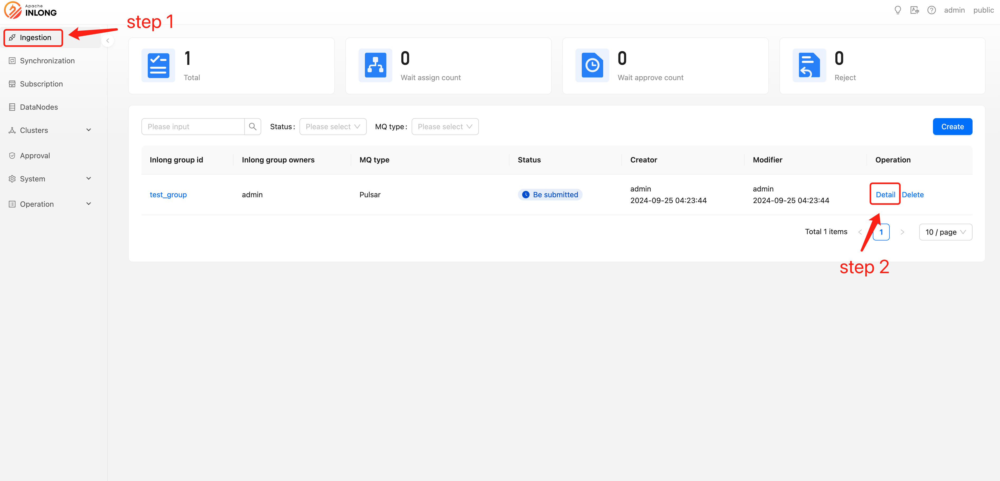
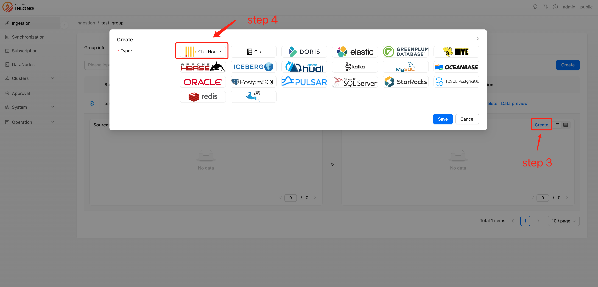

# Prerequisites
- Configure the Clickhouse data node
- Configure the Inlong group and Inlong stream

# Create clickhouse sink
After configuring the Clickhouse data node, Inlong group, and Inlong stream, you can create a Clickhouse sink:

Select【Ingestion】and click【Detail】

Select【Create】and click Clickhouse type.

Fill in the required configuration information for Clickhouse and click Save.

- Name：User-defined name, used to identify this sink information.
- Sink description：This sink description information.
- Create resource：Decide whether to perform table creation operation for this sink.
- DB name：clickhouse database name.
- Table name：clickhouse table name.
- Data node：clickhouse data node.

The creation of the subscription is now complete.
