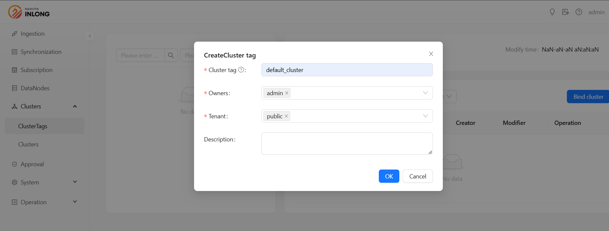
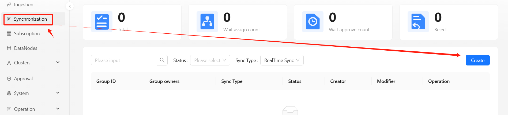
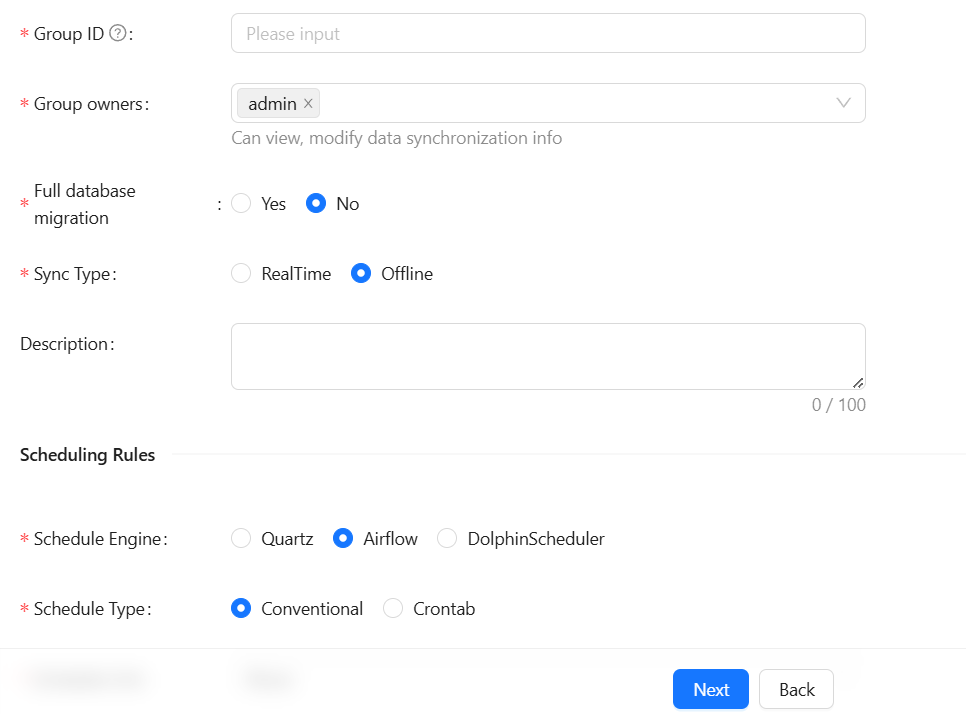

In the following sections, we will walk through a complete example to demonstrate how to integrate the third-party scheduling engine Airflow into Apache InLong to create an offline data synchronization from Pulsar to MySQL.

## Deployment
### Install InLong

Before we begin, we need to install InLong. Here we provide two ways:
- [Docker Deployment](deployment/docker.md) (Recommended)
- [Bare Metal Deployment](deployment/bare_metal.md)

### Add Connectors

Download the [connectors](https://inlong.apache.org/downloads/) corresponding to Flink version, and after decompression, place `sort-connector-jdbc-[version]-SNAPSHOT.jar` in `/inlong-sort/connectors/` directory.
> Currently, Apache InLong's offline data synchronization capability only supports Flink-1.18, so please download the 1.18 version of connectors.

## Create Clusters And Data Target
When all containers are successfully started, you can access the InLong dashboard address `http://localhost`, and use the following default account to log in.
```properties
User: admin
Password: inlong
```

### Create Cluster Tag


### Register Pulsar Cluster


### Create Data Target


Execute the following SQL statement:

```sql
CREATE TABLE sink_table (
    id INT AUTO_INCREMENT PRIMARY KEY,
    name VARCHAR(255) NOT NULL,
    create_time TIMESTAMP DEFAULT CURRENT_TIMESTAMP
);
```

## Airflow Initialize

### Get Original DAG

They can be obtained from [InLong](https://github.com/apache/inlong).


> Airflow does not provide an API for DAG creation, so two original DAGs are required. `dag_creator` is used to create offline tasks, and `dag_cleaner` is used to clean up offline tasks regularly.

### Create Original DAG

Place the DAG file in the Airflow default DAG directory and wait for a while. The Airflow scheduler will scan the directory and load the DAG:


### Airflow REST API

By default, Airflow will reject all REST API requests. Please refer to the [Airflow official documentation](https://airflow.apache.org/docs/apache-airflow-providers-fab/stable/auth-manager/api-authentication.html) for configuration.

### Configure InLong Manager

Modify the configuration file according to the configuration file requirements and restart InLong Manager.
```properties
# InLong Manager URL accessible by the scheduler
schedule.engine.inlong.manager.url=http://inlongManagerIp:inlongManagerPort
# Management URL for Airflow
schedule.engine.airflow.baseUrl=http://airflowIP:airflowPort
# Username and password for Airflow REST API authentication
schedule.engine.airflow.username=airflow
schedule.engine.airflow.password=airflow
# Connection used to save InLong Manager authentication information
schedule.engine.airflow.connection.id=inlong_connection
# The ids of the two original DAGs
schedule.engine.airflow.cleaner.id=dag_cleaner
schedule.engine.airflow.creator.id=dag_creator
```

## Task Creation
### Create Synchronization Task



### Create Data Stream Group


Please refer to the following steps: [Quartz Scheduling Engine Example](./quartz_example.md)
### Create Airflow Offline Task

After approval and configuration, InLong Manager will trigger `dag_creator` through the Airflow API to create the offline task DAG:


> Offline task DAG may not be scheduled immediately, because Airflow will scan DAG files regularly and add them to the schedule, so it may take some time.

The offline task execution results are as follows:


> Airflow will periodically call the interface provided by InLong Manager to submit Flink tasks according to the configuration in the `Create Data Stream Group` section. This is why the authentication information of InLong Manager needs to be saved in the `Configure InLong Manager` section.

## Test Data
### Sending Data

Use the Pulsar SDK to produce data into the Pulsar topic. An example is as follows:

```java
// Create pulsar client and producer
PulsarClient pulsarClient = PulsarClient.builder().serviceUrl("pulsar://localhost:6650").build();
Producer<byte[]> producer = pulsarClient.newProducer().topic("public/default/test").create();

// Send a message
for (int i = 0; i < 10000; i++) {
    // The field separator is |
    String msgStr = i + "|msg-" + i;
    MessageId msgId = producer.send(msgStr.getBytes(StandardCharsets.UTF_8));
    System.out.println("Send msg : " + msgStr + " with msgId: " + msgId);
}
```

### Data Validation

Then enter MySQL to check the data in the table:


