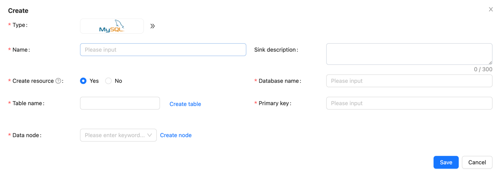
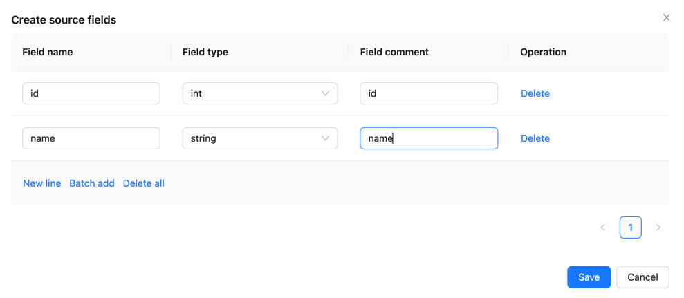
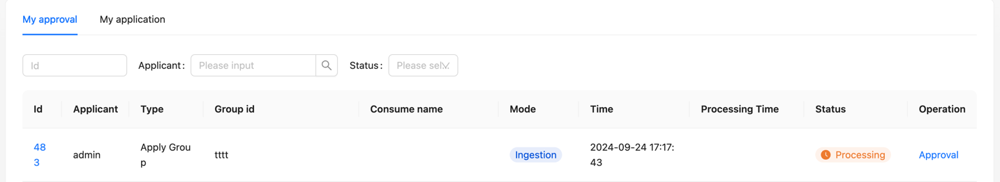
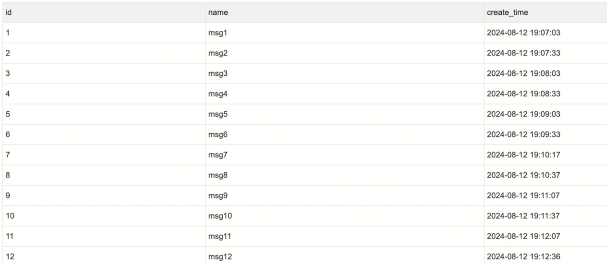

In the following sections, we will walk through a complete example to demonstrate how to use Apache InLong's built-in scheduling engine (Quartz) to create an offline data synchronization from Pulsar to MySQL.

## Deployment
### Install InLong

Before we begin, we need to install InLong. Here we provide two ways:
- [Docker Deployment](deployment/docker.md) (Recommended)
- [Bare Metal Deployment](deployment/bare_metal.md)

### Add Connectors

Download the [connectors](https://inlong.apache.org/downloads/) corresponding to Flink version, and after decompression, place `sort-connector-jdbc-[version]-SNAPSHOT.jar` in `/inlong-sort/connectors/` directory.
> Currently, Apache InLong's offline data synchronization capability only supports Flink-1.18, so please download the 1.18 version of connectors.

## Cluster Initialize
When all containers are successfully started, you can access the InLong dashboard address `http://localhost`, and use the following default account to log in.
```properties
User: admin
Password: inlong
```

### Create Cluster Tag
Click [Clusters] -> [ClusterTags] -> [Create] on the page to specify the cluster label name and person in charge.


:::caution
`default_cluster` is the default ClusterTags for each component. If you decide to use a different name, make sure to update the corresponding tag configuration accordingly.
:::

### Register Pulsar Cluster


:::info
You can refer to the screenshot information to fill in details such as cluster name, associated tag, and Pulsar cluster address.
:::

## Task Creation
### Create Data Stream Group
Click on [Synchronization]→[Create], fill in the Group ID, and ensure the [Sync Type] is checked as "Offline".


### Configuration Scheduling Rules
After selecting "offline" for [Sync Type], you can configure the [Scheduling Rules] for offline tasks. Scheduling Rules include two parts: [Scheduling Engine] and [Scheduling Type].

#### Scheduling Engine
Apache InLong provide several scheduling engines for users to choose from, Quartz is a build-in schedule engine in Apache InLong. Here we use quartz to handle tasks.


#### Schedule Type
Apache InLong supports two scheduling types currently: Conventional and Crontab.

Conventional Scheduling Configuration requires the following parameters:
- Scheduling Unit: Supports minutes, hours, days, months, years, and single execution (single execution means it will run only once).
- Scheduling Interval: Indicates the time interval between two task schedules.
- Delay Time: Indicates the delay time for task startup.
- Valid Time: Includes start time and end time; the scheduled task will only execute within this time range.


Crontab Scheduling requires the following parameters:
- Valid Time: Includes start time and end time; the scheduled task will only execute within this time range.
- Crontab Expression: Indicates the task cycle, e.g. `0 */5 * * * ?`


### Create Data Source
In the data source section, click [Create] → [Pulsar], and configure the data source name, Pulsar tenant, namespace, topic, admin URL, service URL, data format, and other parameters.


Note: The Pulsar topic needs to be created in the Pulsar cluster in advance (or enable the automatic topic creation feature in the Pulsar cluster).

### Create Data Sink

Create the target MySQL table; the example SQL is as follows:

```sql
CREATE TABLE sink_table (
    id INT AUTO_INCREMENT PRIMARY KEY,
    name VARCHAR(255) NOT NULL,
    create_time TIMESTAMP DEFAULT CURRENT_TIMESTAMP
);
```

In the data sink section, click [Create] → [MySQL], and configure the data sink name, database name, and table name (test.sink_table), among other information.



### Configure source and sink fields

Configure schema mapping information in the [Source fields] and [Sink fields] sections, and click [Submit] for approval.




### Approval data flow

On the page, click [Approval] -> [My Approvals] -> [Approve] → [OK].



Return to the [Synchronization] page and wait for the task configuration to succeed. Once configured successfully, the Manager will periodically submit Flink Batch Jobs to the Flink cluster.


## Test Data
### Sending Data

Use the Pulsar SDK to produce data into the Pulsar topic. An example is as follows:
```java
// Create Pulsar client and producer
PulsarClient pulsarClient = PulsarClient.builder().serviceUrl("pulsar://localhost:6650").build();
Producer<byte[]> producer = pulsarClient.newProducer().topic("public/default/test").create();

// Send messages
for (int i = 0; i < 10000; i++) {
    // Field separator is |
    String msgStr = i + "|msg-" + i;
    MessageId msgId = producer.send(msgStr.getBytes(StandardCharsets.UTF_8));
    System.out.println("Send msg : " + msgStr + " with msgId: " + msgId);
}
```

### Data Validation

Then enter MySQL to check the data in the table:


