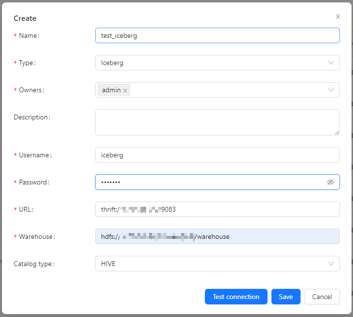
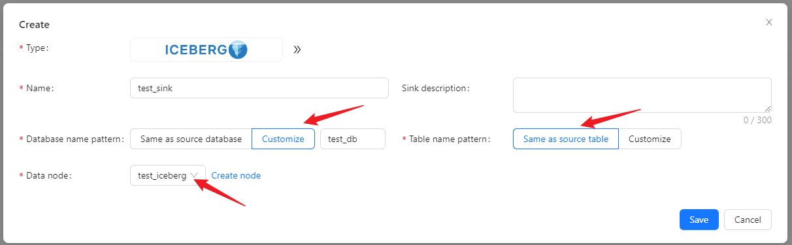
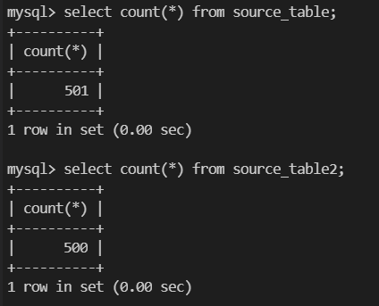
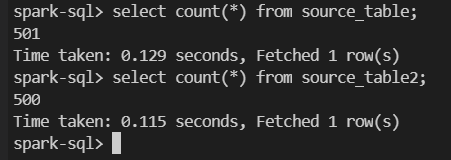

Here we use an example to introduce how to use Apache InLong creating `MySQL -> Iceberg` full database migration.

## Deployment
### Install InLong

Before we begin, we need to install InLong. Here we provide two ways:
- [Docker Deployment](deployment/docker.md) (Recommended)
- [Bare Metal Deployment](deployment/bare_metal.md)

### Add Connectors
Download the [connectors](https://inlong.apache.org/downloads/) corresponding to Flink version, and after decompression, place `sort-connector-iceberg-[version]-SNAPSHOT.jar` in `/inlong-sort/connectors/` directory.

### Install Iceberg
Please refer to the [Installation Tutorial](https://iceberg.apache.org/hive-quickstart) on the Apache Iceberg official website.

## Cluster Initialize
When all containers are successfully started, you can access the InLong dashboard address http://localhost, and use the following default account to log in.
```properties
User: admin
Password: inlong
```

### Register Iceberg DataNodes
Click [DataNodes] -> [Create] on the page to register Iceberg DataNodes.


## Create Task
### Create Data Streams Group
Click [Synchronization] → [Create] on the page and input the Group ID, Stream ID and Full database migration:


### Create Data Source
In the data source, click [New] → [MySQL] to configure the source name, address, databases and tables information.


:::note
- If the read mode is `Full amount + Incremental`, the existing data in the source table will also be collected, but the `Incremental` mode will not.
- The table white list format is `<dbName>.<tableName>` and supports regular expressions.
:::

### Create Data Sink
In the data sink, click [New] → [Iceberg] to configure the sink name and created Iceberg data node.
We can choose the data sink to have the same database table name as the data source, or customize it.


:::note
When customizing the names of database tables, you can use built-in parameters and string combinations to generate the target table names.

Built-in parameters include:
- Source database name: ${database}
- Source table name: ${table}

For example, if the source table name is `table1` and the mapping rule is `${table}_inlong`, the data from `table1` will be ultimately mapped and written into `table1_inlong`.
:::

### Approve Data Stream
Click [Approval] -> [MyApproval] -> [Approval] -> [Ok].


Back to [Synchronization] page, wait for [success].


## Test Data
### Send Data
```bash
#!/bin/bash

# MySQL info
DB_HOST="mysql"
DB_USER="root"
DB_PASS="inlong"
DB_NAME="test"
DB_TABLE1="source_table"
DB_TABLE2="source_table2"

# Insert data in a loop
for ((i=1; i<=500; i++))
do
    # Generate data
    id=$i
    name="name_$i"

    # Build an insert SQL
    query1="INSERT INTO $DB_TABLE1 (id, name) VALUES ($id, '$name');"
    query2="INSERT INTO $DB_TABLE2 (id, name) VALUES ($id, '$name');"

    # Execute insert SQL
    mysql -h $DB_HOST -u $DB_USER -p$DB_PASS $DB_NAME -e "$query1"
    mysql -h $DB_HOST -u $DB_USER -p$DB_PASS $DB_NAME -e "$query2"
done
```

Modify the variables in the script according to the actual environment, and insert 500 pieces of data into each table(There is a piece of existing data in `source_table`):


### Verify Data
Enter Iceberg, check data in table.



You can also view audit data on the page:

