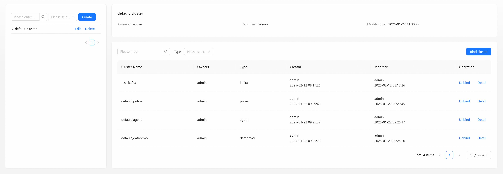

## Overview
The guide in this section will show you how to manage data flows through the `Inlong` dashboard and introduce some management configurations. 
Through this guide, you will learn to perform operations such as data access, data consumption, data synchronization, and cluster management.

## Getting started
To start using the `InLong` dashboard, please deploy it first. Here are several ways to do it:

- [Standalone](/deployment/standalone.md)
- [Docker](/deployment/docker.md)
- [Kubernetes](/deployment/k8s.md)
- [Bare Metal](/deployment/bare_metal.md)

:::tip
We recommend using `docker` for deployment.
:::

## User Login

Requires the user to enter the system account name and password. The default account name is `admin` and the password is `inlong`. 
It is recommended that you change the password in time after logging in.

## Data Access

The data access module is responsible for aggregating data from various data sources into a unified storage service, enabling further data queries and analysis.

### Create Data Stream Group

Click on [Create] button, this step requires you to fill in the basic information of the data flow group.

- **InLong group id**: Unified lowercase English name, please try to include the product name and concise
  specifications, such as pay_base.
- **InLong group name**: Custom data group name.
- **InLong group owners**: The data stream group owner can view and modify group information, 
  add and modify all access configuration items.
- **Description**: Simple text introduction to data stream group
- **MQ type**: Choose message middleware of MQ.

Currently, supports three message middleware of MQ. we use TubeMQ as an example.
you can also check [Kafka](/quick_start/data_ingestion/mysql_kafka_clickhouse_example.md) data access example
and [Pulsar](/quick_start/data_ingestion/file_pulsar_clickhouse_example.md) data access example.

:::info MQ Type
- Apache Kafka: high throughput and low latency, and can handle large-scale data streams.
- Apache Pulsar: high-reliability message transmission component, suitable for billing transmission.
- InLong TubeMQ: high-throughput message transmission component, suitable for log message transmission.
:::

Click on [Next] button, to enter the data stream information filling step.

### Create Data Stream

Data stream has a specific data source, data format and data sink. Click [Create] button to create a new data stream:

#### Step 1: Create Data Stream Information

- **Stream id**: The prefix is automatically generated according to the product/project, which is unique in a 
  specific group and is consistent with the stream id in the data source and the storage table.
- **Stream name**: Custom name for a data stream, used to visually identify the purpose or type of the data stream.
- **Description**: Simple text introduction to data stream.
- **Data type**: The data format type transmitted in the data stream. Supported types: `CSV`, `Key-Value`, `Avro`, `JSON`
- **Ignore parse error**: Whether to ignore data parsing errors.
  - `Yes`: skip the invalid data and continue processing.
  - `No`: stop processing when an error is encountered.
- **Data encoding**: Character encoding of data, such as `UTF-8`, `GBK`.
- **Source data separator**: The field separator of the source data.
- **Source fields**: Schema of the source data fields. Applicable to structured data formats.
- **Advanced options**: Additional configuration for data processing.

Click on [Ok] button, to save the data stream information.

#### Step 2: Create Data Source And Data Target

The left side is the data source, and the right side is the data target.
You can find more examples of create data source and data target in the **[Data Ingestion]** section under **[Quick Start]**.

The types supported by the data source are as:

The types supported by the data target are as:

After create the data source and data target, click the [Submit] button to enter the [approval management](#approval-management).

## Data Synchronization

Data synchronization is the process of establishing consistency between source and target data stores, and the continuous harmonization of the data over time.
Click the [Create] button to create a data synchronization group.

`InLong` has two data synchronization modes, one is real-time data synchronization and the other is offline data synchronization.

### Realtime Data Synchronization

Suitable for low-latency scenarios such as real-time monitoring and transaction flow synchronization

#### Step 1: Create Realtime Synchronization Data Stream Group

Select the synchronization type of [RealTime]

- **Group ID**: Unified lowercase English name, please try to include the product name and concise specifications, such as pay_base.
- **Group owners**: The data stream group owner can view and modify group information,
  add and modify all access configuration items.
- **Full database migration**: Whether to migrate the entire database.
- **Sync Type**: Real-time or offline.
- **Description**: Simple text introduction to data stream group.

Click the [Next] button to create data stream.

#### Step 2: Create Realtime Synchronization Data Stream

Here are a few examples of creating real-time data synchronization:

- [MySQL to ClickHouse Example](/quick_start/realtime_data_sync/mysql_clickhouse_example.md)
- [MySQL to StarRocks Example](/quick_start/realtime_data_sync/mysql_starrocks_example.md)
- [MySQL to Iceberg Example](/quick_start/realtime_data_sync/mysql_iceberg_example.md)
- [Pulsar to ClickHouse Example](/quick_start/realtime_data_sync/pulsar_clickhouse_example.md)

### Offline Data Synchronization

Applicable to scenarios such as data warehouse construction and historical migration.

#### Step 1: Create Offline Synchronization Data Stream Group

Select the synchronization type of [Offline], In addition to filling in the basic data stream group information, you also need to 
fill in offline synchronization related information, such as scheduling rules and dependency configuration.

**Scheduling Rules**:

- **Schedule Engine**: Choose `quartz` or `airflow` or `dolphinScheduler` engine.
- **Schedule Type**: Choose regular or `Crontab` type.
- **Schedule Unit**: Select minutes, hours, days, years, etc.
- **Schedule Interval**: Fill in the schedule unit time.
- **Delay Time**: Fill in the required delay time.
- **Valid Time**: Configure the validity time of offline rules.
- **Self Dependence**: Choose dependency type.

#### Step 2: Create Offline Synchronization Data Stream

Here are a few examples of creating offline data synchronization:

- [Quartz Scheduling Engine Example](/quick_start/offline_data_sync/quartz_example.md)
- [DolphinScheduler Scheduling Engine Example](/quick_start/offline_data_sync/dolphinscheduler_example.md)
- [Airflow Scheduling Engine Example](/quick_start/offline_data_sync/airflow_example.md)

## Data Subscription

Data Subscription provides subscribers bulk data feeds of the data they are entitled to access.

Click [New subscribe] button to create a new data subscription.

- **Consumer group name**: The brief name of the
  consumer must be composed of lowercase letters, numbers, and underscores. The final approval will assign the consumer
  name based on the abbreviation splicing.
- **Subscription owners**: Owner can view and modify consumption information
- **Target inLong group id**: Need to Select the target stream group in the drop-down box.

## Data Nodes

The data node module displays the list of data nodes within the current user permissions. You can view, edit, update and delete the details of these nodes.

Click [Create] button to pop up a dialog box for create a new node. You can choose different node types, such as: `Redis`, `Kafka`, `MySQL`, etc.

- **Name**: The brief name of the node, which must be composed of lowercase letters, numbers, and underscores.
- **Type**: Select the type of node.
- **Owners**: The node responsible person can view and modify node information.
- **Description**: Simple text introduction to data node.

## Cluster Management

The cluster management module is divided into two modules: cluster label management and cluster management. Cluster label 
management is used to manage cluster labels, and cluster management is used to manage clusters.

### Cluster Tag Management

Cluster label management can add, delete, modify cluster labels, view the cluster list, bind clusters, etc.

#### Add New Cluster Label

- **Cluster tag**: The brief name of the label, which must be composed of lowercase letters, numbers, and underscores. 
  Modifying the cluster label name will also modify the label names in all clusters bound to this label. 
  Make sure that this label is not used by InLong Group.
- **Owners**: The person in charge can view and modify cluster label information.
- **Tenant**: Select the tenant to be bound.
- **Description**: Simple text introduction to cluster label.

#### Bind Cluster

Click [Bind cluster] button to open the Bind cluster information box and select the cluster you want to bind.

- **Cluster name**: When the cluster list is empty, you need to go to the cluster management page to create the required
  cluster so that the cluster label can be bound to the cluster.

### Cluster Management

Cluster management can add, delete, modify clusters, view the cluster list, view cluster details, view cluster nodes, etc.

#### Create New Cluster

Click [Create] button to open dialog box for creating a new cluster will pop up.

- **Cluster Name**: The brief name of the cluster, which must be composed of lowercase letters, numbers, and underscores.
- **Type**: Select the type of cluster. you can choose different cluster types, such as `Agent`, `Kafka`, etc.
- **Owners**: The person in charge of the cluster can view and modify the cluster information.
- **Cluster label**: Select the label to be bound.
- **Description**: Simple text introduction to cluster.

## Approval Management

The approval management function module currently includes my application and my approval, and all tasks of data access
and consumption application approval in the management system.

Click [Detail] to view the current basic information and approval process of the task,
display the current task list submitted by the applicant for data access and consumption in the system.

## FAQ

### Data Stream configuration error

Generally, the `MQ` or `Flink` cluster configuration. You can view the error information on the page, or enter the `Manager` 
container to view detailed logs.
