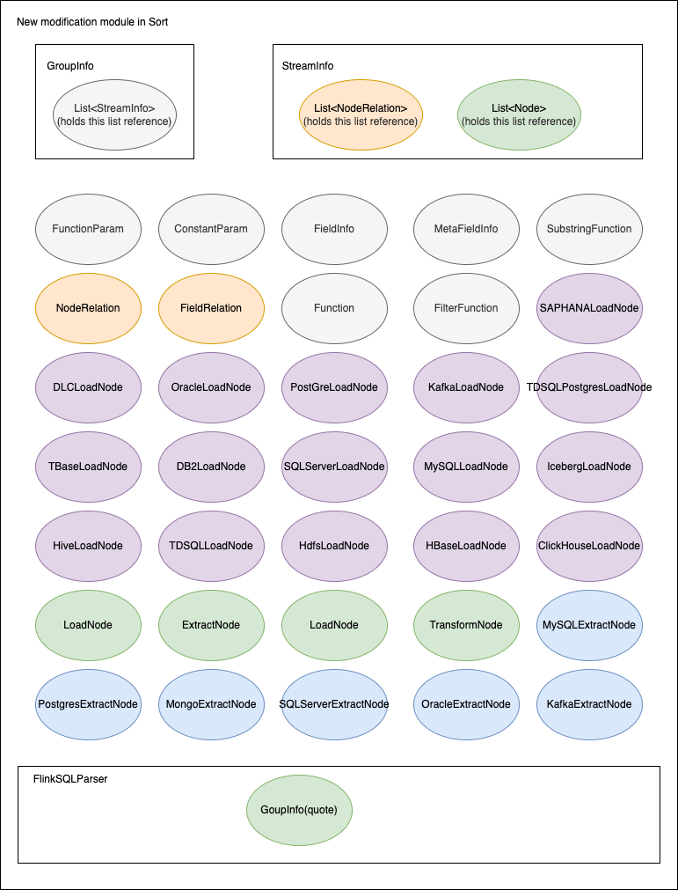

# 基于 Apache Flink SQL 的 InLong Sort ETL 方案解析

## 1. 背景

随着 Apache InLong(incubating) 的用户和开发者逐渐增多，更丰富的使用场景和低成本运营诉求越来越强烈，其中，InLong 全链路增加 Transform（T）的需求反馈最多。经过@yunqingmoswu、@EMsnap、@gong、@thexiay 社区开发者的调研和设计，完成了基于 Flink SQL 的 InLong Sort ETL 方案，本文将详细介绍该方案的实现细节。

<!--truncate-->

首先，基于 Apache Flink SQL 主要有以下方面的考量：

-  Flink SQL 拥有强大的表达能力带来的高可扩展性、灵活性，基本上 Flink SQL 能支持社区大多数需求场景。当 Flink SQL 内置的函数不满足需求时，我们还可通过各种UDF来扩展。
-  Flink SQL 相比 Flink 底层 API 实现开发成本更低，只有第一次需要实现 Flink SQL 的转换逻辑，后续可专注于 Flink SQL 能力本身的构建，比如扩展 Connector、自定义函数UDF等。
- 一般来说，Flink SQL 将更健壮、运行也将更稳定。原因在于 Flink SQL 屏蔽了 Flink 底层大量的细节，有强大的社区支持，并且经过大量用户的实践。
- 对用户来说，Flink SQL 也更加通俗易懂，特别是对使用过 SQL 用户来说，使用方式简单、熟悉，这有助于用户快速落地。
- 对于存量实时任务的迁移，如果其原本就是 SQL 类型的任务，尤其是 Flink SQL 任务，其迁移成本极低，部分情况下甚至都不用做任何改动。

注意：本方案的所有代码，可以参考 [Apache InLong Sort](https://github.com/apache/incubator-inlong/tree/master/inlong-sort) 模块，所含功能可在即将发布的 1.2.0 版本中下载使用。

## 2. 方案介绍

### 2.1 方案需求

该方案的主要需求，是完成的 InLong Sort 模块 Transform（T）能力，包括：

|  Transform   |                            说明                            |
| :----------: | :--------------------------------------------------------: |
|  窗口内去重  |                 在一个时间窗口内对数据去重                 |
| 时间窗口聚合 |             在一个时间窗口内对数据进行聚合操作             |
| 时间格式转换 |          将一个字段的值转换为目标时间格式的字符串          |
|   字段分割   |         将一个字段通过某个分割符分割为多个新的字段         |
|  字符串替换  |           将替换一个字符串字段中的部分或全部内容           |
|   数据过滤   |              将满足过滤条件的数据舍弃或者保留              |
|   内容提取   |            提取一个字段的一部分产生一个新的字段            |
|     连接     |                       支持两表 Join                        |
|    值替换    | 给定一个匹配值，如果该字段的值等于该值，则将其替换为目标值 |

### 2.2 使用场景

大数据集成的用户，在很多业务场景下都有数据转换、连接、过滤等 Transform 需求。

### 2.3 设计目标

本次设计需要达到以下目标：

- 功能性：在 InLong Sort 现有架构、数据流模型下，覆盖基本的 Transform 能力，并具备快速扩张的能力。
- 兼容性：新的 InLong Sort 数据模型向前兼容，确保历史任务能够正常配置运行。
- 可维护性：InLong Sort 数据模型转 Flink SQL 只需实现一遍，后期有新增的功能需求时，这块不需要改动，哪怕有改动也是少量改动即可支持。
- 可扩展性：当出现开源 Flink Connector 或者内置 Flink SQL 函数不满足需求时，可通过自定义 Flink Connector、UDF 来实现其功能扩展。

### 2.4 基本概念

核心概念参照概要设计中的名词解释

|            名称             |                             含义                             |
| :-------------------------: | :----------------------------------------------------------: |
|      InLong Dashborad       |                     Inlong 前端管理界面                      |
|    InLong Manager Client    | 将 Manager 当中的接口进行包装，供外部用户程序调用，不经过前端 InLong Dashboard |
|   InLong Manager Openapi    |               Inlong manager 与外部系统调用接口               |
|   InLong Manager metaData   | Inlong manager 元数据管理，包括 group、stream 纬度的元数据信息 |
| InLong Manager task manager | Inlong manager中管理数据源采集任务模块，管理agent的任务下发，指令下发，心跳上报 |
|        InLong Group         |     数据流组，包含多个数据流，一个 Group 代表一个数据接入     |
|        InLong Stream        |                数据流，一个数据流有具体的流向                |
|        Stream Source        |  流中有对应的采集端和 sink 端，本设计中只涉及到 stream source  |
|         Stream Info         |  Sort 中数据流向的抽象，包含该数据流的各种来源、转换、去向等  |
|         Group Info          |  Sort 中对数据流向的封装，一个 GroupInfo 可包含多个 Stream Info  |
|            Node             |          数据同步中数据源、数据转换、数据去向的抽象          |
|        Extract Node         |                     数据同步的来源端抽象                     |
|          Load Node          |                     数据同步的去向端抽象                     |
|     MySQL Extract Node      |                      MySQL 数据来源抽象                      |
|       Kafka Load Node       |                      Kafka 数据去向抽象                      |
|       Transform Node        |                    数据同步的转换过程抽象                    |
|  Aggregate Transform Node   |                  数据同步聚合类转换过程抽象                  |
|        Node Relation        |                  数据同步中各个节点关系抽象                  |
|       Field Relation        |             数据同步中上下游节点字段间关系的抽象             |
|          Function           |       转换函数的抽象，即数据同步T中各个 T 能力实现的抽象       |
|     Substring Function      |                     字符串截取函数的抽象                     |
|       Filter Function       |                      数据过滤函数的抽象                      |
|       Function Param        |                        函数的入参抽象                        |
|       Constant Param        |                           常量参数                           |
|         Field Info          |                           节点字段                           |
|       Meta FieldInfo        |                        节点元信息字段                        |

### 2.5 领域模型

本次设计主要涉及到以下实体：

Group、Stream、GroupInfo、StreamInfo、Node、NodeRelation、FieldRelation、Function、FilterFunction、SubstringFunction、FunctionParam、FieldInfo、MetaFieldInfo、MySQLExtractNode、KafkaLoadNode 等

为了便于理解，本小节将对实体之间关系进行建模分析。领域模型的实体对应关系说明：

- 一个 Group 对应 1 个 GroupInfo
- 一个 Stream 对应 1 个 StreamInfo
- 一个 Group 包含 1 个或多个 Stream
- 一个 GroupInfo 包含 1 个或多个 StreamInfo
- 一个 StreamInfo 包含多个 Node
- 一个 StreamInfo 包含 1 个或多个 NodeRelation
- 一个 NodeRelation 包含 1 个或多个 FieldRelation
- 一个 NodeRelation 包含 0 个或多个 FilterFunction
- 一个 FieldRelation 包含 1 个 Function 或 1 个 FieldInfo 作为来源字段，1 个 FieldInfo 作为目标字段
- 一个 Function 包含 1 个或多个 FunctionParam

上述关系由 UML 对象关系图可以表示为：


### 2.6 功能用例图


## 3. 系统概要设计

### 3.1 系统架构图


- Serialization：序列化实现模块
- Deserialization：反序列化实现模块
- Flink Source：自定义 Flink source实现模块
- Flink Sink：自定义的 Flink sink 实现模块
- Transformation：自定义的 Transform 实现模块
- GroupInfo：对应 Inlong group
- StreamInfo：对应 Inlong stream
- Node：对数据同步中数据来源、数据转换、数据去向的抽象
- FlinkSQLParser：SQL 解析器

### 3.2 InLong Sort 内部运行流程图


### 3.3 模块设计

本次设计只对原有系统增加 Flink Connector、FlinkSQL Generator 两个模块，对 Data Model 模块有修改。

#### 3.3.1 模块结构



#### 3.3.2 模块划分

重要模块划分说明：

|       名称        |                             说明                             |
| :---------------: | :----------------------------------------------------------: |
|  FlinkSQLParser   |       用于生成 FlinkSQL 核心类，包含 GroupInfo 的引用        |
|     GroupInfo     | Sort 内部对 InlongGroup 的抽象，用于封装整个 InlongGroup 同步相关信息，包含对 List\<StreamInfo\> 的引用 |
|    StreamInfo     | Sort 内部对 InlongStream 的抽象，用于封装 InlongStream 同步相关信息，包含List\<Node\>、List\<NodeRelation\> 的引用 |
|       Node        | 同步节点的顶层接口，它的各个子类实现主要用于对同步数据源、转换节点的数据封装 |
|    ExtractNode    |               数据extract节点抽象，继承自 Node                |
|     LoadNode      |                 数据load节点抽象，继承自 Node                 |
|   TransformNode   |                数据转换节点抽象，继承自 Node                  |
|   NodeRelation    |                       定义节点间的关系                       |
|   FieldRelation   |                     定义节点间字段的关系                     |
|     Function      |                     T能力执行函数的抽象                      |
|  FilterFunction   |         用于数据过滤的 Function 抽象，继承自 Function         |
| SubstringFunction |         用于字符串截取 Function 抽象，继承自 Function         |
|   FunctionParam   |                      用于函数参数的抽象                      |
|   ConstantParam   |           函数常量参数的封装，继承自 FunctionParam            |
|     FieldInfo     |   节点字段的封装，也可做函数入参使用，继承自 FunctionParam       |
|   MetaFieldInfo   | 内置字段的封装，目前主要用于 canal-json 的元数据字段场景，继承自 FieldInfo |

## 4. 系统详细设计

下面以同步 MySQL 中的数据到 Kafka 为例来说明 SQL 的生成原理。

### 4.1 Node 生成 SQL

#### 4.1.1 ExtractNode 生成 SQL

节点配置为：

```java
 private Node buildMySQLExtractNode() {
        List<FieldInfo> fields = Arrays.asList(
                new FieldInfo("name", new StringFormatInfo()),
                new FieldInfo("age", new IntFormatInfo()));
        return new MySqlExtractNode("1", "mysql_input", fields,
                null, null, "id",
                Collections.singletonList("tableName"), "localhost", "root", "password",
                "inlong", null, null,
                null, null);
    }
```

生成的 SQL 为：

```sql
CREATE TABLE `mysql_1` (`name` string,`age` int) 
with 
('connector' = 'mysql-cdc-inlong',
'hostname' = 'localhost',
'username' = 'root',
'password' = 'password',
'database-name' = 'inlong',
'table-name' = 'tableName')
```

#### 4.1.2 TransformNode 生成 SQL

节点配置为：

```java
 List<FilterFunction> filters = Arrays.asList(
                new SingleValueFilterFunction(EmptyOperator.getInstance(),
                        new FieldInfo("age", new IntFormatInfo()),
                        LessThanOperator.getInstance(), new ConstantParam(25)),
                new SingleValueFilterFunction(AndOperator.getInstance(),
                        new FieldInfo("age", new IntFormatInfo()),
                        MoreThanOrEqualOperator.getInstance(), new ConstantParam(18))
        );
```

生成的 SQL 为：

```sql
SELECT `name` AS `name`,`age` AS `age` FROM `mysql_1` WHERE `age` < 25 AND `age` >= 18
```

#### 4.1.3 LoadNode 生成 SQL

节点配置为：

```java
 private Node buildKafkaLoadNode(FilterStrategy filterStrategy) {
        List<FieldInfo> fields = Arrays.asList(
                new FieldInfo("name", new StringFormatInfo()),
                new FieldInfo("age", new IntFormatInfo())
        );
        List<FieldRelation> relations = Arrays
                .asList(
                        new FieldRelation(new FieldInfo("name", new StringFormatInfo()),
                                new FieldInfo("name", new StringFormatInfo())),
                        new FieldRelation(new FieldInfo("age", new IntFormatInfo()),
                                new FieldInfo("age", new IntFormatInfo()))
                );
        List<FilterFunction> filters = Arrays.asList(
                new SingleValueFilterFunction(EmptyOperator.getInstance(),
                        new FieldInfo("age", new IntFormatInfo()),
                        LessThanOperator.getInstance(), new ConstantParam(25)),
                new SingleValueFilterFunction(AndOperator.getInstance(),
                        new FieldInfo("age", new IntFormatInfo()),
                        MoreThanOrEqualOperator.getInstance(), new ConstantParam(18))
        );
        return new KafkaLoadNode("2", "kafka_output", fields, relations, filters,
                filterStrategy, "topic1", "localhost:9092",
                new CanalJsonFormat(), null,
                null, "id");
    }
```

生成的 SQL 为：

```sql
CREATE TABLE `kafka_3` (`name` string,`age` int) 
with (
'connector' = 'kafka-inlong',
'topic' = 'topic1',
'properties.bootstrap.servers' = 'localhost:9092',
'format' = 'canal-json-inlong',
'canal-json-inlong.ignore-parse-errors' = 'true',
'canal-json-inlong.map-null-key.mode' = 'DROP',
'canal-json-inlong.encode.decimal-as-plain-number' = 'true',
'canal-json-inlong.timestamp-format.standard' = 'SQL',
'canal-json-inlong.map-null-key.literal' = 'null'
)
```

### 4.2 字段 T 生成 SQL

#### 4.2.1 过滤算子

相关配置见 4.1 节点配置

生成的 SQL 为：

```sql
INSERT INTO `kafka_3` SELECT `name` AS `name`,`age` AS `age` FROM `mysql_1` WHERE `age` < 25 AND `age` >= 18
```

#### 4.2.2 水位线

GroupInfo 完整配置如下：

```java
private Node buildMySqlExtractNode() {
        List<FieldInfo> fields = Arrays.asList(
                new FieldInfo("name", new StringFormatInfo()),
                new FieldInfo("age", new IntFormatInfo()),
                new FieldInfo("ts", new TimestampFormatInfo()));
        WatermarkField wk = new WatermarkField(new FieldInfo("ts", new TimestampFormatInfo()),
                new StringConstantParam("1"),
                new TimeUnitConstantParam(TimeUnit.MINUTE));
        return new MySqlExtractNode("1", "mysql_input", fields,
                wk, null, "id",
                Collections.singletonList("tableName"), "localhost", "root", "password",
                "inlong", null, null,
                null, null);
    }

    private Node buildKafkaNode() {
        List<FieldInfo> fields = Arrays.asList(
                new FieldInfo("name", new StringFormatInfo()),
                new FieldInfo("age", new IntFormatInfo()),
                new FieldInfo("ts", new TimestampFormatInfo()));
        List<FieldRelation> relations = Arrays
                .asList(new FieldRelation(new FieldInfo("name", new StringFormatInfo()),
                                new FieldInfo("name", new StringFormatInfo())),
                        new FieldRelation(new FieldInfo("age", new IntFormatInfo()),
                                new FieldInfo("age", new IntFormatInfo()))
                );
        return new KafkaLoadNode("2", "kafka_output", fields, relations, null, null,
                "topic", "localhost:9092", new JsonFormat(),
                1, null, "id");
    }

    private NodeRelation buildNodeRelation(List<Node> inputs, List<Node> outputs) {
        List<String> inputIds = inputs.stream().map(Node::getId).collect(Collectors.toList());
        List<String> outputIds = outputs.stream().map(Node::getId).collect(Collectors.toList());
        return new NodeRelation(inputIds, outputIds);
    }

    @Override
    public GroupInfo getTestObject() {
        Node input = buildMySqlExtractNode();
        Node output = buildKafkaNode();
        StreamInfo streamInfo = new StreamInfo("1", Arrays.asList(input, output), Collections.singletonList(
                buildNodeRelation(Collections.singletonList(input), Collections.singletonList(output))));
        return new GroupInfo("1", Collections.singletonList(streamInfo));
    }
```
