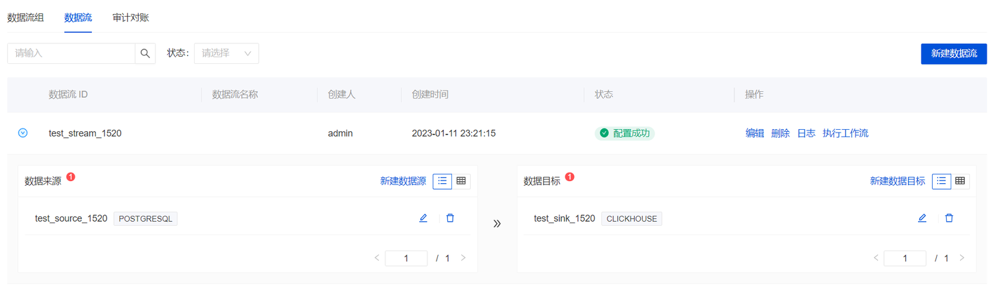
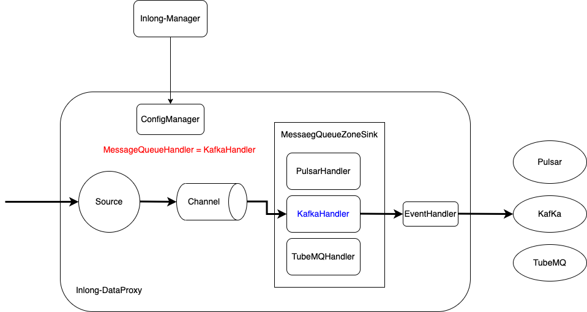

Apache InLong（应龙）最近发布了 1.5.0 版本，该版本关闭了约 296+ 个issue，包含 12+ 个大特性和 110+ 个优化。主要完成了新增 StarRocks、Hudi、Doris、Elasticsearch 等流向、优化 Dashboard 体验、重构 MQ 管理模型、新增脏数据处理、全链路 Apache Kafka 支持、TubeMQ C++/Python SDK 支持生产等。
<!--truncate-->

## 关于 Apache InLong
作为业界首个一站式开源海量数据集成框架，Apache InLong 提供了自动、安全、可靠和高性能的数据传输能力，方便业务快速构建基于流式的数据分析、建模和应用。目前 InLong 正广泛应用于广告、支付、社交、游戏、人工智能等各个行业领域，服务上千个业务，其中高性能场景数据规模超百万亿/天，高可靠场景数据规模超十万亿/天。

InLong 项目定位的核心关键词是“一站式”和真正“海量数据”。对于“一站式”，我们希望屏蔽技术细节、提供完整数据集成及配套服务，实现开箱即用；对于“海量数据”，我们希望通过架构上的数据链路分层、全组件可扩展、自带多集群管理等优势，在百万亿/天的基础上，稳定支持更大规模的数据量。

## 1.5.0 版本总览
Apache InLong 最近发布了 1.5.0 版本，该版本关闭了约 296+ 个issue，包含 12+ 个大特性和 110+ 个优化。主要完成了新增 StarRocks、Hudi、Doris、Elasticsearch 等流向、优化 Dashboard 体验、重构 MQ 管理模型、新增脏数据处理、全链路 Apache Kafka 支持、TubeMQ C++/Python SDK 支持生产等。该版本还完成了大量其它特性，主要包括：

### Agent 模块
- 支持 CVM 场景下的日志采集
- 新增直发Pulsar、发送 DataProxy 同步异步策略

### DataProxy 模块
- 重构 MQ 管理模型，支持快速扩展新的 MQ 类型
- 优化缓存层支持 Apache Kafka 消息队列
- 新增支持 BufferQueueChannel

### TubeMQ 模块
- 增加数据发送和接收延迟统计
- TubeMQ C++ SDK 支持生产
- TubeMQ Python SDK 支持生产

### Manager 模块
- 新增 Hudi 数据节点和流向管理
- 新增 StarRocks 数据节点和流向管理
- 优化 Elasticsearch 数据节点和流向管理
- Manager Client 新增数据转换管理
- 优化  Apache Kafka 消息队列管理

### Sort 模块
- MySQL Load 节点存量阶段支持对无主键的表的并发读取
- 新增 StarRocks、Hudi、Doris、Elasticsearch 5.x 数据流向支持
- 为 Doris、PostgreSQL、Hive、HBase、Elasticsearch 等流向增加脏数据处理
- 升级 Iceberg 到 1.1.0 版本
- StarRocks、PostgreSQL、Doris、Hudi 等流向支持表级别指标

### Dashboard 模块
- 体验优化超 50 个优化点
- 增加 JSON、Key-Value、AVRO 格式
- 支持 ClickHouse 、Iceberg、Elasticsearch、MySQL 等数据节点管理页面
- 新增 SQLServer 、Oracle 、MongoDB、MQTT 数据源页面

### 其它
- 增加 Spotless 代码格式化插件及响应流水线
- Docker-compose 自带 Apache Flink 环境
- 增加 Agent、DataProxy 的 Grafana 指标显示模板

## 1.5.0 版本特性介绍
### 新增 StarRocks、Hudi、Doris、Elasticsearch 等流向
在 1.5.0 版本中，InLong 持续扩展新的数据节点 Connector，针对社区用户使用场景，新增 StarRocks、Hudi、Doris、Elasticsearch 等流向的支持，拓展了数据入仓入湖场景。这些新增数据节点主要由 @liaorui、@featzhang、@kuansix、@LvJiancheng 等开发者贡献。

### 优化 Dashboard 体验
相比于传统的数据集成项目，InLong 新增了 Group、Stream 、数据节点等概念，初次使用 Dashboard 创建的社区用户会对整个流程有些困惑。为了降低 Dashboard 用户的使用成本，InLong 针对 Dashboard 前端页面进行了大量的优化，优化点超过 50 个，在概念、流程、展示上面进行了调整。下图为 1.5.0 中创建 Stream 的流程，相比较之前版本更加简化。Dashboard 的优化特别感谢 @leezng、@bluewang、@kinfuy，也感谢 @Charles Zhang 提供的修改建议。

### 重构 MQ 管理模型
为了快速支持新的消息队列服务（比如 RocketMQ）实现插件化，同时统一现有支持 Pulsar、Kafka、TubeMQ，在 1.5.0 版本中，InLong DataProxy 重构了 MQ 管理模型，所有 MQ 类型都基于 `MessageQueueHandler` 实现对应的 `Handler`。该特性的实现感谢 @woofyzhao、@luchunliang，如果需要开发新的 MQ 类型，可以参考 DataProxy 插件指引。

### 新增脏数据处理
如果入湖入仓时存在不符合数据规范的脏数据（例如字段范围超限、数据字段缺失等 ），可能会导致用户任务写入失败并不断重启。在 1.5.0 版本中，InLong 支持将不能恢复的脏数据到外部存储，包括 S3 和本地日志，同时用户可以自定义脏数据的输出端，可以配置 “是否开启脏数据归档” 与 “是否忽略写入错误”，如下为脏数据归档设计 UML 图。该特性的实现感谢 @yunqingmoswu、@Yizhou-Yang 的支持。

### 全链路 Apache Kafka 支持
在 1.5.0 版本中，完成了 DataProxy、Manager、Sort、Dashboard 模块全链路对 Apache Kafka 的支持，对于 kafka 的支持经历了两个版本，在 1.5.0 实现了生产可用，用户创建数据流时选择 Kafka 即可。该特性的实现感谢 @woofyzhao、@fuweng11、@haifxu 的支持。

更多 1.5.0 版本的细节请参考 版本说明 ，其中详细列出了此版本的特性、提升和 Bug 修复。

## 后续规划
在后续版本中，Apache  InLong 会增加多租户管理，规范数据流、项目、集群和用户的资源和权限，同时对多种数据源进行性能和稳定性优化、Agent 管理等，期待更多开发者参与贡献。