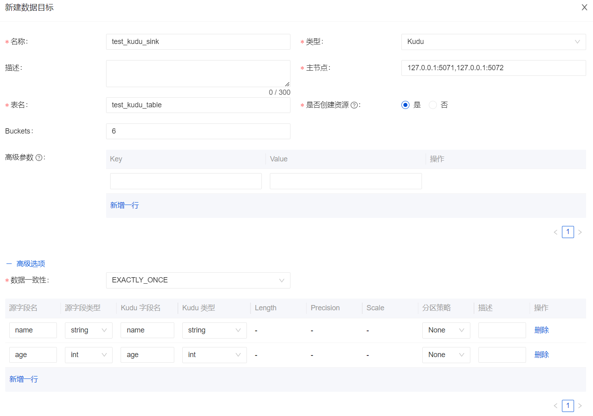

Apache InLong（应龙） 最近发布了 1.6.0 版本，该版本关闭了约 202+ 个issue，包含 9+ 个大特性和 80+ 个优化。主要完成了新增 Kudu 数据流向、完善 Redis 数据流向、增加 MQ 缓存集群 Selector 策略、优化 Audit ID 分配规则、新增数据节点链接性测试、优化 Sort Audit 对账基准时间、Audit 支持使用 Kafka 缓存审计数据等。
<!--truncate-->

## 关于 Apache InLong
作为业界首个一站式开源海量数据集成框架，Apache InLong（应龙） 提供了自动、安全、可靠和高性能的数据传输能力，方便业务快速构建基于流式的数据分析、建模和应用。目前 InLong 正广泛应用于广告、支付、社交、游戏、人工智能等各个行业领域，服务上千个业务，其中高性能场景数据规模超百万亿条/天，高可靠场景数据规模超十万亿条/天。

InLong 项目定位的核心关键词是“一站式”和“海量数据”。对于“一站式”，我们希望屏蔽技术细节、提供完整数据集成及配套服务，实现开箱即用；对于“海量数据”，我们希望通过架构上的数据链路分层、全组件可扩展、自带多集群管理等优势，在百万亿条/天的基础上，稳定支持更大规模的数据量。

## 1.6.0 版本总览
Apache InLong（应龙） 最近发布了 1.6.0 版本，该版本关闭了约 202+ 个issue，包含 9+ 个大特性和 80+ 个优化。主要完成了新增 Kudu 数据流向、增加 MQ 缓存集群级别 Selector 策略、优化 Audit ID 分配规则、新增数据节点链接性测试、优化 Sort 关于 Audit 对账基准时间、Audit 支持使用 Kafka 缓存审计数据等。该版本还完成了大量其它特性，主要包括：

### Agent 模块
- 增强文件采集稳定性，修复多个采集 Bug 
- 修复 MQTT 、MongoDB 等多个 Bug

### DataProxy 模块
- 增加 MQ 缓存集群 Selector 策略，减少 Producer 数量
- 为新的 MQ Sink 增加 Audit 上报

### Manager 模块
- 优化 Audit ID 分配规则，支持多 Load 数据节点审计
- 优化 ClickHouse 数据节点元数据配置和管理
- 新增数据节点链接性测试，检查节点可用性
- 增加 Pulsar 多集群 Topic 订阅管理
- 修复 Manager 多个数据流管理、状态管理 Bug

### Sort 模块
- 为 Kafka Source Connector 新增数据审计
- Doris Connector 新增 CSV 格式及脏数据归档
- 支持 ARRAY、MAP、STRUCT 等复杂类型
- 优化 Pulsar Connector 解决数据丢失问题
- 修复 Canal-JSON 元数据字段乱序写入问题
- 优化 Sort 关于 Audit 对账基准时间，对齐对账

### Dashboard 模块
- 持续优化 Dashboard 体验，降低初次部署理解门槛
- 增加 Redis、Kudu 等数据节点管理
- 优化 PostgreSQL 、Kafka、Redis 等数据节点参数
- 简化 Agent 节点 IP 选取策略
- 增加多个数据节点链接性测试页面

### 其它
- Audit 支持使用 Kafka 缓存审计数据
- Audit 统一从 Manager 获取 MQ 集群
- 优化 Standalone、Docker-compose 、Kubernetes 等部署步骤

## 1.6.0 版本特性介绍
### 新增 Kudu 数据流向
Apache Kudu 是由 Cloudera 开源的存储引擎，可以同时提供低延迟的随机读写和高效的数据分析能力。在 1.6.0 版本中， InLong 支持了 Kudu 数据流向，包括新增 Kudu Connector、元数据管理、指标、Dashboard 页面等。Kudu 数据流向由 @featzhang 独立参与和完整贡献，感兴趣的用户可以进行安装体验。


### 完善 Redis 数据流向
Redis 是很流行的开源内存数据库，拥有高性能和丰富的数据结构，在 1.6.0 版本， InLong 完善了 Redis 数据流向，包括在 Redis Connector 中增加 SinkFunction、元数据管理、指标和 Dashboard 页面等，完整支持了 Redis 的 Plain、Hash、Bitmap 等数据格式, 并通过 SchemaMapping 机制实现 Redis Schema 转换。Redis 数据流向通过 Schema 映射模式，可以将 Schema 转换为不同的 [Redis Data-Type](https://redis.io/docs/data-types/tutorial/)  。 Redis 数据流向主要由 @featzhang 独立参与和完整贡献，详见 [INLONG-7060](https://github.com/apache/inlong/issues/7060) 。


### 增加 MQ 缓存集群 Selector 策略
多 MQ 集群场景下，如果 DataProxy 同时连接所有 MQ 集群，会导致 MQ 集群的 Producer 数暴增，同时导致 Zookeeper 元数据超量，进而引发 OutOfMemory。在 1.6.0 版本中，InLong 增加了 MQ 缓存集群级别 Selector 策略（主要针对 Apache Pulsar），DataProxy 节点可以只选择同一个 Tag 下的部分 MQ 集群进行生产，从而降低 Producer 连接数和 Zookeeper 元数据规模。该特性主要是由 @luchunliang 开发完成，详见 [INLONG-7231](https://github.com/apache/inlong/pull/7236) 。


### 优化 Audit ID 分配规则
在 InLong Audit 原有的设计的中，每个模块的接收与发送分别为一个独立的审计项 ID，用于记录模块级别的数据发送和数据接收量。该方案存在一个缺陷，如果 InLong Sort 同时向多个目标端分拣数据（比如同时写入 Hive 和 Clickhouse），那一个审计项 ID 对于 Sort  来说无法区分不同的数据流向。在 1.6.0 版本中，优化了 Audit ID 分配规则，不同的数据流向在 Sort 分拣中拥有不同的审计项 ID，实现了对同个数据流多个分拣目标的数据审计。该特性同时涉及 Manager 和 Sort 的改动，由 @fuweng11 和 @EMsnap 一起开发实现，详见 [INLONG-7389](https://github.com/apache/inlong/pull/7390), [INLONG-7232](https://github.com/apache/inlong/pull/7233) 和 [INLONG-7503](https://github.com/apache/inlong/pull/7552) 。
```sql
('audit_sort_hive_input', 'HIVE', 0, '7'),
('audit_sort_hive_output', 'HIVE', 1, '8'),
('audit_sort_clickhouse_input', 'CLICKHOUSE', 0, '9'),
('audit_sort_clickhouse_output', 'CLICKHOUSE', 1, '10'),
('audit_sort_es_input', 'ELASTICSEARCH', 0, '11'),
('audit_sort_es_output', 'ELASTICSEARCH', 1, '12'),
('audit_sort_starrocks_input', 'STARROCKS', 0, '13'),
('audit_sort_starrocks_output', 'STARROCKS', 1, '14'),
('audit_sort_hudi_input', 'HUDI', 0, '15'),
('audit_sort_hudi_output', 'HUDI', 1, '16'),
('audit_sort_iceberg_input', 'ICEBERG', 0, '17'),
('audit_sort_iceberg_output', 'ICEBERG', 1, '18'),
('audit_sort_hbase_input', 'HBASE', 0, '19'),
('audit_sort_hbase_output', 'HBASE', 1, '20'),
('audit_sort_doris_input', 'DORIS', 0, '21'),
('audit_sort_doris_output', 'DORIS', 1, '22')
```

### 新增数据节点链接性测试
在之前版本中，InLong 新增数据节点以及注册 MQ 集群，并没有判断集群可用性。在新版本中，InLong 为主要的数据节点及 InLong 系统组件注册，新增了链接性测试，用于提前检查待注册集群，提升数据流创建易用性。该特性主要是由 @leosanqing、@bluewang 和 @fuweng11 参与开发。


### 优化 Sort Audit 对账基准时间，对齐对账
在 1.6.0 版本之前，Sort 的对账基准时间是处理数据时的机器时间，使用该时间会造成全链路数据对账不准确。在该版本中，Sort 对账埋点借鉴了 Flink 中的 TimestampedCollector 设计，替换了原有 Pulsar Connector 中的 Simple Collector，对齐了对账指标。实现原理为在 Collector 中设置了 Timestamp 字段，当获取到由 Dataproxy 传输的 InlongMsg 数据时，先对其进行解包并提取包内每条消息的数据时间，对 Collector 中的 Timestamp 进行重置，Collector 在往下游传输消息时将重置后的数据时间作为 Audit 时间记录指标。优化后的 Sort Audit 对账指标能与 DataProxy 等其它模块对齐，该特性主要由 @Emsnap 开发。


### Audit 支持使用 Kafka 缓存审计数据
InLong Audit 是独立的子系统，对 InLong 系统的 Agent、DataProxy、Sort 模块的入流量、出流量进行实时审计对账，目前对账的粒度有分钟、小时、天三种。在之前的版本中，InLong Audit 只支持使用 Pulsar 缓存审计数据，这里会增加只熟悉 Kafka 的用户部署和使用成本，在整个  InLong Audit 设计上，MQ 类型的选择应该和数据流保持一致，避免使用不同的 MQ 类型。在 1.6.0 版本中，为了实现 Audit 模块和数据流保持使用同类型 MQ 服务，Audit 支持了使用 Kafka 缓存审计数据，实现了 MQ 服务选型的统一。该特性主要是由 @haifxu、@dockerzhang 完成。


## 后续规划
在 1.6.0 中，Sort 模块还修复脏数据归档、指标、Connector 等多个 Bug，Dashboard 持续优化显示、审批流程等体验问题，详情可以参考 1.6.0 发布 [Changelog](https://github.com/apache/inlong/blob/master/CHANGES.md) 。在后续版本中，Apache  InLong 会增加 Schema 动态感知、Schema 批量导入、Agent 安装、扩展更多数据节点等，期待更多开发者参与贡献。