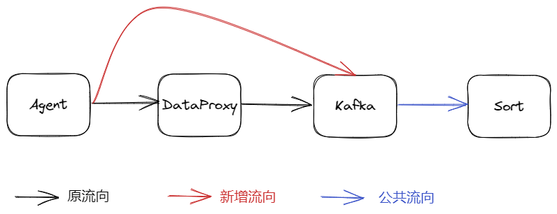
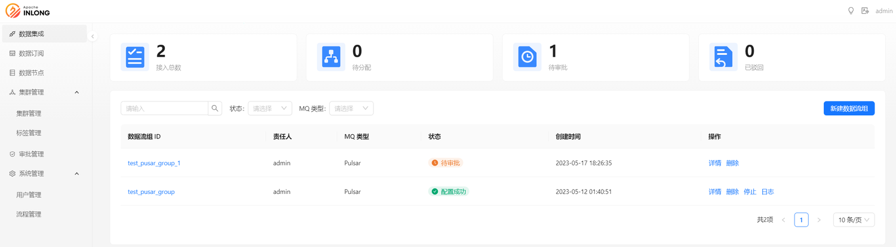

Apache InLong（应龙） 最近发布了 1.7.0 版本，该版本关闭了约 150+ 个issue，包含 3+ 个大特性和 40+ 个优化。主要完成了支持直发数据到 Kafka、MySQL 整库迁移支持 schema 变更、MySQL 整库迁移支持 GH-OST 感知、增加 CSV/SQL/JSON/Excel 4 种批量导入模式、简化命令行工具创建数据流配置、重构 Dashboard 整体布局等。
<!--truncate-->

## 关于 Apache InLong
作为业界首个一站式开源海量数据集成框架，Apache InLong（应龙） 提供了自动、安全、可靠和高性能的数据传输能力，方便业务快速构建基于流式的数据分析、建模和应用。目前 InLong 正广泛应用于广告、支付、社交、游戏、人工智能等各个行业领域，服务上千个业务，其中高性能场景数据规模超百万亿条/天，高可靠场景数据规模超十万亿条/天。

InLong 项目定位的核心关键词是“一站式”和“海量数据”。对于“一站式”，我们希望屏蔽技术细节、提供完整数据集成及配套服务，实现开箱即用；对于“海量数据”，我们希望通过架构上的数据链路分层、全组件可扩展、自带多集群管理等优势，在百万亿条/天的基础上，稳定支持更大规模的数据量。

## 1.7.0 版本总览
Apache InLong（应龙） 最近发布了 1.7.0 版本，该版本关闭了约 150+ 个issue，包含 3+ 个大特性和 40+ 个优化。主要完成了支持直发数据到 Kafka、MySQL 整库迁移支持 schema 变更、MySQL 整库迁移支持 GH-OST 感知、增加 CSV/SQL/JSON/Excel 4 种批量导入模式、简化命令行工具创建数据流配置、重构 Dashboard 整体布局等。该版本还完成了大量其它特性，主要包括：

### Agent 模块
- 支持直接发送数据到 Kafka，不经过 DataProxy
- Agent 优化，提供文件采集发性能
- 修复 MySQL 采集时 Reader 创建失败问题

### DataProxy 模块
- 简化 common 配置及相关控制逻辑
- 代码优化，清理 ConfigManager 中的无效配置

### Manager 模块
- 增加 PostgreSQL、Redis 数据节点管理
- 为数据源增加心跳超时状态
- 增加 CSV/SQL/JSON/Excel 4 种批量导入模式
- 简化命令行工具，涉及数据流创建的逻辑
- 支持重启和停止数据流中的数据源任务
- Redis、Kudu 增加连接性测试

### Sort 模块
- 在日志中屏蔽 Flink SQL 相关数据源/目标端的敏感信息
- 优化计算对象字节大小的逻辑及相关指标
- 支持在原始数据中提取 DDL 及操作
- 写入 Iceberg 时增加速率控制
- MySQL 整库迁移支持 schema 变更
- 整库迁移中，MySQL Connector 支持感知 GH-OST 的 DDL

### Dashboard 模块
- 增加 CSV/SQL/JSON/Excel 4 种批量导入页面
- 优化 Clickhouse 流向配置，支持 ttl/engine 等配置
- 重构 Dashboard 整体布局，优化显示体验
- 优化数据源和数据目标端创建流程

### 其它
- 修复多个 MySQL 相关安全漏洞
- TubeMQ Golang SDK 支持生产，完成一期开发
- 优化 InLong 开发工具在 MacOS 和 Linux 的支持
- 优化 Pulsar Client 依赖减小安装包大小

## 1.7.0 版本特性介绍
### 支持直发数据到 Kafka
在之前版本中，InLong 支持了 Agent 直发数据到 Pulsar 而不经过 DataProxy，通过这样的设计，对于数据场景简单、尽可能保证数据完整性用户，可以减少对 DataProxy 的依赖。对于习惯使用 Kafka 的用户，在 1.7.0 版本中支持了 Agent 直发数据到 Kafka 的特性，感谢 @wangpeix 的完整贡献，详情可见 INLONG-7783。如果需要体验该特性，可以在数据流审批环节选择“发往 MQ，待 MQ 接收后再响应”。



### MySQL 整库迁移支持 schema 变更
随着社区用户对 InLong 的深入使用，不能支持 schema 变更的弊端逐渐显现，源端变更 DDL 后需要任务修改配置重启，大大增大了运维成本，在当前版本中，InLong 支持了 schema 的自动变更能力，上游数据源支持感知 Create、Alter、Drop、Truncate、Rename 等 DDL 操作，并同步该 DDL 操作到下游，同时下游数据源支持响应上游 DDL 变更，并同步处理该 DDL 变更，同时支持不同处理策略，详情参考 INLONG-7553。感谢 @Emsnap @yunqingmoswu @lordcheng10 对该功能的贡献，下图为核心流程：


数据库中的 DDL 消息由 CDC 中的 DEBEZIUM 感知，此时得到的数据为单一的 DDL 语句，例如：“DROP TABLE A”，该语句为 DEBEZIUM JSON 中的字段，DDL 语句后经由 JSQLPARSER 解析为 DDL MODEL，该 MODEL 中对常见的 DDL 消息都进行了解析，处理为程序易处理的 JSON 格式，DDL MODEL 会作为 FLINK 中的数据下发到 SINK OPERATOR, 由 OPERATOR 对 DDL MODEL 进行处理。

### MySQL 整库迁移支持 GH-OST 感知
GH-OST（GitHub Online Schema Migration）是 GitHub 发布的一款用于 MySQL 的无触发器在线模式迁移解决方案。它是可测试的，并提供暂停，动态控制/重新配置，审计和许多操作特权。它在整个迁移过程中，对主服务器产生的工作量很少，与已迁移表上的现有工作分离。通过支持感知 GH-OST 的 DDL，MySQL Connector 可以在捕获数据变更的同时，正确处理由 GH-OST 引发的表结构变更。感谢 @e-mhui 的完整贡献，该特性详情可见 INLONG-7554。下图为核心流程：


首先，开启 MySQL CDC 的 DDL 自动响应后，对 GH-OST 产生的 ghc, gho, del 表也进行捕获；其次，在感知到 GH-OST 对 gho 表的变更时，将 DDL 语句中的 gho 表替换成 源表，并存储到 state 中；最后，在 GH-OST 对源表执行完整的变更流程后，将之前存储到 state 中的 DDL 语句发送到下游。

### 增加 CSV/SQL/JSON/Excel 4 种批量导入模式
在创建数据流录入元数据字段时，我们需要按名称、类型、描述等信息依次输入，如果需要录入成百上千的字段信息，这种处理方式效率极低。在 1.7.0 版本中，InLong 同时增加了 CSV/SQL/JSON/Excel 4 种格式的批量导入模式，用户只需要参考每种格式的模板，填写自选信息，就可以实现一次性导入。该功能非常感谢 @featzhang、@fuweng11 参与开发完成。4 种批量导入模式已经支持前后端，可下载最新版本直接使用。


### 简化命令行工具创建数据流配置
旧版本使用命令行创建数据流时，需要准备的 JSON 文件内容很复杂，并且文件结构不够清晰，用户通过命令行创建数据流的门槛非常高。另外，用户想复用文件创建新的数据流时，需要修改很多重复的字段，如 inlongGroupID、inlongStreamID。在 1.7.0 版本中，InLong 优化了数据流配置 JSON 结构以及字段配置，用户可根据数据流需求，简单添加 Source / Sink 内容即可，整个创建数据流过程相较之前简单了很多。详情可见 INLONG-7778，非常感谢 @haifxu 的贡献。以下示例为新版本创建 File -> Pulsar -> Clickhouse 的模板：

```json
{
    "groupInfo": {
        "inlongGroupId": "test_group_ctl",
        "inlongClusterTag": "default_cluster",
        "mqType": "PULSAR"
    },
    "streamInfo": {
        "inlongStreamId": "test_stream_ctl",
        "fieldList": [
            {
                "fieldName": "name",
                "fieldType": "string"
            }
        ],
        "sourceList": [
            {
                "sourceType": "FILE",
                "sourceName": "test_source_ctl",
                "agentIp": "127.0.0.1",
                "pattern": "/data/test.txt"
            }
        ],
        "sinkList": [
            {
                "sinkType": "CLICKHOUSE",
                "sinkName": "test_sink_ctl",
                "dataNodeName": "test_clickhouse",
                "dbName": "db_test",
                "tableName": "table_test",
                "flushInterval": 1,
                "flushRecord": 1000,
                "retryTimes": 3,
                "engine": "Log",
                "isDistributed": 1,
                "sinkFieldList": [
                    {
                        "sourceFieldName": "name",
                        "sourceFieldType": "string",
                        "fieldName": "name",
                        "fieldType": "string"
                    }
                ]
            }
        ]
    }
}
```

### 重构 Dashboard 整体布局
在 1.7.0 版本中，社区重构了 Dashboard 的整体布局，包括将上下布局调整为左右布局（导航栏移动到左侧）、增加暗黑主题、主要菜单增加 icon、调整数据源选择显示和流程等，这次调整使 Dashboard 的使用体验更好，特别感谢@leezng、@bluewang 的贡献，详情可见 INLONG-7734。



## 后续规划
在 1.7.0 版本中，社区还提升了 Agent 文件采集的性能和稳定性，同时 TubeMQ 完成 Golang SDK 生产一期，Sort 也能够使用 Manager 分配的订阅组进行消费。在后续的版本中，InLong 会支持 Apache Flink 多版本，除了当前的 Flink 1.13，还会支持 Flink 1.15；另外，也会增加租户管理，完成 InLong 项目、用户、资源的模型的统一，期待更多开发者参与贡献。