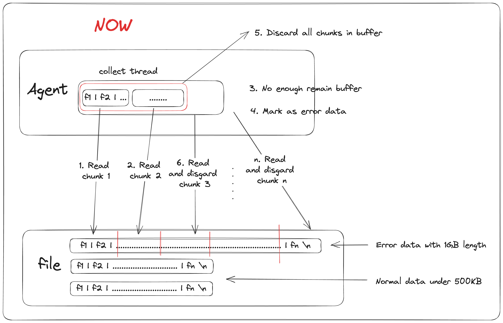
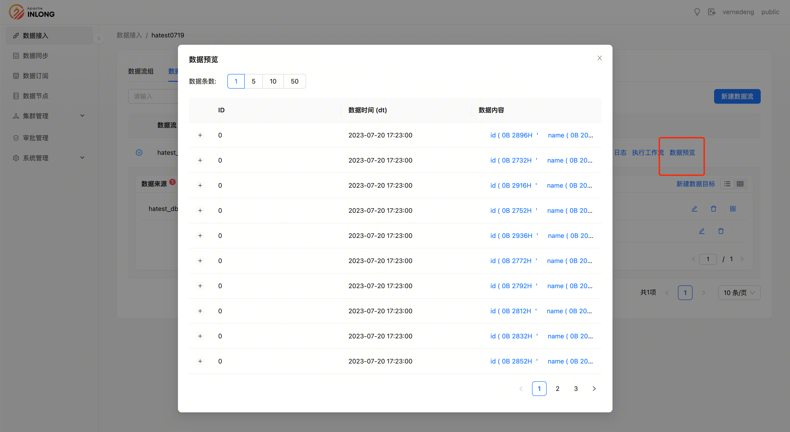

Apache InLong（应龙） 最近发布了 1.8.0 版本，该版本关闭了约 190+ 个issue，包含 6+ 个大特性和 30+ 个优化，主要完成了多租户管理、支持 Apache Flink 多版本、Dashboard 增加数据同步、支持数据预览、优化超长日志处理逻辑等。1.8.0 发布后，Apache InLong 围绕数据接入、数据同步和数据订阅的全场景数据集成布局基本完成，配合多租户管理、多集群管理、审批流管理、全链路审计/指标等。
<!--truncate-->

## 关于 Apache InLong
作为业界首个一站式、全场景海量数据集成框架，Apache InLong（应龙） 提供了自动、安全、可靠和高性能的数据传输能力，方便业务快速构建基于流式的数据分析、建模和应用。目前 InLong 正广泛应用于广告、支付、社交、游戏、人工智能等各个行业领域，服务上千个业务，其中高性能场景数据规模超百万亿条/天，高可靠场景数据规模超十万亿条/天。

InLong 项目定位的核心关键词是“一站式”、“全场景”和“海量数据”。对于“一站式”，我们希望屏蔽技术细节、提供完整数据集成及配套服务，实现开箱即用；对于“全场景”，我们希望提供全方位的解决方案，覆盖大数据领域常见的数据集成场景；对于“海量数据”，我们希望通过架构上的数据链路分层、全组件可扩展、自带多集群管理等优势，在百万亿条/天的基础上，稳定支持更大规模的数据量。

## 1.8.0 版本总览
Apache InLong（应龙） 最近发布了 1.8.0 版本，该版本关闭了约 190+ 个issue，包含 6+ 个大特性和 30+ 个优化，主要完成了多租户管理、支持 Apache Flink 多版本、Dashboard 增加数据同步、支持数据预览、优化超长日志处理逻辑等。1.8.0 发布后，Apache InLong 围绕数据接入、数据同步和数据订阅的全场景数据集成布局基本完成，配合多租户管理、多集群管理、审批流管理、全链路审计/指标等，Apache InLong 搭建完成全方位的数据集成解决方案，实现开箱机用：

- 数据接入：数据接入是将数据从数据源汇聚到同一个存储服务的过程，可用于进一步数据查询和分析；
- 数据同步：数据同步是建立数据源和目标数据存储之间一致性的过程，可随着时间持续协调数据；
- 数据订阅：数据订阅为订阅者提供他们有权访问的数据；

Apache InLong 1.8.0 版本中，还完成了大量其它特性，主要包括：

### Agent 模块
- 优化超长日志处理逻辑，提升文件采集效率和稳定性
- 修复因任务停止导致线程泄漏的问题
- 采用流量控制，解决文件数增长导致的 OOM 问题

### DataProxy 模块
- 支持 Golang SDK
- 支持基于完整 IP 或 CIDR 格式的 IP 段配置黑白名单
- 支持配置写入最大重试次数
- 支持配置写入失败时将数据发送到缺省 Topic
- 代码重构，统一配置获取方式

### Sort 模块
- 增强了 DDL 的解析能力, 提升 DDL 感知场景的稳定性
- 支持 Flink 多版本
- 整库场景下支持 Decimal 的精度识别
- Hive 支持整库迁移，实现方式与 mysql 整库迁移保持一致
- Iceberg 支持自动列更新和列删除，极大丰富了 Schema 变更能力

### Manager 模块
- 支持 Pulsar、TubeMQ 数据预览
- 支持动态配置审计数据源
- 支持查询审计延迟信息
- 支持多租户管理

### Dashboard 模块
- 支持流向数据预览
- 支持 InLongGroup 查看资源详情
- 支持租户管理和租户切换
- 支持数据同步

### 其它
- 移除 Jsqlparser 冲突版本
- 升级 Spring-Boot-Autoconfigure 版本到 2.6.15
- 升级 Snappy-Java 版本到 1.1.10.1
- 修复 Workflow 配置文件语法错误

## 1.8.0 版本特性介绍
### Agent 优化超长日志处理逻辑，提升文件采集效率和稳定性
在实际使用中，由于用户使用不当或数据生产程序 bug 等问题，偶发出现单条数据长度达到 MB 甚至 GB 级别。 对于部署在低配环境的 Agent 而言，这类数据极大影响了发送的性能。 低版本 Agent 根据换行符将这类数据直接读到内存中再丢弃，但受限于 Agent 部署环境硬件配置， 单条超长数据极易导致 OOM 异常。 在 1.8.0 版本中， Agent 优化了超长日志的处理逻辑， 通过分段采集、分段丢弃的方式保证数据加载不会超过内存限制。 感谢 @justinhuang 的贡献，详情可见 INLONG-8180。



### Agent 采用全局流控，解决文件数增长导致的 OOM 问题
在之前版本中，每个文件分别由各自的线程负责采集和发送。虽然我们限制了每个文件的最大采集 buffer，但是随着用户流量的增长，文件数的增加难以避免，进而导致同时采集文件数过多，打爆内存引发 OOM 异常。InLong 在 1.8.0 版本中支持 Agent 配置全局流量控制的特性，利用该特性，Agent 可以有效避免因为文件数增长或者采用小配额服务器导致的频繁 OOM 的问题，感谢 @justinhuang 的贡献，详情可见 INLONG-8251。如果需要使用该特性，可以在 agent.properties 中增加相应配置。


### 支持 Flink 多版本
随着社区用户的深入使用，InLong 面对的场景也更加多样化和复杂化。为了支持不同 Flink 环境的用户需求，InLong 在当前版本增加了支持 Flink 多版本的特性，用户可以在 InLong-Manager 的 plugins/flink-sort-plugin.properties 配置文件中选择启动的flink 版本。

更换运行 Sort 组件所需要的 Flink 版本时，也需要更换 InLong-Sort/connector 目录中的 connectors 为对应版本的 jar 包，详情可以查看 InLong 官网文档。感谢 @Emsnap，@GanfengTan 和 @haifxu 对该能力的贡献。
```
# inLong-manager/plugins/flink-sort-plugin.properties

# Flink version, support [1.13|1.15]
flink.version=1.13
```

### 支持多租户管理
为了解决多用户场景下对于权限和资源隔离性的要求，InLong 在当前版本引入了多租户架构。多租户架构能够在同一组服务下，确保不同用户间数据和权限互不干扰。感谢 @vernedeng 和 @bluewang 对该功能的贡献，特性详情可见 INLONG-7914。下图为核心流程：


租户对于核心逻辑开发者而言是透明的。在请求的入口处，增加了租户鉴权，对于没有访问该租户权限的请求直接驳回；在访问 Database 前，增加对应的租户过滤条件，确保数据的查询和修改范围被限制在该租户内。

用户可以在 Dashboard 上完成租户的创建，租户角色分配等操作。


### 支持实时同步
新版本中支持了数据的实时同步，实时同步与数据接入的主要区别是不需要中间 MQ 存储的支持，由 Sort 组件直接将源端数据入库，极大丰富了用户的使用场景。

如下图所示，Tab 页新增 “数据同步” 标签，用户配置完基本 Group 信息后只需要输入 “数据来源” 以及 “数据目标” 信息即可，提交任务后便可实现数据的实时同步。

感谢 @fuwen11 、@bluewang 、@Emsnap 、@haifxu 对此功能的贡献。


### 支持数据预览
对于刚接入 InLong 的业务而言，数据预览能够帮助用户快速确认上报数据的准确性以及定位问题。在该版本中，InLong 前端支持预览用户实时上报的数据。感谢 @fuwen11 和 @bluewang 的贡献，用户在成功创建数据流并上报数据后，可以在数据流下的操作栏选择数据预览。


### 支持查询链路传输时延
传输时延对于某些实时消费场景至关重要。在该版本中，InLong 审计支持前端查看平均传输时延指标。感谢 @fuwen11 和 @bluewang 的贡献，用户在成功创建数据流并上报数据后， 可以查询链路传输时延。


## 后续规划
在 1.8.0 版本中，社区还重构了 DataProxy 代码，统一了配置拉取接口，支持完整 IP 和基于 CIDR 的 IP 段配置黑白名单的特性，提升了模块性能和稳定性。 Sort 在 DDL 感知场景的稳定性有所提升， 同时支持 Hive 整库迁移， Iceberg 自动列更新和列存储等特性。 在后续的版本中，InLong 将重构 DataProxy C++ SDK、丰富 Flink 1.15 Connector、完善数据同步功能等，期待更多开发者参与贡献。

