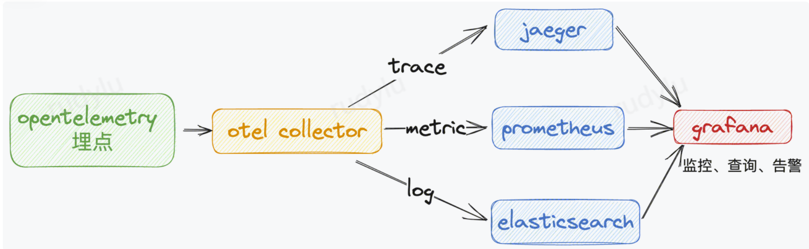

Apache InLong（应龙） 最近发布了 1.9.0 版本，该版本关闭了约 200+ 个issue，包含 2+ 个大特性和 30+ 个优化，主要完成了可观测性能力建设、优化DataProxySDK-CPP等。1.9.0 发布后，Apache InLong 在全链路跟踪、指标采集、接入及可视化观测、告警方面补齐了可观测能力建设，解决在开发和运营过程中的快速排查问题、性能优化等需求，优化Apache InLong运营运维的使用体验。
<!--truncate-->

## 关于 Apache InLong

作为业界首个一站式、全场景海量数据集成框架，Apache InLong（应龙） 提供了自动、安全、可靠和高性能的数据传输能力，方便业务快速构建基于流式的数据分析、建模和应用。目前 InLong 正广泛应用于广告、支付、社交、游戏、人工智能等各个行业领域，服务上千个业务，其中高性能场景数据规模超百万亿条/天，高可靠场景数据规模超十万亿条/天。

InLong 项目定位的核心关键词是“一站式”、“全场景”和“海量数据”。对于“一站式”，我们希望屏蔽技术细节、提供完整数据集成及配套服务，实现开箱即用；对于“全场景”，我们希望提供全方位的解决方案，覆盖大数据领域常见的数据集成场景；对于“海量数据”，我们希望通过架构上的数据链路分层、全组件可扩展、自带多集群管理等优势，在百万亿条/天的基础上，稳定支持更大规模的数据量。

## 1.8.0 版本总览

Apache InLong（应龙） 最近发布了 1.9.0 版本，该版本关闭了约 200+ 个issue，包含 2+ 个大特性和 30+ 个优化，主要完成了可观测性能力建设、优化DataProxySDK-CPP等。1.9.0 发布后，Apache InLong 在全链路跟踪、指标采集、接入及可视化观测、告警方面补齐了可观测能力建设，解决在开发和运营过程中的快速排查问题、性能优化等需求，优化Apache InLong运营运维的使用体验。

Apache InLong 1.9.0 版本中，还完成了大量其它特性，主要包括：

### Agent 模块

- 支持全链路日志跟踪上报，提升可观测性能力
- 移除TaskManager初始化时的指标上报注销逻辑
- 移除设置黑名单的容量限制
- 停止发送任务快照到Manager
- 优化Agent的JVM参数

### DataProxy 模块

- 优化元数据更新逻辑；
- 优化文件指标输出格式；
- 优化DataProxy指标统计
- 支持配置加载逻辑的可配置
- HTTP接口支持callback参数
- 优化发送失败后的重发逻辑
- 调整入MQ消息的IP，从DataProxy节点IP到客户端IP

### Sort 模块

- Iceberg数据源支持Flink 1.15
- 增加StarRocks connector的审计指标上报
- Iceberg支持元数据动态更新
- 支持Iceberg数据源
- 支持动态变更数据源和数据目标的字段类型
- 解决Mysql connector JDBC和Mysql CDC之间的版本兼容问题
- 支持更多DDL类型
- 优化SortStandalone的Pulsar接出逻辑
- Iceberg支持动态切换append和upsert模式
- PostgreSQL connetor支持并行读取数据
- 更新Kafka单表时支持根据定制化字段寻址分区
- Doris支持DDL变更
- 数据同步支持审计指标上报

### Manager 模块

- 支持Tencent CLS数据流
- 支持配置是否使用ZooKeeper
- 支持全链路日志跟踪上报，提升可观测性能力
- 支持订阅到Pulsar集群
- 支持Iceberg数据源配置
- 删除租户前支持校验租户状态
- 优化Agent的心跳处理逻辑
- Openapi支持租户参数
- 测试连接前支持校验参数
- 优化SortSDK的配置接口
- 增加新的角色INLONG_SERVICE，支持内部服务查询
- 优化租户相关的权限校验
- 创建新租户支持自动审批
- ManagerClient支持分页查询InLong数据流的source和sink
- ManagerClient工具支持多租户逻辑
- Service层和DAO层移除租户权限校验
- 数据源支持多租户配置

### Dashboard 模块

- 支持Pulsar数据集群的管理
- 支持接出到Pulsar数据集群
- 优化StarRocks的接出字段配置
- 支持Iceberg数据源的管理
- 优化数据同步界面
- 优化修改密码界面逻辑
- 优化数据同步的字段映射交互
- 数据同步支持审计指标展现
- 审批管理支持数据同步业务
- 优化租户管理查询
- 数据访问支持展现处理进度

### Audit模块

- 添加audit_tag信息以区分数据源和数据目标
- 优化审计Proxy的日志输出

### SDK模块

- 优化DataProxySDK-CPP，提升性能和网络不稳定时的可靠性
- SortSDK支持并行创建缓存层消费
- 优化DataProxySDK-Java的失败重试策略
- DataProxySDK-Java增加缓存池和异步发送逻辑

### TubeMQ模块

- 增加TubeMQ命令行工具
- TubeMQ Manager增加restart脚本

### 其它

- 增加ASF DOAP文件
- 增加Mysql connector管理镜像
- 优化第三方依赖，解决安全风险

## 1.9.0 版本特性介绍

### 可观测性能力建设

在Apache InLong的应用过程中，经常遇到如下场景：

- 通过详细的链路调用数据定位到出现问题的代码 ( Tracing )
- 对异常模块以及关联日志进行查询分析，找到核心的报错信息 (Logs)
- 打开监控大盘查找异常现象，并通过查询找到异常模块（Metrics）
- 通过各式各样预设报警发现异常（Metrics/Logs）

为此，我们调研了业界主流的可观测建设方案，最终 skywalking 和 opentelemetry 进入了选型，经过对比，选择了opentelemetry，主要原因在于 Trace (链路跟踪) 方面：opentelemtry 提供更灵活、方便和丰富的 Span 定制能力，如添加自定义属性、添加事件。只需在代码中开发，就能展示在后端 UI。

实现方案：

- 应用将埋点采集的 trace、log、metric 数据通过 otlp-exporter push 到 otel collector。
- Otel collector 将数据收集、转换后，导出到 jaeger、prometheus、elasticsearch。
- Grafana 配置三方数据源，统一展示、查询、监控、告警。

## 后续规划

在 1.9.0 版本中，社区还重构 DataProxy C++ SDK，丰富 Flink 1.15 Connector，完善数据同步功能等特性。 在后续的版本中，InLong 将继续丰富 Flink 1.15 Connector、增强数据同步的调度能力等，期待更多开发者参与贡献。
