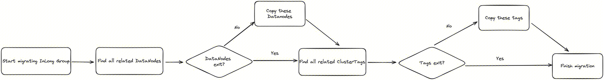

Apache InLong（应龙） 最近发布了 1.9.0 版本，该版本关闭了约 200+ 个issue，包含 2+ 个大特性和 30+ 个优化，主要完成了可观测性能力建设、优化DataProxySDK-CPP等。1.9.0 发布后，Apache InLong 在全链路跟踪、指标采集、接入及可视化观测、告警方面补齐了可观测能力建设，解决在开发和运营过程中的快速排查问题、性能优化等需求，优化Apache InLong运营运维的使用体验。
<!--truncate-->

## 关于 Apache InLong

作为业界首个一站式、全场景海量数据集成框架，Apache InLong（应龙） 提供了自动、安全、可靠和高性能的数据传输能力，方便业务快速构建基于流式的数据分析、建模和应用。目前 InLong 正广泛应用于广告、支付、社交、游戏、人工智能等各个行业领域，服务上千个业务，其中高性能场景数据规模超百万亿条/天，高可靠场景数据规模超十万亿条/天。

InLong 项目定位的核心关键词是“一站式”、“全场景”和“海量数据”。对于“一站式”，我们希望屏蔽技术细节、提供完整数据集成及配套服务，实现开箱即用；对于“全场景”，我们希望提供全方位的解决方案，覆盖大数据领域常见的数据集成场景；对于“海量数据”，我们希望通过架构上的数据链路分层、全组件可扩展、自带多集群管理等优势，在百万亿条/天的基础上，稳定支持更大规模的数据量。

## 1.9.0 版本总览

Apache InLong（应龙） 最近发布了 1.9.0 版本，该版本关闭了约 200+ 个 issue ，包含 5+ 个大特性和 30+ 个优化，主要完成了可观测性能力建设、优化 DataProxy C++ SDK、DataProxy 元数据配置更新优化、TubeMQ 增加命令行工具、Iceberg 自动切换写入方式、Manager 支持资源在租户间迁移等。1.9.0 发布后，Apache InLong 在全链路跟踪、指标采集、接入及可视化观测、告警方面补齐了可观测能力建设，解决在开发和运营过程中的快速排查问题、性能优化等需求，同时优化 Apache InLong 运营运维的使用体验。

Apache InLong 1.9.0 版本中，还完成了大量其它特性，主要包括：

### Agent 模块

- 支持全链路日志跟踪上报，提升可观测性能力
- 移除 TaskManager 初始化时的指标上报注销逻辑
- 移除设置黑名单的容量限制
- 优化 Agent 的 JVM 参数

### DataProxy 模块

- 优化元数据更新逻辑；
- 优化DataProxy指标统计
- 优化发送失败后的重发逻辑

### Sort 模块

- 数据同步支持审计指标上报
- Iceberg 支持动态切换 append 和 upsert 模式
- 数据写入 Kafka 时支持根据定制化字段写入不同分区
- PostgreSQL 支持多并发读取 
- Doris 写入支持 Schema 自动变更

### Manager 模块

- 支持全链路日志跟踪上报，提升可观测性能力
- 支持 Tencent CLS、Pulsar 集群、Iceberg 、StartRocks 等数据目标
- 在 Flink 1.15上支持 Iceberg 、StarRocks 作为数据源
- 完善多租户能力：包括删除租户前支持校验租户状态、OpenAPI 支持租户参数、数据源支持多租户配置等
- ManagerClient 支持分页查询数据流的 Source 和 Sink 资源

### Dashboard 模块

- 支持 Pulsar 数据集群的管理，并支持接出 Pulsar 接出
- 优化租户的权限查询性能
- 优化界面展现的易用性

### Audit模块

- 添加 audit_tag 信息以区分数据源和数据目标
- 优化审计 Proxy 的日志输出

### SDK模块

- 优化 DataProxy C++ SDK，提升性能和网络不稳定时的可靠性
- Sort SDK 支持并行创建缓存层消费
- 优化 DataProxy Java SDK 的失败重试策略，以及缓存池和异步发送逻辑

### TubeMQ模块

- 增加 TubeMQ 命令行工具
- TubeMQ Manager 增加 restart 脚本

### 其它

- 增加 ASF DOAP 文件
- 增加 MySQL Connector 管理镜像
- 优化第三方依赖，解决安全风险

## 1.9.0 版本特性介绍

### 可观测性能力建设

在 Apache InLong 的应用过程中，经常遇到如下场景需求：

- 通过详细的链路调用数据定位到出现问题的代码 ( Tracing )
- 对异常模块以及关联日志进行查询分析，找到核心的报错信息 ( Logs )
- 打开监控大盘查找异常现象，并通过查询找到异常模块（ Metrics ）
- 通过各式各样预设报警发现异常（ Metrics/Logs ）

在 1.9.0 版本中，@ZhaoNiuniu 基于 OpenTelemetry 完整贡献了 InLong 的可观测性能力建设。OpenTelemetry 提供了灵活、方便和丰富的 Span 定制能力，如添加自定义属性、添加事件等，只需在代码中核心位置进行埋点，就能展示在后端 UI 统一展示 。整个方案主要包括以下几个步骤：

- 应用将埋点采集的 Trace、Log、Metric 数据通过 otlp-exporter push 到 otel collector；
- Otel Collector 将数据收集、转换后，导出到 Jaeger 、Prometheus 、Elasticsearch ；
- Grafana 配置三方数据源，统一展示、查询、监控、告警；


感谢 @ZhaoNiuniu 的贡献，详情可见 INLONG-8611 和 INLONG-8799 。

### DataProxy C++ SDK 优化

老版本 DataProxy C++ SDK 基于 C 语言开发，扩展受限，采用单例模式导致性能受限，对于发送失败场景处理不合理，容易触发 coredump 。因此对 SDK 进行了优化，优化点如下：

- 采用 C++ 的开发模式，重构 DataProxy C++ SDK，不用再受C语言限制，增强了代码的扩展性；
- 单进程支持多 SDK 实例，支持通过增加 SDK 实例进行水平扩容，突破性能上限；
- 数据接收与数据发送进行解耦，可按配置分别增加接收和发送的线程数，提高了 SDK 的可扩展性；
- 将 SDK 数据打包逻辑与业务线程进行解耦，一方面减少了对业务线程的影响，另一方面提高了打包的性能；
- 从根源上解决了老版本 SDK 发送失败导致 coredump 的问题。


感谢 @doleyzi 的完整贡献，详情可见 INLONG-8747 。

### DataProxy 元数据配置更新优化

DataProxy 从 Manager 获取元数据配置，有时会因为网络、误操作等原因，导致 DataProxy 从 Manager 拿到错误的元数据配置，1.9.0 版本 DataProxy 增加了元数据配置更新的保护机制，提升 Apache InLong 在极端场景下的可靠性。感谢 @gosonzhang 的贡献，详情可见 INLONG-8758 和 INLONG-8899 。元数据配置更新的保护机制逻辑如下：


### TubeMQ 增加命令行工具

为了在服务器管理和 DevOps 场景下，Apache InLong 运维人员可以简单、快速、灵活地在终端窗口中执行各种操作。TubeMQ 提供命令行工具通过命令行参数或选项来管理主题，生产和消费消息，以及管理消费者组。感谢 @fancycoderzf 的贡献，详情可见 INLONG-4972 。详细使用文档，可以参考 [TubeMQ Command-line Tools](https://inlong.apache.org/docs/modules/tubemq/commandline_tools/) ，主要功能包括：

```
$ bin/tubectl [options] [command] [command options]
$ bin/tubectl topic -h
$ bin/tubectl message produce
$ bin/tubectl message consume
$ bin/tubectl cgroup list
```

### Iceberg 自动切换写入方式

目前实时同步 MySQL-> Iceberg 链路全量阶段默认为 upsert 模式，而 upsert 在 Iceberg 中的实现为先 delete 后 add, delete 操作表现为新增 delete 文件，全量阶段会有大量的 delete 文件产生，严重影响了查询的效率。本次优化使得任务能在全量阶段使用 Append 写入，在增量阶段能够自动转为 Upsert 写入。 实现方式源端在数据中携带元数据字段来决定 Iceberg writer 中使用何种方式写入，切换写入方式时会进行数据的刷新，实际写入时去除掉了元数据字段。感谢 [@lordcheng10](https://github.com/lordcheng10) 和 @Emsnap 的贡献。


### Manager 支持资源在租户间迁移

InLong 支持多租户后，从旧版本升级上来的 InLong Group 都将被定义在 public 租户下， 用户新建的 InLong Group 则定义在其名下的租户内。这就导致用户需要频繁在多个租户之间切换来使用资源。 本次优化支持 InLong Group 在不同租户之间进行迁移，同时校验并自动创建对应的集群标签， 数据节点等资源。 感谢 @vernedeng 的贡献



## 后续规划

在 1.9.0 版本中，社区还重构 DataProxy C++ SDK ，丰富 Flink 1.15 Connector ，完善数据同步功能等特性。 在后续的版本中，InLong 将继续丰富 Flink 1.15 Connector 、增强数据同步的调度能力、完善 Agent 文件采集能力等，期待更多开发者参与贡献。
