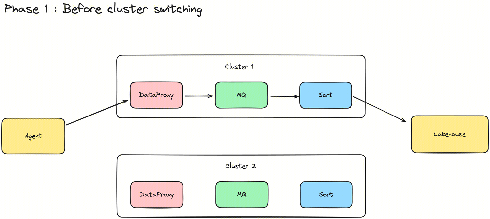
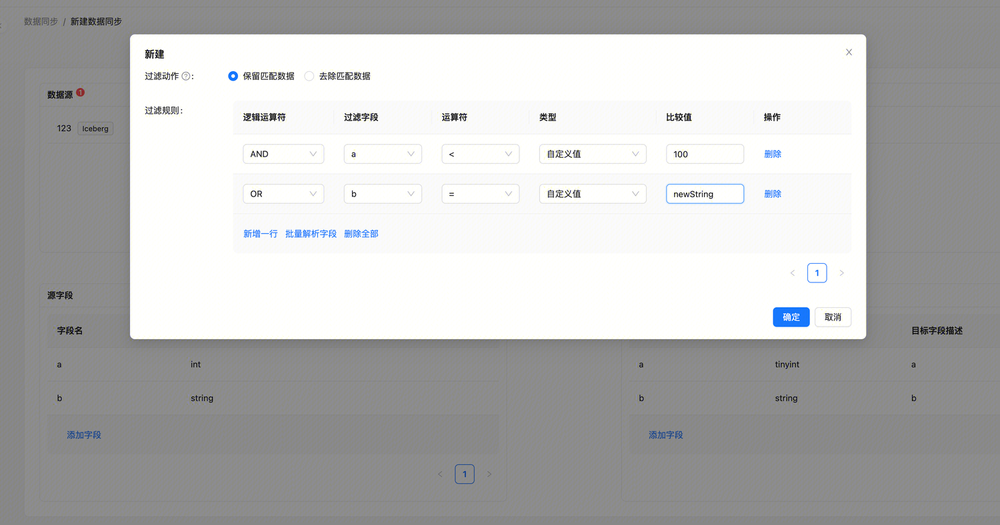

Apache InLong（应龙）最近发布了 1.10.0 版本，该版本关闭了约 200+ 个 issue ，包含 6+ 个大特性和 30+ 个优化，主要完成了 Manager 支持查看操作日志、支持 Group 在集群间迁移、Agent 支持周期采集和任务补录、Sort 实时同步支持 Transform、支持 MySQL 到 Iceberg 整库同步、支持自动建表等特性。1.10.0 发布后，Apache InLong 丰富并优化了 Agent 功能场景， 新增整库同步自动建表的能力，支持查看操作日志，解决在开发和运营过程中的快速排查问题的需求，同时优化 Apache InLong 运营运维的使用体验。
<!--truncate-->

## 关于 Apache InLong
作为业界首个一站式、全场景海量数据集成框架，Apache InLong（应龙）提供了自动、安全、可靠和高性能的数据传输能力，方便业务快速构建基于流式的数据分析、建模和应用。目前 InLong 正广泛应用于广告、支付、社交、游戏、人工智能等各个行业领域，服务上千个业务，其中高性能场景数据规模超百万亿条/天，高可靠场景数据规模超十万亿条/天。

InLong 项目定位的核心关键词是“一站式”、“全场景”和“海量数据”。对于“一站式”，我们希望屏蔽技术细节、提供完整数据集成及配套服务，实现开箱即用；对于“全场景”，我们希望提供全方位的解决方案，覆盖大数据领域常见的数据集成场景；对于“海量数据”，我们希望通过架构上的数据链路分层、全组件可扩展、自带多集群管理等优势，在百万亿条/天的基础上，稳定支持更大规模的数据量。

## 1.10.0 版本总览
Apache InLong（应龙）最近发布了 1.10.0 版本，该版本关闭了约 200+ 个 issue ，包含 6+ 个大特性和 30+ 个优化，主要完成了 Manager 支持查看操作日志、支持 Group 在集群间迁移、Agent 支持周期采集和任务补录、Sort 实时同步支持 Transform、支持 MySQL 到 Iceberg 整库同步、支持自动建表等特性。1.10.0 发布后，Apache InLong 丰富并优化了 Agent 功能场景， 新增整库同步自动建表的能力，支持查看操作日志，解决在开发和运营过程中的快速排查问题的需求，同时优化 Apache InLong 运营运维的使用体验。Apache InLong 1.10.0 版本中，还完成了大量其它特性，主要包括：

### Agent 模块
- 支持周期采集、任务补录
- 全局内存控制，避免业务数据较大导致 OOM
- 实现 Agent 与 Manager 任务最终一致
- 丰富 Agent 审计维度

### Sort 模块
- 支持 MySQL 到 Iceberg 整库同步
- 支持更丰富的 Flink 1.15 Connector： MongoDB、Iceberg、SQLServer、HBase
- 支持任务状态管理，能够查看实时同步任务实时状态
- 实时任务支持自动建表
- 支持配置 Transform 

### Manager 模块
- 支持 Sort Standalone 管理
- 传输协议与数据协议类型拆分
- 支持 Group 集群切换
- 支持查询审计数据大小
- 支持查看操作日志
- Apache Iceberg 支持自动拉取 Schema 信息

### Dashboard 模块
- 支持同时展示资源创建者以及最近修改者
- 支持查看操作日志
- 审批目录显示 Group 对应的消费组 
- 支持批量解析源字段

### Audit 模块
- 支持服务启动时自动创建需要的 Kafka Topic

### SDK 模块
- DataProxy Java SDK 解决依赖版本冲突问题 
- DataProxy Go SDK 更新版本依赖 
- DataProxy Go SDK 使用 UUID 替换雪花算法来生成数据 ID 
- DataProxy C++ SDK 支持动态负载均衡 
- DataProxy C++ SDK 支持多维度资源隔离 
- DataProxy C++ SDK 优化多地部署下就近接入的能力 
- DataProxy C++ SDK 支持本地容灾 
- DataProxy C++ SDK 支持动态更新 DataProxy 节点信息

### 其他
- 强化请求伪造攻击保护 
- 更新 Snappy 版本 
- 增加 Master 分支保护策略

## 1.10.0 版本特性介绍

### Agent 支持周期采集
InLong 1.10.0 版本新增周期文件采集任务的能力，周期策略包括天、小时、实时，用户可以在新建文件数据源时指定该策略。同时，用户也可以配置时间偏移量来延迟或提前采集。感谢 @Justinhuang，@Bluewang，@fuwen11 的贡献，详情可见 INLONG-9094， INLONG-9344， INLONG-9356。

### 支持按 IP 维度查看 Agent 审计
为了更好地监控 InLong Agent 的状态，方便在现网运行中快速发现问题，在 1.10.0 版本中，用户可以在系统运维->审计模块里根据 IP 维度查看 Agent 审计不同指标。感谢 @fuwen11，@Bluewang 和 @Justinhuang 的贡献，详情可见 INLONG-9443，INLONG-9446 和 INLONG-9458

### Manager 新增 Group 操作日志
在 1.10.0 版本中，InLong 支持查看操作日志， 包括 Group/Stream 的创建和变更，Sink/Source 的新增和下线等操作。操作日志可以快速帮着用户追踪历史行为，用户可以快速查看数据流关键操作，便于现网维护 。用户可以在数据接入->Group详情->操作日志里查看 Group 下所有的操作日志：

### 新增 Group 集群切换的能力
为了支持资源整合以及成本划分的能力，InLong 在 1.10.0 版本引入了 Group 集群切换的特性。直接进行切换必然导致模块间元数据不同步和数据丢失等问题。为了实现业务无感的集群切换能力，Group 集群切被分为三个状态和两个步骤。感谢 @Vernedeng 的贡献，详情可见 INLONG-9314。

切换集群前，数据在 Cluster 1 上。

开始切换集群后，复制原路由配置，新数据写入 Cluster 2，同时 Cluster 1 上的未发送完的数据继续发送。

### C++ SDK 支持多维度隔离
在老版本 C++ SDK 中，所有 Group 通过竞争的方式来争夺 SDK 的内部资源。如果某个 Group 流量特别大，那么势必对其他 Group 造成挤压，导致小流量 Group 无法获得资源。 在 1.10.0 版本中，DataProxy C++ SDK 支持 Custer 以及 Group 级别的资源隔离，用户可以通过配置 enable_isolation 来开启或关闭。感谢 @doleyzi 的贡献，详情可见 INLONG-9213。

### 实时同步支持配置 Transform
在 1.10.0 版本中，实时同步任务支持配置 Transform。用户可以在新建实时同步任务时点击设置 Transform 按钮进行配置。目前 Transform 支持两类动作：保留或去除匹配数据、支持复杂过滤规则，在后续版本中，Transform 的能力会不断完善。感谢 @Bluewang 、 @fuwen11 以及 @EMSnap 的贡献， 详情可看 INLONG-8992。

## 未来规划
在 1.10.0 版本中，社区重构了 InLong Agent，丰富 Flink 1.15 Connector ，完成支持查看操作日志等功能。在后续的版本中，InLong 将继续丰富 Flink 1.15 Connector 、丰富 Transform 能力、统一 DataProxy 数据协议、支持入 Apache Paimon、Dashboard 体验优化等，期待更多开发者参与贡献。
