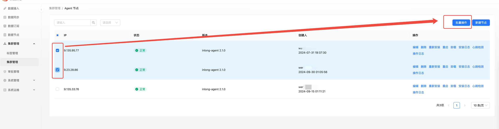
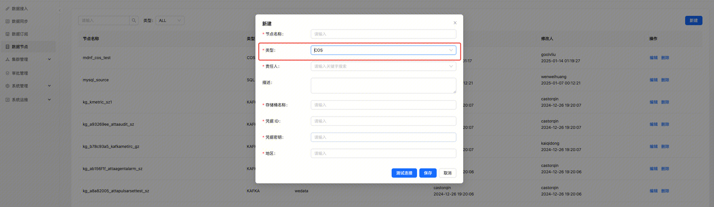

Apache InLong（应龙） 最近发布了 2.1.0 版本，该版本关闭了约 120+ 个 issue，包含 4+ 个大特性和 110+ 个优化，主要完成了 Dashboard 支持批量操作节点、Manager 支持多种调度引擎、Agent 支持 COS 数据源、Sort 支持通过 InLong SDK 进行脏数据的归档。同时优化 Apache InLong 运营运维的使用体验。Apache InLong 2.1.0 版本中，还完成了大量其它特性。
<!--truncate-->

## 关于 Apache InLong
作为业界**首个一站式、全场景海量数据集成框架**，Apache InLong（应龙） 提供了自动、安全、可靠和高性能的数据传输能力，方便业务快速构建基于流式的数据分析、建模和应用。目前 InLong 正广泛应用于广告、支付、社交、游戏、人工智能等各个行业领域，服务上千个业务，其中高性能场景数据规模超百万亿条/天，高可靠场景数据规模超十万亿条/天。
InLong 项目定位的核心关键词是**“一站式”、“全场景”**和**“海量数据”。**对于“**一站式”，**我们希望屏蔽技术细节、提供完整数据集成及配套服务，实现开箱即用；对于**“全场景”**，我们希望提供全方位的解决方案，覆盖大数据领域常见的数据集成场景；对于**“海量数据”，**我们希望通过架构上的**数据链路分层、全组件可扩展、自带多集群管理**等优势，在百万亿条/天的基础上，稳定支持更大规模的数据量。
## 2.1.0 版本总览

Apache InLong（应龙） 最近发布了 2.1.0 版本，该版本关闭了约 120+ 个 issue，包含 4+ 个大特性和 110+ 个优化，主要完成了
- Dashboard 支持批量操作节点
- Manager 支持多种调度引擎
- Agent 支持 COS 数据源
- Sort 支持通过 InLong SDK 进行脏数据的归档。

同时优化 Apache InLong 运营运维的使用体验。Apache InLong 2.1.0 版本中，还完成了大量其它特性。
### Dashboard 模块
- 支持 COS 数据源
- 支持 Agent 批量操作：重启、升级
- 支持审计数据导出成 CSV 文件
- 支持审计数据排序、差值对比
- 支持全量指标类型查询
- 支持数据预览字段分割
### Manager 模块
- 支持 COS 数据源
- 支持管理多种调度引擎：AirFlow、DolphinScheduler
- 支持脏数据管理以及查询
- 支持根据 IP 查询心跳信息
- 限制一个 IP 只能归属到一个集群
- 提供脏数据归档查询 API
### Agent 模块
- 支持 COS 数据源
- 支持快速启动、关闭
- 支持启动多实例
- 支持按时间顺序补录数据
- 优化 Installer 守护 Agent 逻辑
- 支持按照数据本地时间进行补录
### Sort 模块
- 新增基于 Flink 1.18 的 Elasticsearch connector
- 支持 Kafka Sink 端的 KV 分隔
- 支持审计数据上报
- Tube Connector source 支持脏数据归档
### SDK 模块
- Transform SDK 新增 7 种函数
- 新增脏数据归档 SDK
### Audit 模块
- Audit Proxy 增加指标上报
- Audit Store 增加指标上报
- Audit Service 增加指标上报
- 新增异步刷审计数据接口
### TubeMQ 模块
- 将消费位点信息写到本地文件
- 优化 Go 版本 SDK 负载均衡逻辑
### 其他
- 流水线支持并行构建
- 支持管理器配置卷
## 2.1.0 版本主要特性
### Dashboard 支持批量操作节点
改特性主要是用于 Inlong Agent 的操作：主要是升级和重启：
- 在集群管理找到集群后，选择要操作的多个节点，点击 批量操作。

  

- 选择操作类型，并填写对应操作所需的参数，点击确定即可。

  

该功能优化了 Inlong 的运维体验：界面化操作，运维不再需要操作 DB，增加了 Inlong 的内聚性：
- 可视化 Agent 版本升级，可分批、定时升级，控制升级风险。
- Agent 故障恢复时可通过该功能进行快速重启。

感谢 @[wohainilaodou](https://github.com/wohainilaodou) 的贡献，详情参考 [INLONG-11187](https://github.com/apache/inlong/issues/11187)
### Manager 支持多种调度引擎
之前对于离线数据同步 Inlong 只支持 Quartz 调度引擎。这次的版本则增加了两个第三方引擎：DolphinScheudler 和 AirFlow。
#### AirFlow 引擎
- 为了便于未来 AirFlow 接口支持的维护和扩展，设计了 AirflowApi 接口和 BaseAirflowApi 抽象类，后续扩展只需要在此基础上进行。
- 为接口实现统一的请求类 AirflowServerClient。
- 在 OkHttpClient 中添加两个拦截器：AirflowAuthInterceptor 用于接口的统一授权；LoggingInterceptor 用于日志记录。

感谢 @[Zkplo](https://github.com/Zkplo) 的贡献，详情参考 [INLONG-11400](https://github.com/apache/inlong/issues/11400)
#### DolphinScheudler 引擎
- 在 org.apache.inlong.manager.schedule 中添加 DolphinScheudler 包
- 添加 DS 的客户端和引擎，以及用于操作 DS 的开放 API 的 Util
- 为 DS 交互添加 pojo 类

感谢 @[emptyOVO](https://github.com/emptyOVO) 的贡献，详情参考 [INLONG-11401](https://github.com/apache/inlong/issues/11401)
### Agent 支持 COS 数据源
- 新建 COS 类型节点，填写相应的 桶名、凭据 ID、凭据密钥和地区即可。

  

- 新建 COS 类型数据源，选择相应的节点、IP、文件路径即可。

  

  

该功能支持从 COS 存储直接采集数据，业务不需要把 COS 文件下载到本地再做数据采集。
感谢 @[justinwwhuang](https://github.com/justinwwhuang) 的贡献，详情参考 [INLONG-11187](https://github.com/apache/inlong/issues/11187)

### Sort 支持通过 InLong SDK 进行脏数据的归档
新增通过 InLong SDK 上报脏数据至指定 GroupId 和 StreamId 的能力。用户可以选择将脏数据接出，或从 Pulsar 中自主消费。


需要在 Connector 中增加如下配置
``` 
'dirty.side-output.inlong-sdk.inlong-auth-key' = 'your auth key',

'dirty.side-output.inlong-sdk.inlong-auth-id' = 'your auth id',

'dirty.side-output.enable' = 'true',

'dirty.side-output.inlong-sdk.inlong-group-id' = 'target_inlong_group_id',
'dirty.side-output.inlong-sdk.inlong-stream-id' = 'target_inlong_stream_id',

'dirty.side-output.labels' = 'groupId=xx&streamId=xx&serverType=tube&dataflowId=xx',

'dirty.side-output.inlong-sdk.inlong-manager-addr' = 'xxx',

'dirty.side-output.connector' = 'inlong-sdk',

'dirty.ignore' = 'true',`
```
感谢 @[vernedeng](https://github.com/vernedeng) 和 @[fuweng11](https://github.com/fuweng11) 的贡献，
详情参考 [INLONG-11481](https://github.com/apache/inlong/issues/11481) 和 [INLONG-11508](https://github.com/apache/inlong/issues/11508)


## 未来规划
在 2.1.0 版本中，我们丰富、完善了运维能力。欢迎大家使用，如果有更多场景和需求，或者使用期间遇到的问题， 欢迎大家提 issue和 PR。在后续的版本中，InLong 社区将继续：

- 支持更多数据源采集能力

- 丰富 Flink 1.15、1.18 Connector

- 丰富 Transform 能力，并且集成到 InLong 的各个模块

- 实时同步支持更多数据源、数据目标

- 优化 SDK 能力和使用体验

- 优化 Dashboard 体验

我们也期待更多对 InLong 感兴趣的开发者可以参与贡献。