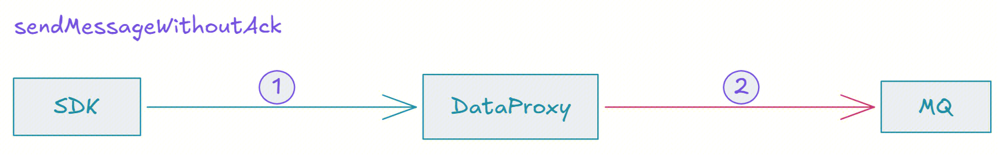
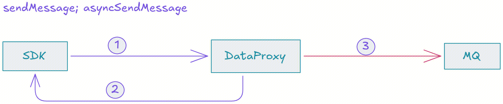
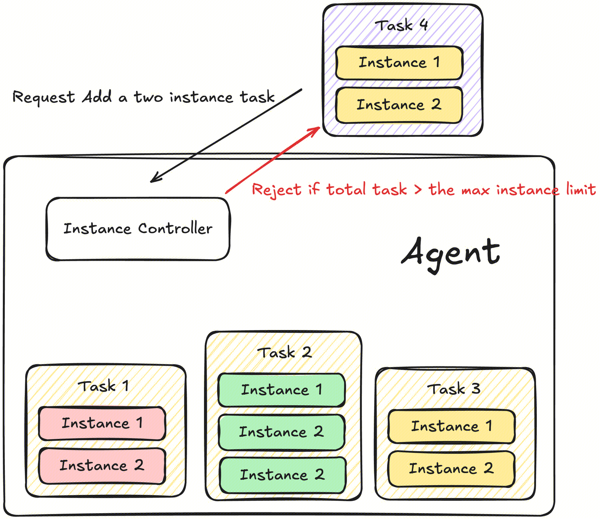
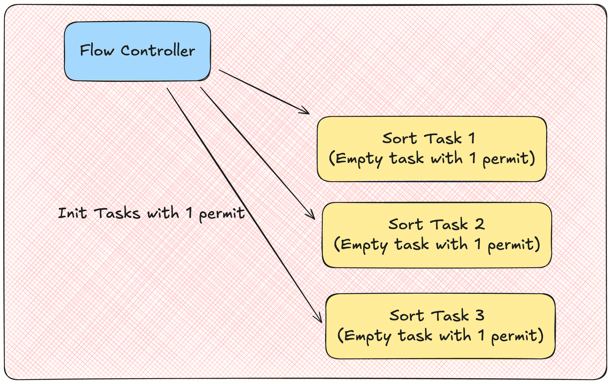
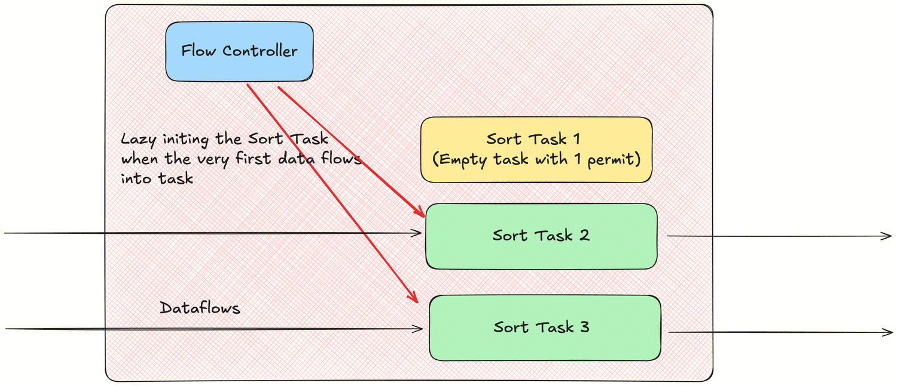
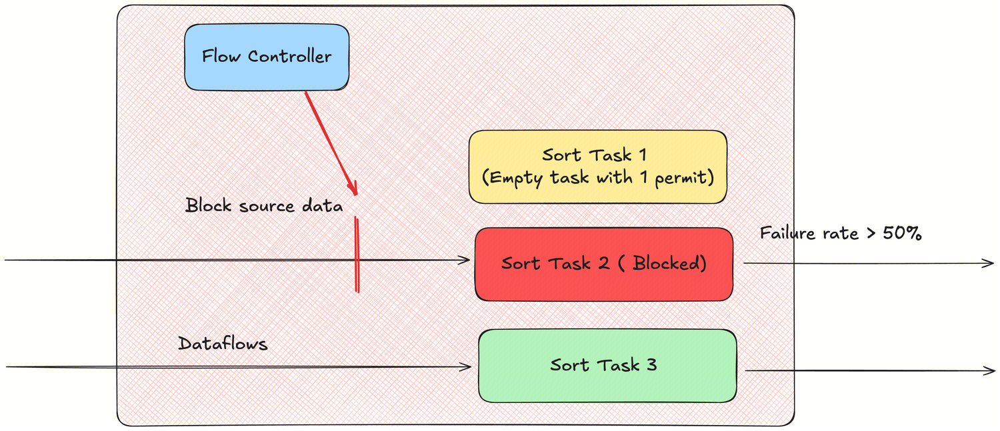

Apache InLong（应龙） 最近发布了 2.2.0 版本，该版本关闭了 87 个 issue，包含 3 个大特性和 80+ 个优化，主要完成了 Agent 提升数据采集的稳定性和资源管理能力、SDK 多语言支持与性能优化、Sort 流量控制能力增强。同时优化 Apache InLong 运营运维的使用体验。Apache InLong 2.2.0 版本中，还完成了大量其它特性。
<!--truncate-->

## 关于 Apache InLong

作为业界首个一站式、全场景海量数据集成框架，Apache InLong（应龙） 提供了自动、安全、可靠和高性能的数据传输能力，方便业务快速构建基于流式的数据分析、建模和应用。目前 InLong 正广泛应用于广告、支付、社交、游戏、人工智能等各个行业领域，服务上千个业务，其中高性能场景数据规模超百万亿条/天，高可靠场景数据规模超十万亿条/天。
InLong 项目定位的核心关键词是“一站式”、“全场景”和“海量数据”。对于“一站式”，我们希望屏蔽技术细节、提供完整数据集成及配套服务，实现开箱即用；对于“全场景”，我们希望提供全方位的解决方案，覆盖大数据领域常见的数据集成场景；对于“海量数据”，我们希望通过架构上的数据链路分层、全组件可扩展、自带多集群管理等优势，在百万亿条/天的基础上，稳定支持更大规模的数据量。
## 2.2.0 版本总览

Apache InLong（应龙） 最近发布了 2.2.0 版本，该版本关闭了 87 个 issue，包含 3 个大特性和 80+ 个优化，主要完成了

- Agent 提升数据采集的稳定性和资源管理能力
- SDK 多语言支持与优化
- Sort 流量控制能力增强

同时优化 Apache InLong 运营运维的使用体验。Apache InLong 2.2.0 版本中，还完成了大量其它特性。

### Dashboard 模块

- 修复页面切换后刷新问题
- 优化用户登录验证逻辑

### Manager 模块

- 支持 SQL 数据源
- JDBC 校验增强
- Pulsar 数据源支持配置 Inlong Properties 元数据

### Agent 模块

- 优化实例生命周期控制机制
- 支持全局实例数量限制
- 修复重复文件采集问题
- 增强异常场景下的恢复能力
- 提升日志采集准确性

### Sort 模块

- 为 SortStandalone 引入流量控制
- 优化 KV/CSV 格式的转义处理
- MySQL CDC 支持 Exactly Once 审计上报

### SDK 模块

- Go SDK 增加连接池生存时间限制，提升高并发场景稳定性
- 优化 JAVA SDK 相关实现
- SortSDK 在不同的 SortTask 之间共享同一个 PulsarClient，避免过多的 PulsarClient 造成性能瓶颈

### Audit 模块

- 支持 MySQL Binlog 的 CDC 审计

### TubeMQ 模块

- 修复偶发的消费中断问题
- 本地文件保存消费偏移量

## 2.2.0 版本主要特性

### DataProxy SDK 重构
原有 SDK 针对 TCP，HTTP 上报协议分别提供了 2 个不同的 Sender 对象，不仅对象名不同，实现上也是两条独立的逻辑线，对于重叠的功能需要在多处修改，维护成本比较高。同时，SDK 调用出错返回只有一个粗粒度的错误码，具体的错误详情没有细分。
在此版本中，我们重构了 DataProxy Java SDK 的实现，大幅降低了用户使用和理解的成本。主要有下面几点的优化：
- Sender 对象构造与初始化解耦。之前版本里，SDK 在初始化对象时候进行了一些线程操作，包括初始化线程池，与 Manager 交互进行联网访问以获取元数据等，由于网络交互会尝试多次并且可能耗费很长时间，使得对象创建不能快速返回；新版本里针对这块将对象的创建与重逻辑做拆解，新加了一个 start() 函数, 创建对象后需要调用 start()，便于业务构造对象和启动对象两个环节分开。
- TCP 上报方式增加 QoS。新版本针对业务数据上报要求提供了三种不同的上报模式：
  （1） QoS 0 上报模式：SDK 持续不断的上报请求并且无响应消息需要处理；DataProxy 收到请求消息后不会回应 SDK 响应消息，而是直接将请求转发给 MQ；如果 DataProxy 转发失败则继续重试，直到重试次数达到上限或者重试成功：
  
  （2）  QoS 1 上报模式：SDK 上报请求后会等待响应消息的到达；DataProxy 收到 SDK 上报请求后立即反馈给 SDK 一个响应消息告知请求是否已接纳，然后 DataProxy 再将接收到的请求消息转发给 MQ，如果 DataProxy 转发失败则继续重试，直到重试次数达到上限或者重试成功：
  
  （3） QoS 2 上报模式：SDK 上报请求后会等待响应消息的到达；DataProxy 收到 SDK 上报请求不会反馈 SDK响应消息，而是将接收到的请求消息转发给 MQ 并且接收到 MQ 对转发的请求的响应消息后，再将响应结果返回给 SDK；从接收请求到转发请求过程中遇到失败，DataProxy 不会重试：
  
  感谢 [@gosonzhang](https://github.com/gosonzhang) 对此功能的贡献，具体可以参考 [INLONG-11729](https://github.com/apache/inlong/pull/11730) 和 [INLONG-11720](https://github.com/apache/inlong/pull/11721)。

### Agent 提升数据采集的稳定性和资源管理能力
Agent 支持增加全局实例控制，当新增任务后 Agent 总实例数大于配置的最大的实例限制，则会拒绝该任务添加请求。

全局实例最大值默认为 100，可以在配置文件中通过 agent.instance.limit 参数进行配置。
感谢 [@justinwwhuang](https://github.com/justinwwhuang) 对此功能的贡献，具体请参考 [INLONG-11760](https://github.com/apache/inlong/issues/11760) 和 [INLONG-11776](https://github.com/apache/inlong/issues/11776)。

### Sort 流量控制能力增强
在历史版本中，SortStandalone 对于新增的 task 总是分配至多 1/3 的物理资源。即使该 task 长时间处于空闲状态，剩余 task 最多只能使用 2/3 的内存资源，造成较大的资源浪费。
该版本中，SortStandalone 进一步增强了流量控制的能力。在启动时，Flow Controller 实行懒加载模式，并不会真正为每个 task 分配实际的物理资源。

当 task 的数据流被消费到后，会先向 Flow Controller 申请资源，此时才会触发实际的物理资源分配。

当发现某个 task 的失败率突增，Flow Controller 会短暂暂停数据流的读取，等待队列中数据重试完成，避免整体服务性能因为单个 task 的阻塞而大幅下降。

感谢[@luchunliang](https://github.com/luchunliang) 对此功能的贡献，具体请参考 [INLONG-11836](https://github.com/apache/inlong/issues/11836) 和 [INLONG-11841](https://github.com/apache/inlong/issues/11841)。

## 未来规划

在 2.2.0 版本中，我们丰富、完善了运维能力。欢迎大家使用，如果有更多场景和需求，或者使用期间遇到的问题， 欢迎大家提 Issue 和 PR。在后续的版本中，InLong 社区将继续：

- 支持更多数据源采集能力
- 实时同步支持更多数据源、数据目标
- 优化 SDK 能力和使用体验
- 优化 Dashboard 体验

我们也期待更多对 InLong 感兴趣的开发者可以参与贡献。