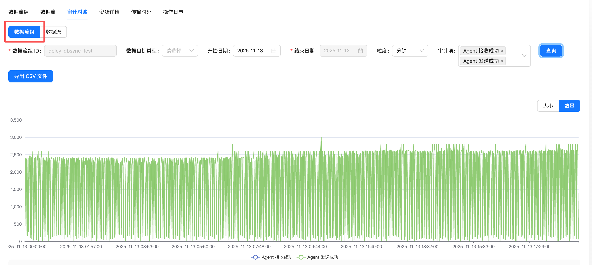

Apache InLong（应龙） 最近发布了 2.3.0 版本，该版本关闭了 59 个 issue，包含 3 个大特性和 50+ 个优化，主要完成了 SortCkafka 等支持 Transform 能力、Audit Store 支持横向扩展能力、SDK 的优化 。同时优化 Apache InLong 运营运维的使用体验。Apache InLong 2.3.0 版本中，还完成了大量其它特性。
<!--truncate-->

## 关于 Apache InLong

作为业界首个一站式、全场景海量数据集成框架，Apache InLong（应龙） 提供了自动、安全、可靠和高性能的数据传输能力，方便业务快速构建基于流式的数据分析、建模和应用。目前 InLong 正广泛应用于广告、支付、社交、游戏、人工智能等各个行业领域，服务上千个业务，其中高性能场景数据规模超百万亿条/天，高可靠场景数据规模超十万亿条/天。
InLong 项目定位的核心关键词是“一站式”、“全场景”和“海量数据”。对于“一站式”，我们希望屏蔽技术细节、提供完整数据集成及配套服务，实现开箱即用；对于“全场景”，我们希望提供全方位的解决方案，覆盖大数据领域常见的数据集成场景；对于“海量数据”，我们希望通过架构上的数据链路分层、全组件可扩展、自带多集群管理等优势，在百万亿条/天的基础上，稳定支持更大规模的数据量。
## 2.3.0 版本总览

Apache InLong（应龙） 最近发布了 2.3.0 版本，该版本关闭了 59 个 issue，包含 3 个大特性和 50+ 个优化，主要完成了

- SortCkafka、SortHttp、SortStandalone、sortCls 及 SortEs 支持 Transform 转换功能
- Audit Store 实现横向扩展，提升系统扩展能力与稳定性
- 对 Transform SDK 和 DataProxy SDK 进行了性能及功能优化

同时优化 Apache InLong 运营运维的使用体验。Apache InLong 2.3.0 版本中，还完成了大量其它特性。

### Dashboard 模块

- 审计页面新增分组及流切换功能，提升使用便捷性
- 修复审计页面查询时接口多次调用的问题，优化性能

### Manager 模块

- 新增完善的审计告警规则管理接口，支持更细粒度告警策略配置
- 支持将转换配置自动解析为对应的转换 SQL
- 接收器源字段新增配置支持，增强灵活性

### Agent 模块

- 代理程序支持并发创建发送方连接，显著提升连接初始化效率
- 引入 agent_ext.properties 配置文件加载机制，避免升级过程中 agent.properties 被覆盖导致的个性化配置丢失

### Sort 模块

- SortCkafka、SortHttp、SortStandalone、sortCls 及 SortEs 均增加转换功能支持
- 反序列化过程支持返回单条数据的字节大小信息，提升数据处理的可视化和精准度
- Pulsar SDK 升级至 4.0.3，增强稳定性与功能兼容性

### SDK 模块

- TransformSDK 支持数组索引访问，WHERE 子句新增 LIKE 运算符，str_to_json 函数支持 KV 格式数据转 JSON
- SortSDK 在无法从 InLongMsgV0 协议获取 GroupId 和 StreamId 时，默认从统一元数据中读取，增强兼容性
- 优化 Golang SDK，修复潜在数据竞争问题，提高并发安全性

### Audit 模块

- 审计服务支持自定义缓存开关，满足不同场景的性能需求
- 支持按数据流组维度进行审计对账，提升核查精度
- 新增全流程对账告警，及时发现异常情况
- 引入 Audit Store 横向扩展能力，增强系统承载性能

### TubeMQ 模块

- 解决 TubeMQ 镜像构建失败问题，保障镜像稳定生成

## 2.3.0 版本主要特性

### Dashboard 支持基于数据流组的审计数据对账功能
该特性支持基于数据流组查询审计数据，实现对账功能: 

感谢 [@wohainilaodou](https://github.com/wohainilaodou) 对此功能的贡献，具体可以参考 [INLONG-11894](https://github.com/apache/inlong/pull/11895) 。

### Audit Store 支持水平扩展
当审计数据规模达到千亿级时，单个 Audit-Store 可能面临性能压力。本版本新增横向扩展能力，有效提升系统承载能力

- 构建 Audit Store 集群与 AuditId、GroupId、StreamId 之间的路由关系表。
- Audit Store 根据该路由关系，将审计数据写入对应的存储 (ClickHouse/StarRocks/MySQL) 集群。
- Audit Service 基于该路由关系，查询对应的审计数据

感谢[@doleyzi](https://github.com/doleyzi) 对此功能的贡献，具体请参考 [INLONG-12009](https://github.com/apache/inlong/pull/12013) 。

## 未来规划

在 2.3.0 版本中，我们丰富、完善了运维能力。欢迎大家使用，如果有更多场景和需求，或者使用期间遇到的问题， 欢迎大家提 Issue 和 PR。在后续的版本中，InLong 社区将继续：

- 支持更多数据源采集能力
- 实时同步支持更多数据源、数据目标
- 优化弱网络环境下，数据重复的问题

我们也期待更多对 InLong 感兴趣的开发者可以参与贡献。