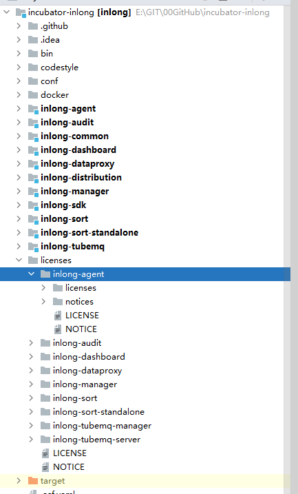
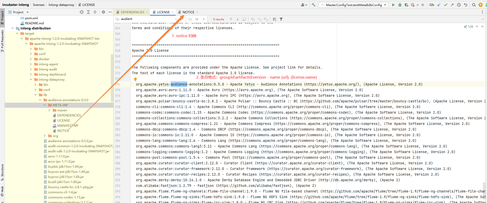
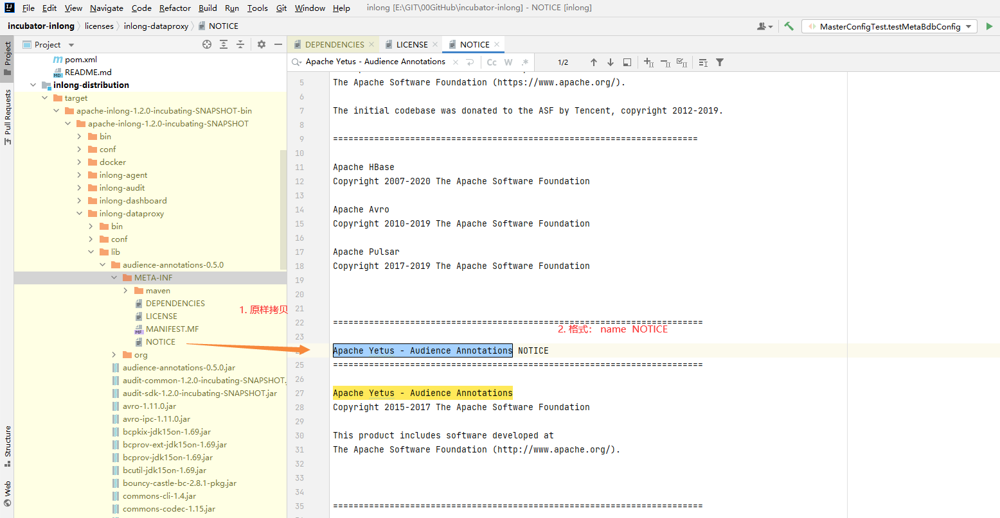

## 为什么要维护第三方依赖
   不同的依赖包含了不同的 LICENSE，Apache 项目使用的第三方依赖必须严格遵守[ASF 第 3 方许可政策](https://www.apache.org/legal/resolved.html) ，该政策将第三方依赖的各种 LICENSE 分为了3类：A类，B类，X类，并对哪种授权协议属于哪一类做了详细而明确的枚举定义；Apache 项目的交付物里禁止包含带有X类的授权协议依赖包，无论是直接依赖还是间接依赖，都不允许。

## 涉及的操作
   基于 [ASF 第 3 方许可政策](https://www.apache.org/legal/resolved.html) ，我们已经对 InLong 项目的所有依赖做了一次完整的梳理及检查，确保版本的所有第三方依赖已经是符合 Apache 规范要求的状态；由于项目是不断迭代发展的，后续大家需要按照统一的标准对第三方依赖包进行检查和维护，包括：
   1. 对项目新增模块；
   2. 对项目已有的模块进行如下操作：
      1. 新增新第三方依赖；
      2. 删除已有的第三方依赖；
      3. 修改已有第三方依赖的版本号；
   3. 版本发布前对交付物进行发版检查

   上面操作的核心即新增或修改各个 pom.xml 时，需要检查项目的第三方依赖并对已有的第三方依赖的汇总文件进行变更；修改第三方依赖的版本号，需要将使用该依赖包的所有模块对应的LICENSE和NOTICE进行对应更新。

## 第三方依赖梳理方法
   1. 第三方依赖的 LICENSE 及 NOTICE 汇总位置：
      按照项目的模块名，我们将各个模块第三方依赖的 LICENSE 及 NOTICE 汇总到 [第三方license目录](https://github.com/apache/inlong/tree/master/licenses) ， 大家导入项目后即可看到如下内容：
   2. 交付物的第三方依赖如何映射：
      以 inlong-dataproxy 模块为例，我们首先通过 `mvn clean package install` 命令进行本地打包，获取各个依赖包的详情信息：；
      从图中可以看到，我们获得了模块的 DEPENDENCIES 文件，根据交付物里依赖包的 artifactId 查找 DEPENDENCIES 文件对应条目，将该依赖按照 LICENSE 的类型归档梳理：，这里的条目格式为 “groupId:artifactId:version - name (url), (license.name)”，每个单元按照 artifactId 的字母进行排序；
      该项目存在 NOTICE，我们需要将对应的 NOTICE 原文拷贝到 inlong-dataproxy 模块的 NOTICE 文件中：，如果 NOTICE 原文超过10行，则将原文放到 notices 子目录里；
   3. 特别情况：如果依赖包里没有携带 LICENSE 和 NOTICE 文件（或只有 LICENSE，没有 NOTICE），我们需要查找该依赖包对应的项目源码中的 LICENSE 和 NOTICE，并添加到如上目录中，可参考 ZooKeeper 组件的梳理方式：。
   4. **梳理目标：Apache 项目交付物里不能包含 X 类的授权协议依赖包，无论是直接依赖还是间接依赖，都不允许存在。**
