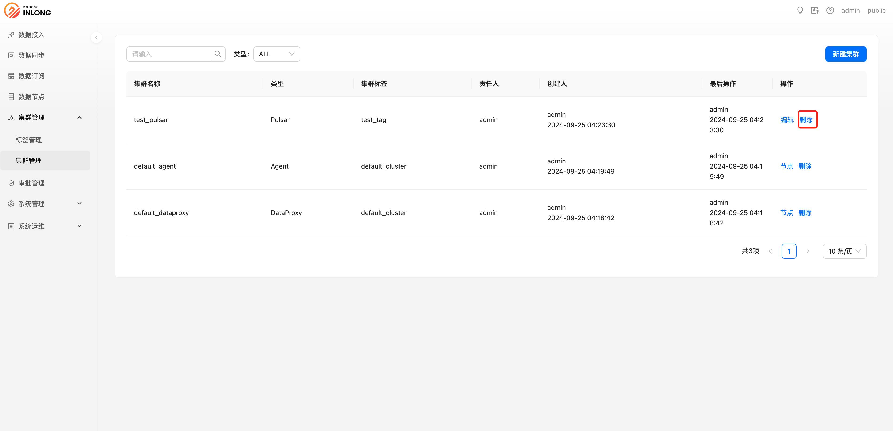

角色为系统管理员或者租户管理员的用户才可以使用此功能，他们可以创建、修改、删除集群。

### 新建集群

具有系统管理员或者租户管理员权限用户，可以进行创建新集群：

- 集群名称：用户自定义名，用来标识此集群信息
- 类型：集群类型
- 集群标签：该集群所属集群标签
- 责任人：该集群负责人，只有责任人能够修改该集群的配置信息
- 集群描述：集群描述信息

以上为集群的公用配置，另外，根据不同的集群类型，还会有不同的配置信息，如 Pulsar 集群需要填写 Service URL、AdminURL、默认租户、token 等信息。

### 删除集群

系统管理员或者租户管理员权限可以对已创建的集群进行删除，删除后此集群将停止使用：

### 修改集群

系统管理员或者租户管理员可以修改已创建的集群：

