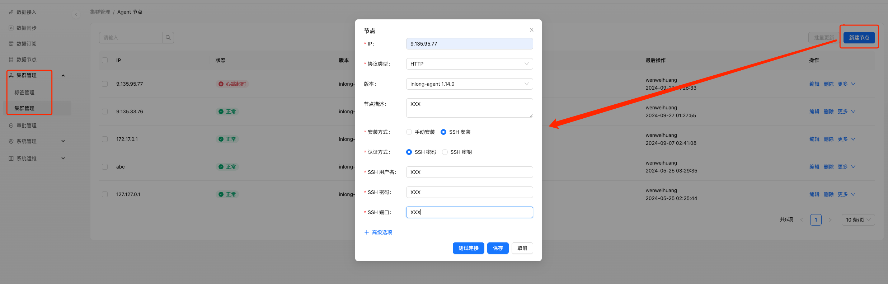

## 概述
平台实现了 Agent 的界面化管理能力，支持在界面进行 Agent 的安装包管理、版本管理、安装操作、卸载操作、升级操作、重启操作等，并且支持批量操作的能力。

## 安装包管理
安装包管理主要是对安装包的名称、地址、MD5 的管理。
### 新增
如图所示在 "系统运维-安装包" 点击 "新建 Package" 进行安装包新建：

文件名称：Agent 安装包名称

下载地址：安装包的下载地址，我们是通过 wget 来下载安装包。

MD5：安装包文件的 MD5 值，用于下载完成后校验安装包是否有损坏。

存储路径：安装包下载完成后的存放路径。

### 修改、删除
点击 "详情" 即可进行 Agent 的修改；点击 "删除" 即可进行安装包删除。

### Installer 
Installer 是 Agent 的守护进程，实际上我们在业务机器上同时装了 Installer 和 Agent 两个进程。Installer 的安装包、版本管理和 Agent 一样。

## 版本管理
版本管理是基于安装包管理之上的，主要是管理这个安装包所需的安装、检查、启动、停止命令。
### 新增
如图所示在 "系统运维-版本管理" 点击 "新建 module" 进行版本新建：

名称：版本名称。

版本：版本号，需要遵循 X.X.X 三段式规范，并且只能是数字。

安装包：选择该版本对应的安装包。

检查命令：用于检测进程是否存在的命令。

启动命令：用于启动进程。

停止命令：用于停止进程。

卸载命令：用于卸载 Agent。

### 修改、删除
点击 "详情" 即可进行版本修改；点击 "删除" 即可进行版本删除。

## Agent 安装
如图所示在集群管理里找到 Agent 集群后，选择新建节点：

IP：要安装 Agent 的机器的 IP。

协议类型：标识 Agent 与 Manager 交互所用协议类型，如果是同一个局域网的我们选择 HTTP；如果是需要跨公网传输的就选择 HTTPS。

版本：选择 Agent 的版本。

安装方式：如果要平台自动安装，请选择 SSH 安装，并且一般是通过 SSH 密码安装。

SSH 用户名：SSH 登录用户名

SSH 密码：SSH 登录密码

SSH 端口：SSH 端口号

填写完成后可以点击 "测试连接" 按钮测试 SSH 登录是否成功。
点击 "保存" 按钮后即可进行自动安装。
## 修改、删除
点击 "编辑" 即可进行 Agent 节点修改；点击 "删除" 即可进行 Agent 节点删除。

## 批量操作
如图所示，我们可以选择多个 Agent 节点，然后点击 "批量操作" 按钮进行批量操作。

分批：我们可以进行分批操作，这个是分的批次。

间隔：每个批次之间的时间间隔。

操作类型：对这批节点要进行的操作，

版本：Agent 版本。

Installer：Installer 版本。