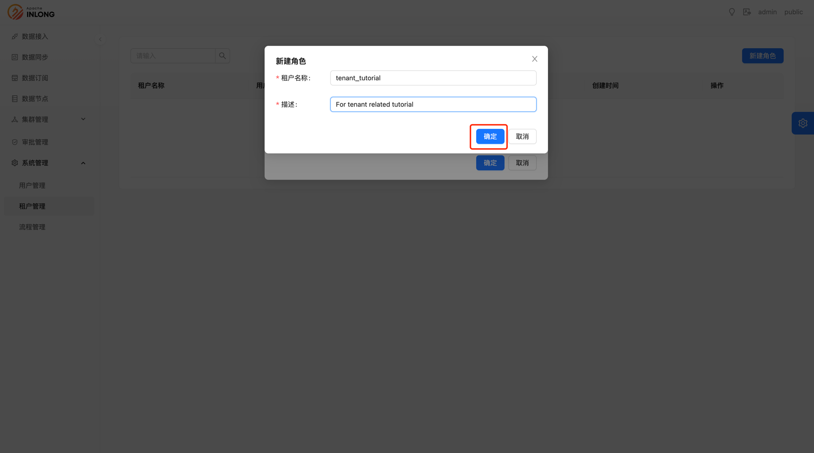
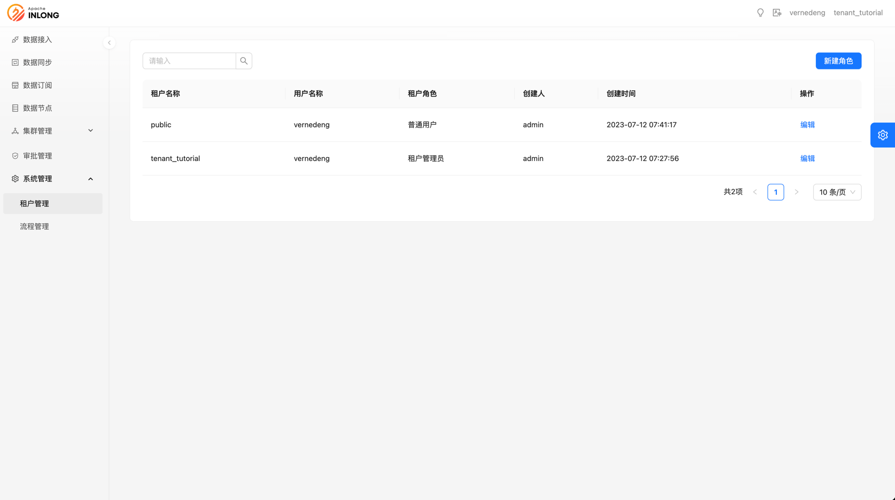

# 多租户

InLong多租户实现可以参考：
https://github.com/apache/inlong/issues/7914

:::caution
- 不同租户之间资源和权限互相隔离，用户只能看到该租户下的资源。
- 从低版本升级至1.8版本后，所有资源会被迁移到公共租户 `public` 下。
:::

## 创建租户
:::caution
目前只允许`InLong管理员`来进行租户的创建和修改操作。
:::

- 选择`租户管理`，点击`新建角色`

- 选择`新建租户`

- 完善`租户名称`和`描述`，点击`确定`，则完成租户的创建

至此完成了租户的创建

## 创建租户角色

- 选择`租户管理`，点击`新建角色`

- 选则`目标租户`，`用户名称`，和想要授予的`租户角色`(如果租户不存在，请参考 [创建租户](#创建租户))

- 创建成功后，可以在`租户管理`界面看到名下的租户以及对应的用户角色

## 租户切换
- 点击右上角`租户`字段，可以选择切换到名下拥有的租户

