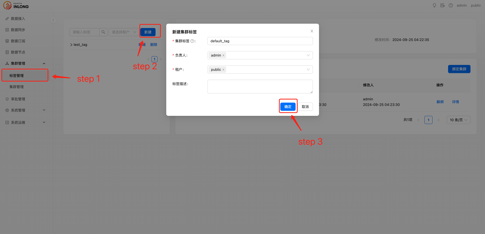

角色为系统管理员或者租户管理员的用户才可以使用此功能，他们可以创建、修改、删除集群标签，并使用将集群信息绑定在已创建的集群标签上。

### 新建集群标签

具有系统管理员或者租户管理员权限用户，可以进行创建新集群集群标签：

- 集群标签：用户自定义名，用来标识此集群标签信息
- 责任人：该集群标签负责人，只有责任人能够修改该集群标签的配置信息
- 租户：该集群标签所属租户，只有对应的租户下能看到该集群标签
- 标签描述：该集群标签描述信息

### 删除集群标签

系统管理员或者租户管理员权限可以对已创建的集群标签进行删除，删除后此集群标签将停止使用：

### 修改集群标签

系统管理员或者租户管理员可以修改已创建的集群标签：

### 绑定集群

系统管理员或者租户管理员可以为已创建的集群标签绑定相关集群信息：

### 解绑集群

系统管理员或者租户管理员可以为已创建的集群标签解绑相关集群信息：

