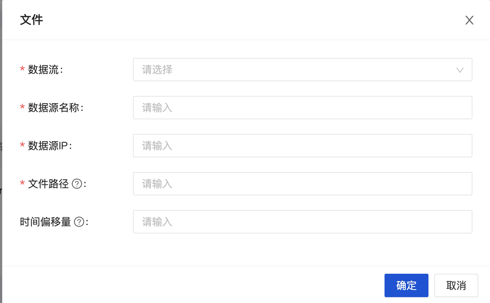

## 参数说明

- 数据源名称
- 数据源IP：采集节点 Agent IP
- ⽂件路径：必须是绝对路径，支持正则表达式，多个时以逗号分隔
- 时间偏移量：从文件的某个时间开始采集，'1m'表示1分钟之后，'-1m'表示1分钟之前，支持m(分钟)，h(小时)，d(天)，空则从当前时间开始采集
- 文件分隔符：支持竖线(|), 逗号（,），分好（;)
- 源数据字段：分隔符切分后的字段

## 路径配置
```
/data/inlong-agent/test.log  //代表读取inlong-agent文件夹下的的新增文件test.log
/data/inlong-agent/test[0-9]{1} //代表读取inlong-agent文件夹下的新增文件test后接一个数字结尾
/data/inlong-agent/test //如果test为目录，则代表读取test下的所有新增文件
/data/inlong-agent/^\\d+(\\.\\d+)? // 以一个或多个数字开头,之后可以是.或者一个.或多个数字结尾，?代表可选,可以匹配的实例："5", "1.5" 和 "2.21"
```

## 数据时间
Agent支持从文件名称中获取时间当作数据的生产时间，配置说明如下：
```
/data/inlong-agent/***YYYYMMDDHH***
```

其中YYYYDDMMHH代表数据时间，YYYY表示年，MM表示月份，DD表示天，HH表示小时
其中***为任意字符

同时需要在job conf中加入当前数据的周期，当前支持天周期以及小时周期，
在添加任务时，加入属性 job.cycleUnit。job.cycleUnit 包含如下两种类型：
- D : 代表数据时间天维度
- H : 代表数据时间小时维度

例如：
配置数据源为
```
/data/inlong-agent/2021020211.log
```
写入数据到 2021020211.log
配置 job.cycleUnit 为 D
则agent会在2021020211时间尝试2021020211.log文件，读取文件中的数据时，会将所有数据以20210202这个时间写入到后端proxy
如果配置 job.cycleUnit 为 H
则采集2021020211.log文件中的数据时，会将所有数据以2021020211这个时间写入到后端proxy。