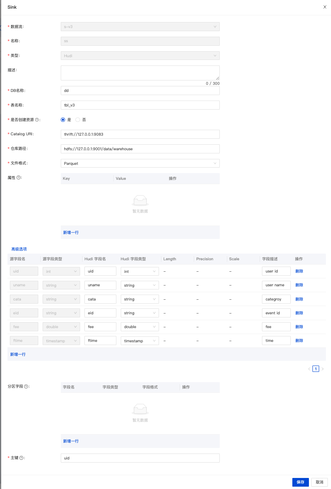

import {siteVariables} from '../../version';

## 概览

[Apache Hudi](https://hudi.apache.org/cn/docs/overview/) (发音为"hoodie")是下一代流式数据湖平台。
Apache Hudi 将核心仓库和数据库功能直接带到数据湖中。
Hudi 提供表、事务、高效的 upserts/delete、高级索引、流摄入服务、数据聚类/压缩优化和并发，同时保持数据的开源文件格式。

## 支持的版本

| Load Node         | Version                                                          |
| ----------------- | ---------------------------------------------------------------- |
| [Hudi](./hudi.md) | [Hudi](https://hudi.apache.org/cn/docs/quick-start-guide): 0.12+ |

### 依赖

通过 `Maven` 引入 `sort-connector-hudi` 构建自己的项目。
当然，你也可以直接使用 `INLONG` 提供的 `jar` 包。([sort-connector-hudi](https://inlong.apache.org/download))

### Maven 依赖

```xml
<dependency>
    <groupId>org.apache.inlong</groupId>
    <artifactId>sort-connector-hudi</artifactId>
    <version>${siteVariables.inLongVersion}</version>
</dependency>
```

## 如何配置 Hudi 数据加载节点

### SQL API 的使用

使用 `Flink SQL Cli` :

```sql
CREATE TABLE `hudi_table_name` (
  id STRING,
  name STRING,
  uv BIGINT,
  pv BIGINT
) WITH (
    'connector' = 'hudi-inlong',
    'path' = 'hdfs://127.0.0.1:90001/data/warehouse/hudi_db_name.db/hudi_table_name',
    'uri' = 'thrift://127.0.0.1:8091',
    'hoodie.database.name' = 'hudi_db_name',
    'hoodie.table.name' = 'hudi_table_name',
    'hoodie.datasource.write.recordkey.field' = 'id',
    'hoodie.bucket.index.hash.field' = 'id',
    -- compaction
    'compaction.tasks' = '10',
    'compaction.async.enabled' = 'true',
    'compaction.schedule.enabled' = 'true',
    'compaction.max_memory' = '3096',
    'compaction.trigger.strategy' = 'num_or_time',
    'compaction.delta_commits' = '5',
    'compaction.max_memory' = '3096',
    --
    'hoodie.keep.min.commits' = '1440',
    'hoodie.keep.max.commits' = '2880',
    'clean.async.enabled' = 'true',
    --
    'write.operation' = 'upsert',
    'write.bucket_assign.tasks' = '60',
    'write.tasks' = '60',
    'write.log_block.size' = '128',
    --
    'index.type' = 'BUCKET',
    'metadata.enabled' = 'false',
    'hoodie.bucket.index.num.buckets' = '20',
    'table.type' = 'MERGE_ON_READ',
    'clean.retain_commits' = '30',
    'hoodie.cleaner.policy' = 'KEEP_LATEST_COMMITS'
);
```

### InLong Dashboard 方式

#### 配置

在创建数据流时，选择数据落地为 `Hudi` 然后点击 `Add` 来配置 `Hudi` 的相关信息。



| 配置项            | 对应SQL DDL中的属性                                 | 备注                                                     |
| -------------- | --------------------------------------------- | ------------------------------------------------------ |
| `DB名称`         | `hoodie.database.name`                        | 库名称                                                    |
| `表名`           | `hudi_table_name`                             | hudi表名                                                 |
| `是否创建资源`       | -                                             | 如果库表已经存在，且无需修改，则选【不创建】；<br/>否则请选择【创建】，由系统自动创建资源。       |
| `Catalog URI`  | `uri`                                         | 元数据服务地址                                                |
| `仓库路径`         | -                                             | hudi表存储在HDFS中的位置<br/>在SQL DDL中path属性是将`仓库路径`与库、表名称拼接在一起 |
| `属性`           | -                                             | hudi表的DDL属性需带前缀`ddl`.                                   |
| `高级选项`>`数据一致性` | -                                             | Flink计算引擎的一致性语义: `EXACTLY_ONCE`或`AT_LEAST_ONCE`        |
| `分区字段`         | `hoodie.datasource.write.partitionpath.field` | 分区字段                                                   |
| `主键字段`         | `hoodie.datasource.write.recordkey.field`     | 主键字段                                                   |

### InLong Manager Client 方式

:::note
将在未来支持此功能
:::

## Hudi 加载节点参数信息

| 选项                                          | 必填  | 类型     | 描述                                                                                             |
| ------------------------------------------- | --- | ------ | ---------------------------------------------------------------------------------------------- |
| connector                                   | 必填  | String | 指定要使用的Connector，这里应该是`hudi-inlong`。                                                             |
| uri                                         | 必填  | String | 用于配置单元同步的 Metastore uris                                                                       |
| hoodie.database.name                        | 可选  | String | 将用于增量查询的数据库名称。如果不同数据库在增量查询时有相同的表名，我们可以设置它来限制特定数据库下的表名                                          |
| hoodie.table.name                           | 可选  | String | 将用于向 Hive 注册的表名。 需要在运行中保持一致。                                                                   |
| hoodie.datasource.write.recordkey.field     | 必填  | String | 记录的主键字段。 用作“HoodieKey”的“recordKey”组件的值。 实际值将通过在字段值上调用 .toString() 来获得。 可以使用点符号指定嵌套字段，例如：`a.b.c` |
| hoodie.datasource.write.partitionpath.field | 可选  | String | 分区路径字段。 在 HoodieKey 的 partitionPath 组件中使用的值。 通过调用 .toString() 获得的实际值                           |
| inlong.metric.labels                        | 可选  | String | 在long metric label中，value的格式为groupId=xxgroup&streamId=xxstream&nodeId=xxnode。                  |

## 数据类型映射

| Hive type     | Flink SQL type |
| ------------- | -------------- |
| char(p)       | CHAR(p)        |
| varchar(p)    | VARCHAR(p)     |
| string        | STRING         |
| boolean       | BOOLEAN        |
| tinyint       | TINYINT        |
| smallint      | SMALLINT       |
| int           | INT            |
| bigint        | BIGINT         |
| float         | FLOAT          |
| double        | DOUBLE         |
| decimal(p, s) | DECIMAL(p, s)  |
| date          | DATE           |
| timestamp(9)  | TIMESTAMP      |
| bytes         | BINARY         |
| array         | LIST           |
| map           | MAP            |
| row           | STRUCT         |
