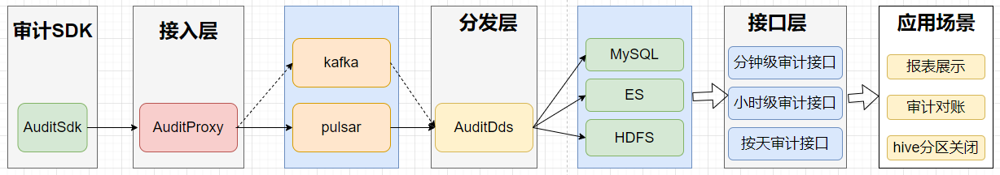

# 总览

本文尽可能全面介绍下Inlong审计的设计与实现

## 整体架构


1. 审计SDK嵌套在需要审计的服务，对服务进行审计，将审计结果发送到审计接入层
2. 审计接入层将审计数据写到MQ(kafak或者pulsar)
3. 分发服务消费MQ的审计数据，将审计数据写到MySQL、Elasticsearch
4. 接口层将MySQL、Elasticsearch的数据进行封装
5. 应用场景主要包括报表展示、审计对账等等

## 审计维度
| 机器ip |  容器ID | 线程ID | 日志时间(分钟) | 审计ID | inlong_group_id | inlong_stream_id | 条数 | 大小 | 传输时延(ms) |

## 审计项ID
每个模块的接收与发送分别为一个独立的审计项ID

|Inlong服务模块 |审计ID |
|----|----|
|Inlong api接收成功	|1 |
|Inlong api发送成功	|2|
|Inlong agent接收成功	|3|
|Inlong agent发送成功	|4|
|Inlong DataProxy接收成功	|5|
|Inlong DataProxy发送成功	|6|
|Inlong分发服务1接收成功	|7|
|Inlong分发服务1发送成功	|8|
|Inlong分发服务2接收成功	|9|
|Inlong分发服务2发送成功	|10|

##数据传输协议
sdk、接入层、分发层之间的传输协议为Protocol Buffers
```markdown
syntax = "proto3";

package org.apache.inlong.audit.protocol;

message BaseCommand {
    enum Type {
        PING          = 0;
        PONG          = 1;
        AUDITREQUEST  = 2;
        AUDITREPLY    = 3;
    }
    Type type                            = 1;
    optional AuditRequest audit_request  = 2;
    optional AuditReply audit_reply      = 3;
    optional Ping ping                   = 4;
    optional Pong pong                   = 5;
}

message Ping {
}

message Pong {
}

message AuditRequest {
  AuditMessageHeader msg_header = 1;   //包头
  repeated AuditMessageBody msg_body = 2;   //包体
}

message AuditMessageHeader {
  string ip = 1;            //sdk客户端ip
  string docker_id = 2;     //sdk所在容器ID
  string thread_id = 3;     //sdk所在的线程ID
  uint64 sdk_ts = 4;        //sdk上报时间
  uint64 packet_id = 5;     //sdk上报的包ID
}

message AuditMessageBody {
  uint64 log_ts = 1;    //日志时间
  string inlong_group_id= 2;   //inlong_group_id
  string inlong_stream_id= 3; //inlong_stream_id
  string audit_id = 4;   //审计ID
  uint64 count = 5;     //条数
  uint64 size = 6;      //大小
  int64  delay = 7;      //总传输延时
}

message AuditReply {
  enum RSP_CODE {
    SUCCESS  = 0;  //成功
    FAILED   = 1;   //失败
    DISASTER = 2; //容灾
  }
  RSP_CODE rsp_code = 1;   //服务端返回码
  optional string message = 2;
}
```
