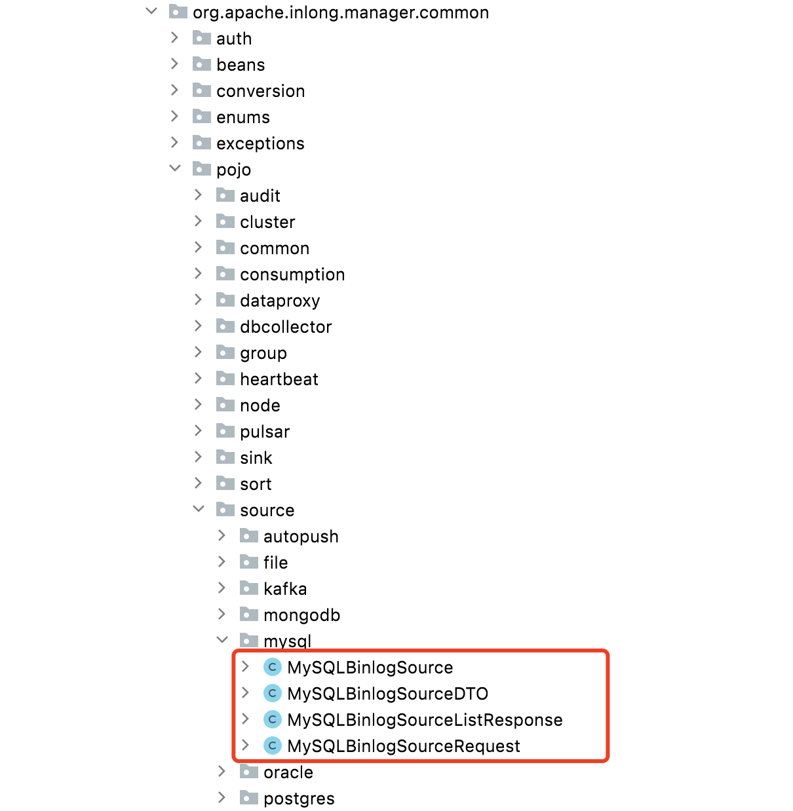
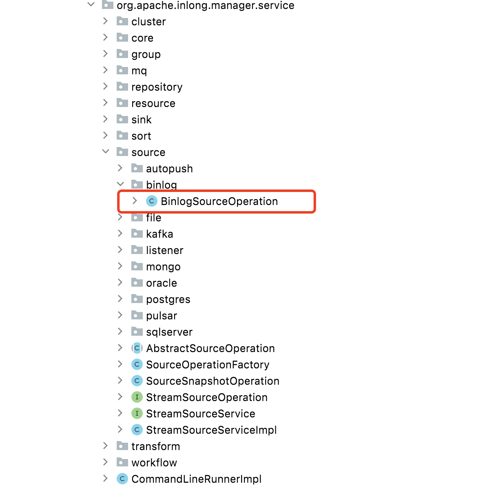
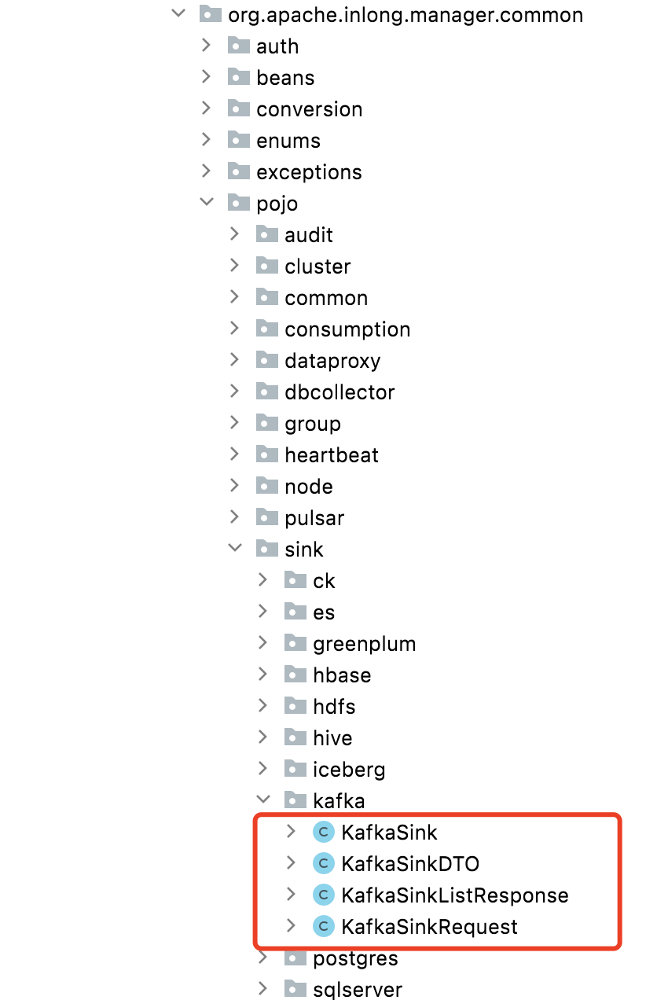

## 总览

Inlong 设计初衷即是为了在不同数据源之间创建数据流, 到目前为止，Inlong已经支持了多种常用数据源的读取和写入，如 **MySQL**, **Apache Kafka**, **ClickHouse** 等,
详细内容可参考 [数据节点](https://inlong.apache.org/zh-CN/docs/next/data_node/extract_node/auto_push).
我们预计会在未来支持更多的常用数据源, 故本文会简短介绍如何在现有框架下扩展数据源.

## 扩展读取节点
 
以**MySQL_BINLOG**为例，下午会介绍如何在Inlong框架下扩展读取节点.

- 首先需要在Sort组件内支持该数据源, 详情参考 [Sort 插件](https://inlong.apache.org/zh-CN/docs/next/design_and_concept/how_to_write_plugin_sort)
- 在枚举类`org.apache.inlong.common.enums.TaskTypeEnum`中增加对应的枚举
```java
public enum TaskTypeEnum {

    DATABASE_MIGRATION(0),
    SQL(1),
    BINLOG(2),
    FILE(3),
    KAFKA(4),
    PULSAR(5),
    POSTGRES(6),
    ORACLE(7),
    SQLSERVER(8),
    MONGODB(9),
    ...
```
- 在枚举类`org.apache.inlong.manager.common.enums.SourceType`中同样增加对应枚举
```java
public enum SourceType {

    AUTO_PUSH("AUTO_PUSH", null),
    FILE("FILE", TaskTypeEnum.FILE),
    SQL("SQL", TaskTypeEnum.SQL),
    BINLOG("BINLOG", TaskTypeEnum.BINLOG),
    KAFKA("KAFKA", TaskTypeEnum.KAFKA),
    PULSAR("PULSAR", TaskTypeEnum.PULSAR),
    POSTGRES("POSTGRES", TaskTypeEnum.POSTGRES),
    ORACLE("ORACLE", TaskTypeEnum.ORACLE),
    SQLSERVER("SQLSERVER", TaskTypeEnum.SQLSERVER),
    MONGODB("MONGO", TaskTypeEnum.MONGODB),
    ...
```
- 在`org.apache.inlong.manager.common.pojo.source`路径下创建文件夹, 创建对应实体类.
  
- 在`org.apache.inlong.manager.service.source`路径下，创建对应工具类.
  
- 支持数据源到**ExtractNode**的转换函数
```java
public class ExtractNodeUtils {
    
    public static ExtractNode createExtractNode(StreamSource sourceInfo) {
        SourceType sourceType = SourceType.forType(sourceInfo.getSourceType());
        switch (sourceType) {
            case BINLOG:
                return createExtractNode((MySQLBinlogSource) sourceInfo);
            case KAFKA:
                return createExtractNode((KafkaSource) sourceInfo);
            case PULSAR:
                return createExtractNode((PulsarSource) sourceInfo);
            case POSTGRES:
                return createExtractNode((PostgresSource) sourceInfo);
            case ORACLE:
                return createExtractNode((OracleSource) sourceInfo);
            case SQLSERVER:
                return createExtractNode((SqlServerSource) sourceInfo);
            case MONGODB:
                return createExtractNode((MongoDBSource) sourceInfo);
            default:
                throw new IllegalArgumentException(
                        String.format("Unsupported sourceType=%s to create extractNode", sourceType));
        }
    }
    ...
```
## 扩展写入节点
扩展写入节点的方式与读取节点类似
- 在Sort组件内支持该数据源, 详情参考 [Sort 插件](https://inlong.apache.org/zh-CN/docs/next/design_and_concept/how_to_write_plugin_sort)
- 在枚举类`org.apache.inlong.manager.common.enums.SinkType`中增加对应枚举
```java
public enum SinkType {

    HIVE,
    KAFKA,
    ICEBERG,
    CLICKHOUSE,
    HBASE,
    POSTGRES,
    ELASTICSEARCH,
    SQLSERVER,
    HDFS,
    GREENPLUM,
    ...
```
- 在`org.apache.inlong.manager.common.pojo.sink`路径下创建文件夹, 创建对应实体类..
  
- 在`org.apache.inlong.manager.service.sink`路径下创建对应工具类
  
- 支持数据源到**LoadNode**的转换函数
```java
public class LoadNodeUtils {

    /**
     * Create load node from the stream sink info.
     */
    public static LoadNode createLoadNode(StreamSink streamSink) {
        SinkType sinkType = SinkType.forType(streamSink.getSinkType());
        switch (sinkType) {
            case KAFKA:
                return createLoadNode((KafkaSink) streamSink);
            case HIVE:
                return createLoadNode((HiveSink) streamSink);
            case HBASE:
                return createLoadNode((HBaseSink) streamSink);
            case POSTGRES:
                return createLoadNode((PostgresSink) streamSink);
            case CLICKHOUSE:
                return createLoadNode((ClickHouseSink) streamSink);
            case ICEBERG:
                return createLoadNode((IcebergSink) streamSink);
            case SQLSERVER:
                return createLoadNode((SqlServerSink) streamSink);
            case ELASTICSEARCH:
                return createLoadNode((ElasticsearchSink) streamSink);
            case HDFS:
                return createLoadNode((HdfsSink) streamSink);
            case GREENPLUM:
                return createLoadNode((GreenplumSink) streamSink);
            case MYSQL:
                return createLoadNode((MySQLSink) streamSink);
            default:
                throw new BusinessException(String.format("Unsupported sinkType=%s to create load node", sinkType));
        }
    }
   ...
```
