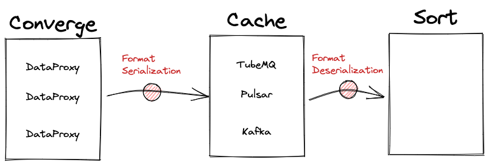

## 什么是 Format?


如上图所示， Flink SQL 在读写数据时，均采用 Row 的形式，其内部为 Object 数组 `Object[]`，数组中每个元素代表了一个 Flink 表的字段。
字段的类型、名称、精度等信息，通过 `Schema` 来标示。

Flink 的 Format 提供了两种接口：SerializationSchema 和 DeserializationSchema。

- 当 Flink 往 MQ 写数据时，需要把 `Flink Row` 序列化为 `key-value` / `csv` / `Json` 等 Format,
  这时调用了 `SerializationSchema#serialize` 方法，数据会序列化成 `Byte[]`，写入到 `MQ`。
- 当 Flink 读取 MQ 的数据时，该过程则相反：从 MQ 读取数据，数据格式为 `byte[]`，反序列化为`Format`，再转换为 `Flink row`。

> 详情请查看代码 [`inlong-sort/sort-formats`](https://github.com/apache/inlong/tree/master/inlong-sort/sort-formats)

## InLong 中的 Format



InLong 作为一站式、全场景的数据集成平台，将 MQ（图中 Cache 部分）作为传输通道，同时实现 DataProxy 与 Sort 的解耦，扩展性会更强：

- DataProxy 上报数据时，需要将数据序列化成对应的格式（`SerializationSchema#serialize`）。
- Sort 接收到数据，将 MQ 的数据反序列化（`DeserializationSchema#deserialize`）成 `Flink Row` ，通过 Flink SQL 写入到对应的存储。

## 有哪些 Format?

目前，InLong-Sort 提供了 CSV/KeyValue/JSON，以及通过 InLongMsg 封装的格式。

### CSV

```xml
<dependency>
    <groupId>org.apache.inlong</groupId>
    <artifactId>sort-format-csv</artifactId>
    <version>${inlong.version}</version>
</dependency>
```

`org.apache.inlong.sort.formats.kv.KvFormatFactory`

| Option                    | Type    | Required | Default value            | 高级属性 | Remark                                                                                                                                 |
|---------------------------|---------|----------|--------------------------|------|----------------------------------------------------------------------------------------------------------------------------------------|
| `format.delimiter`        | char    | Y        | `,`                      | N    |                                                                                                                                        |
| `format.escape-character` | char    | N        | disabled                 | Y    |                                                                                                                                        |
| `format.quote-character`  | char    | N        | disabled                 | Y    |                                                                                                                                        |
| `format.null-literal`     | String  | N        | disabled                 | Y    |                                                                                                                                        |
| `format.charset`          | String  | Y        | "UTF-8"                  | N    |                                                                                                                                        |
| `format.ignore-errors`    | Boolean | Y        | true                     | N    |                                                                                                                                        |
| `format.derive_schema`    | Boolean | N        | 如果未定义 Format Schema，则为必需。 | Y    | 从表的 Schema 中派生 Format Schema 。 这允许只定义一次schema 信息。 <br/> format 的名称、类型和字段顺序由表的 schema 决定。 <br/>如果时间属性不是字段，则忽略它们。 <br/> “from” 定义被解释为 format 中的字段重命名。 |

### Key-Value

```xml
<dependency>
    <groupId>org.apache.inlong</groupId>
    <artifactId>sort-format-kv</artifactId>
    <version>${inlong.version}</version>
</dependency>
```

`org.apache.inlong.sort.formats.csv.CsvFormatFactory`

| Option                    | Type    | Required | Default value                            | 高级属性 | Remark                                                                                                                                 |
|---------------------------|---------|----------|------------------------------------------|------|----------------------------------------------------------------------------------------------------------------------------------------|
| `format.entry-delimiter`  | char    | N        | `&`                                      | N    |                                                                                                                                        |
| `format.kv-delimiter`     | char    | N        | `=`                                      | N    |                                                                                                                                        |
| `format.escape-character` | char    | N        | disabled                                 | Y    |                                                                                                                                        |
| `format.quote-character`  | char    | N        | disabled                                 | Y    |                                                                                                                                        |
| `format.null-literal`     | char    | N        | disabled                                 | Y    |                                                                                                                                        |
| `format.charset`          | String  | Y        | "UTF-8"                                  | N    |                                                                                                                                        |
| `format.ignore-errors`    | Boolean | Y        | true                                     | N    |                                                                                                                                        |
| `format.derive_schema`    | Boolean | N        | Required if no format schema is defined. | Y    | 从表的 Schema 中派生 Format Schema 。 这允许只定义一次schema信息。 <br/> format 的名称、类型和字段顺序由表的 schema 决定。 <br/>如果时间属性不是字段，则忽略它们。 <br/> “from” 定义被解释为 format 中的字段重命名。 |

### JSON

```xml
<dependency>
    <groupId>org.apache.flink</groupId>
    <artifactId>flink-json</artifactId>
    <version>${flink.version}</version>
</dependency>
```

`org.apache.flink.formats.json.JsonFormatFactory`

`org.apache.flink.formats.json.JsonOptions`

| Option                           | Type    | Required | Default value | 高级属性 | Remark                                                                                                                                                                    |
|----------------------------------|---------|----------|---------------|------|---------------------------------------------------------------------------------------------------------------------------------------------------------------------------|
| `ignore-parse-errors`            | Boolean | N        | false         | N    | 可选标志以跳过具有解析错误而不是失败的字段和行； <br/>如果出现错误，字段设置为 null，默认情况下为 false。                                                                                                             |
| `map-null-key.mode`              | String  | N        | "FAIL"        | Y    | 可选标志，用于在序列化map数据的空键时控制处理模式。<br/><br/>选项 DROP 将删除map数据的空键条目。<br/>选项 LITERAL 将使用 `map-null-key.literal` 作为 key 关键字。                                                           |
| `map-null-key.literal`           | String  | N        | "null"        | Y    | 当“map-null-key.mode”为 LITERAL 时，用于为空键指定字符串文字的可选标志。                                                                                                                        |
| `encode.decimal-as-plain-number` | Boolean | N        | false         | Y    | 可选标志，用于指定是否将所有小数编码为普通数字而不是科学记数法，默认情况下为 false。                                                                                                                             |
| `timestamp-format.standard`      | String  | N        | "SQL"         | Y    | 用于指定时间戳格式的可选标志，默认为 SQL。<br/>选项 ISO-8601 将以“yyyy-MM-ddTHH:mm:ss.s{precision}” 格式解析输入时间戳，并以相同格式输出时间戳。 <br/>选项 SQL 将以“yyyy-MM-dd HH:mm:ss.s{precision}”格式解析输入时间戳，并以相同格式输出时间戳。 |
| `encode.decimal-as-plain-number` | Boolean | N        | false         | Y    | 可选标志，用于指定是否将所有小数编码为普通数字而不是可能的科学记数法，默认情况下为 `false`。                                      |
